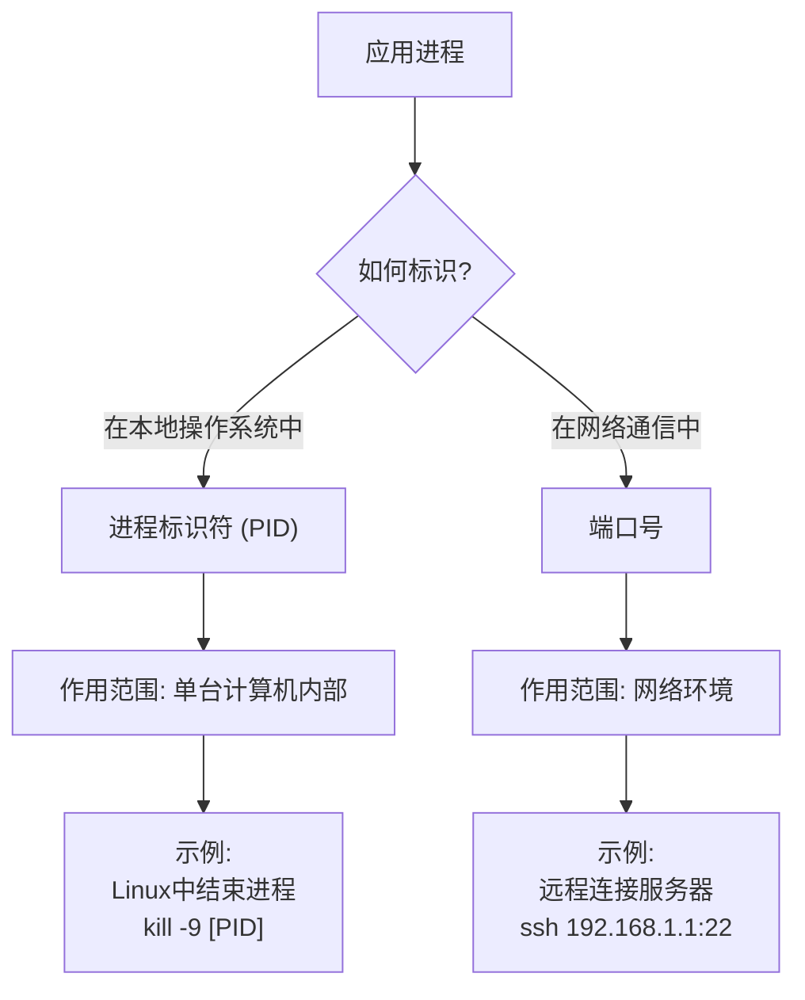

# 1 概述

## 1.1 计算机网络基本概念

### 1.1.1 定义

- **internet**（互连网）是一个通用名词，泛指由多个计算机网络互连而成的计算机网络。在这些网络之间可以使用任意的通信协议作为通信规则，不一定非要使用 TCP/IP。
- **Internet**（互联网或因特网）则是一个专用名词，指当前全球最大的、开放的、由众多网络和路由器互连而成的特定计算机网络，它采用 TCP/P 族作通信规则。

### 1.1.2 组成

物理上看：

- **硬件**：主要由主机（端系统）、通信链路（如双绞线、光纤）、交换设备（如路由器、交换机等) 和通信处理机（如网卡）等组成
- **软件**：主要包括各种实现资源共享的软件和方便用户使用的各种工具软件（如网络操作系统、邮件收发程序、FTP 程序、聊天程序等)
- **协议**：计算机网络的核心，规定了网络传输数据时所遵循的规范

逻辑上看：

1. 节点：主机（host） 路由器 交换机
2. 通信链路：接入链路 主干链路
3. 协议

工作方式上看：

1. 边缘
   1. 由端系统（主机）构成
      1. 主机分为 客户 和 服务器
2. 接入
   1. 端系统通过ISP（Internet Service Provider）接入因特网
3. 核心
   1. 由⼤量网络和连接这些网络的路由器组成

### 1.1.3 功能

- 数据通信：最基本的功能
- 资源共享：包括软件共享、硬件共享
- 分布式管理
- 提高可靠性
- 负载均衡

### 1.1.4 分类

- **按分布范围**：
  - 广域网 WAN：互联网的核心部分，采用**交换**技术
  - 城域网 MAN：大多采用以太网技术
  - 局域网 LAN：采用**广播**技术
  - 个域网 PAN：采用无线技术，无线个人局域网（WPAN）
- **按传输技术**：
  - 广播式
  - 点对点
- **按拓扑结构**：
  - 总线形
  - 星形
  - 环形
  - 网状形
- **按交换技术**：
  - 电路交换
  - 报文交换
  - 分组交换

### 1.1.5 性能指标

1. 时延
   1. 发送、传播、处理、排队 
2. 带宽
   1. 单位时间内网络中点对点的**最高数据传输速率**
   2. 短板效应：`min(主机接口速率, 线路带宽, 交换机或路由器的接口速率)`
3. 吞吐量
   1. 单位时间通过某接口的实际数据量
   2. 也有短板效应
4. 时延带宽积
   1. 字面意思：`传播时延 * 信道带宽`
   2. 指发送端发送的第一个比特即将到达终点时，发送端已发出了多少比特
   3. 也称为**以比特为单位的链路长度**
5. 往返时间 RTT
   1. 指从发送端**发送数据**分组开始，到发送端**收到接收端发来的相应确认**分组为止，总共耗费的时间
6. 利用率
   1. **信道利用率**
      1. 用来表示某链路有百分之几的时间是被利用的 (有数据通过)
      2. **信道利用率不是越高越好**：根据排队论，当某链路的利用率增大时，该信道引起的时延也会激增 
   2. **网络利用率**：全网络所有链路的链路利用率的加权平均
7. 丢包率
   1. 即分组丢失率，是指在一定的时间范围内，传输过程中丢失的分组数量与总分组数量的比率
   2. 具体可分为：接口丢包率、结点丢包率、链路丢包率、路径丢包率、网络丢包率等
   3. **分组丢失的两种情况**
      1. 分组在传输过程中**出现误码**，被传输路径中的**交换机**（例如路由器）或**目的主机**检测出误码而丢弃
      2. 分组到达一台**队列已满**的分组交换机时被丢弃，在通信量较大时就可能造成网络拥塞

#### 有效速率

例题：链路带宽 50kbps，传播时延 250msec；数据长度 1000bits；采用应答方式，应答发送时延不计，求有效速率。

数据往返时间 $250*2 = 500$
数据发送时延 $1000/50k = 20 ms$
一个 transaction 完整延时 $520ms$
有效速率（有效带宽）：
$$20/520 * 50kbps = 1.92kbps$$

## 1.2 体系结构

### 1.2.1 分层结构

分层结构的要求：

- 第 n 层的实体不仅要**使用**第 n-1 层的**服务**来实现自身定义的功能，还要向第 n+1 层**提供本层的服务**，该服务是第 n 层及其下面各层提供的服务总和
- 最低层只提供服务，是整个层次结构的基础；最高层面向用户提供服务
- 上一层只能通过相邻层间的**接口**使用下一层的服务，而不能调用其他层的服务；下一层所提供服务的实现细节对上一层**透明**
- 两台主机通信时，对等层**在逻辑上**有一条直接信道，表现为不经过下层就把信息传送到对方

### 1.2.2 协议、接口、服务

**协议**和**服务**的区别：

1. 服务(Service)：低层向上层提供它们之间的通信能力，是通过原语 (primitive)来操作的，_垂直_。
2. 协议(protocol) ：对等层实体(peer entity)在相互通信的过程中，需要遵循的规则的集合，_水平_。

#### 协议栈


#### 封装和解封装


#### 各层次的协议数据单元

**协议数据单元 PDU**：对等层之间传送的数据单位。

- 应用层：报文 message
- 传输层：报文段 segment
  - TCP 段、UDP 数据报
- 网络层：分组 packet（如果无连接方式：数据报 datagram）
- 数据链路层：**帧** frame
- 物理层：位 bit

### 1.2.3 OSI 参考模型

三种常见的模型：


OSI 共 7 层：

- **低三层统称为通信子网**，它是为了联网而附加的通信设备，完成数据的传输功能
- **高三层统称为资源子网**，它相当于计算机系统，完成数据的处理等功能

#### 物理层

1. 传输单位：比特
2. 物理层主要定义数据终端设备（DTE）和数据通信设备（DCE）的物理与逻辑连接方法
   1. 规定了通信链路与通信结点的连接所需**电路接口**的一些参数
   2. 规定了通信链路上传输的信号的意义和电气特征
3. 功能：在物理媒体上为数据端设备透明地传输原始比特流
4. 注意：
   1. 传输信息所利用的一些物理介质（双绞线、光缆、无线信道等），并不在物理层协议之内而在物理层协议下面
   2. 因此，有人把物理介质当作第 0 层
5. 接口标准：EIA-232 C、EIA/TIARS-449、CCITT 的X.21 等

#### 数据链路层

1. 传输单位：帧
2. 将网络层传来的 IP 分组**封装成帧**，并**可靠**地传输到相邻结点的网络层
3. 功能：**封装成帧、差错控制、流量控制、传输管理**

#### 网络层

1. 传输单位：数据报
2. 把网络层的协议数据单元（分组）从源端传到目的端，为分组交换网上的不同主机提供通信服务，并对分组进行路由选择
3. 功能：流量控制、**拥塞控制**、差错控制和网际互连
   1. 网络层流量控制能力有限，**尽力而为**，没有**节点到节点**的能力
4. 网络层协议： IP、IPX、ICMP、IGMP、ARP、RARP、OSPF 等

另外，因特网是一个很大的互联网，它由大量异构网络通过路由器（Router）相互连接起来。

1. 因特网的主要网络层协议是无连接的网际协议 IP 和许多路由选择协议
2. 因特网的网络层也称**网际层**或 IP 层

#### 传输层

1. 传输单位：报文段
2. 负责主机中两个**进程**之间的通信，为**端到端**连接提供**可靠**的传输服务
3. 功能：流量控制、差错控制、服务质量、传输管理
4. 一台主机可同时运行多个进程，具有**复用和分用**的功能
5. 传输层协议：TCP、UDP

> [!NOTE] 链路层和传输层的对比
>
> 数据链路层提供的是**点到点**的通信：
>
> 1. **主机**到主机之间的通信
> 2. 一个点是指一个硬件地址或 IP 地址，网络中参与通信的主机是通过硬件地址或地址标识的
>
> 传输层提供的是**端到端**的通信：
>
> 1. 不同主机内的两个**进程**之间的通信
> 2. 一个进程由一个**端口**来标识

#### 会话层

1. 允许同主机上的各个进程之间进行**会话**
2. 管理主机间的会话进程，包括建立、管理及终止进程间的会话
3. 可以使用校验点使通信会话在通信失效时从校验点继续恢复通信，实现**数据同步**

> [!NOTE] 建立会话
>
> 1. 也称建立**同步**（SYN）
> 2. 主要为表示层实体或用户进程建立连接并**在连接上有序地传输数据**，这就是会话。

#### 表示层

1. 主要处理在两个通信系统中交换信息的表示方式
2. 采用插象的标准方法定义数据结构，并采用标准的编码形式，使不同表示方法的数据和信息之间能互相交换
   1. 不同机器采用的编码和表示方法不同，使用的数据结构也不同
3. 功能：**数据压缩、加密和解密**

#### 应用层

1. OSI 参考模型的最高层，是用户与网络的界面
2. 为特定类型的**网络应用**提供访问 OSI 参考模型环境的手段
3. 网络层协议：用于文件传送的 FTP、用于电子邮件的 SMTP、用于万维网的 HTTP 等
   1. 用户的实际应用多种多样，因此应用层协议最多、**最复杂**

### 1.2.4 TCP/IP 模型


熟练掌握 OSI 即可，TCP/IP 可以基本对应上 OSI 的各层。

| TCP/IP         | 协议    | OSI                        |
| -------------- | ------- | -------------------------- |
| **应用层**     | HTTP等  | **会话层、表示层、应用层** |
| 传输层         | TCP/UDP | 传输层                     |
| 网际层         | IP      | 网络层                     |
| **网络接口层** | 接口    | **物理层、数据链路层**     |

# 2 物理层

物理层的主要功能是提供透明**比特流**的传输服务。


## 2.1 通信基础

### 2.1.1 基础概念

#### 码元

码元是指用一个固定时长的信号波形（数字脉冲），代表不同离散数值的基本波形，这个**固定时长**称为**码元宽度**。

若码元的有 M 个离散状态，则称为 M 进制码元。

- 在二进制系统中，一个码元可以是“0”或“1”，对应低电平或高电平。
- 在四进制系统中，一个码元可以是“00”、“01”、“10”、“11”，对应四种不同的波形（如四种相位）。

#### 信源与信宿


#### 同步/异步传输

- **同步传输**
  - 指数据块以**稳定**的**比特流**形式传输，字节之间没有间隔
  - 接收端在每个比特信号的中间时刻 (有区分 `0,1` 的标志) 进行检测，以判别接收到的是比特 `0` 还是 `1
  - 收发双方时钟同步方法：
    - **外同步**：在收发双方之间加一条单独的时钟信号线
    - **内同步**：发送端将时钟同步信号编码到发送数据中一起传输 (如曼彻斯特编码) `
- **异步传输**
  - 指以**字节**为**独立**的传输单位，字节间的时间间隔不是固定的
  - 接收端仅在每个字节的起始处对字节内的比特实现同步
  - 通常传送前要在每个字节前后加上起始位和结束位
  - 异步是指**字节之间异步**【字节之间的时间间隔不固定】
  - **字节中的每个比特仍然要同步**【各比特的持续时间是相同的】

#### 通信方式

- **单工通信**
  - 只有**一个方向**的通信而没有反方向的交互，如无线电广播、电视广播
  - 只需一个信道
- **半双工通信**
  - 通信双方都可发送或接收信息，但**不能同时**通信
  - 需要两个信道
- **全双工通信**
  - 通信双方可同时发送或接收信息
  - 需要两个信道

#### 速率

速率也叫数据率，是指数据的传输速率，表示单位事件内传输的数据量。

速率主要有**波特率/码元传输速率**、**比特率/信息传输速率**两种。

##### 码元传输速率

- 又叫波特率、码元速率、波形速率、调制速率

表示单位时间内数字通信系统所传输的**码元**个数(或称脉冲个数、信号变换次数），单位为**波特**（Baud），波特是速度单位。

1波特表示数字通信系统每秒传输一个码元，这里的码元可以是多进制的，也可以是二进制的，但**码元速率与进制数无关。**

- 曼彻斯特编码下，码元速率是传输速率的两倍

##### 信息传输速率

- 又叫比特速率、信息速率

表示单位事件内数字通信系统传输的**二进制码元**个数（即**比特数**），单位为比特/秒，即 1s 传输多少比特

> [!NOTE] 码元传输速率和信息传输速率的关系
>
> 若一个码元携带 `n` 比特的信息量，则 `M` Baud 的码元传输速率所对应的信息传输速率为 `M x n` 比特/秒。
>
> - N 进制就是携带 $n = log_2N$ 个比特

#### 带宽

在**模拟信号**系统中，带宽（又称频率带宽）用来表示某个信道所能传输信号的频率范围，即**最高频率与最低频率之差**，单位是赫兹（Hz）。

在计算机网络中，带宽用来表示网络的通信线路的最大数据传输率。

##### 例题


1. `带宽 = 最高频率 - 最低频率`
2. `频率 = 光速 / 波长`


### 2.1.2 奈奎斯特定理

在**理想低通**（没有噪声、带宽有限）的信道中，为了避免码间串扰，极限码元传输率为 $2W$ Baud。

- W 是理想低通信道的带宽，单位为 Hz

转换为以 bit 为单位：

- V 表示每个码元离散电平的数目
  - 指有多少种不同的码元，与 V 进制等价
  - 故，$\log_{2}V$ 表示每个码元的比特数
- 理想低通信道下的极限数据传输率 $2W\log_{2}V$（b/s）

### 2.1.3 香农定理

香农定理给出了带宽受限旦**有高斯噪声**干扰的信道的极限传输速率。

香农公式表示**极限传输速度**：
$$C = W*log_2 (1+\frac{S}{N}), \text{(bit/s)}$$

- W 是带宽，单位为Hz
- $\frac{S}{N}$ 一般需要通过**信噪比 SNR** 来计算，相关公式如下：
  $$
  \begin{cases}SNR=10*log_{10}\frac{S}{N}\\
  \frac{S}{N}=10^{\frac{SNR}{10}}\end{cases}
  $$
- 信噪比 SNR 单位为 dB

对于香农定理，有以下结论：

1. 信道的带宽或信道中的**信噪比**越大，信息的极限传输速率越高。
2. 对一定的传输带宽和一定的信噪比，信息传输速率的上限是**确定的**。
3. 只要信息传输速率低于信道的极限传输速率，就能找到某种方法实现**无差错**的传输。
4. 香农定理得出的是极限信息传输速率，**实际**信道能达到的传输速率要比它低不少。

### 2.1.4 编码与调制


- 编码转为数字信号
- 调制转为模拟信号

#### 常用编码


说明一下反向非归零（NRZI）：

1. **Non-Return-to-Zero Inverted**，非归零**反相**编码这个说法更好
   1. 非归零 NTZ
2. 用电平的跳变表示 0、电平保持不变表示 1。
3. **跳变信号**本身可作为一种通知机制。
4. 这种编码方式集成了前两种编码的优点，既能传输时钟信号，又能尽量不损失系统带宽。
5. USB 2.0 的编码方式就是 NRZI 编码
6. 差分曼彻斯特编码类似 NRZI
   1. 不变是1，跳变是0，**第一位无法判断**
7. 其他编码看图很好理解

#### 模拟数据转数字信号

采样、量化和编码，常用于对音频信号进行编码的PCM 编码。

1. **采样**是指对模拟信号进行**周期性扫描**，将时间上连续的信号变成时间上离散的信号。
   1. 根据奈奎斯特定理，采样频率必须大于或等于模拟信号最大频率的两倍。
2. **量化**是指将采样得到的电平幅值按照一定的分级标度转换为对应的**数值并取整**，这样就将连续的电平幅值转换了离散的数字量。
   1. 采样和量化的实质就是**分割和转换**。
3. **编码**是指将量化得到的离散整数转换为与之对应的二进制编码。

#### 数字数据调制为模拟信号

数字数据**调制**技术在发送端将数字信号转换模拟信号，而在接收端将模拟信号还原数字信号，分别对应于调制解调器的调制和解调过程。

**数字调制**的 4 种方式：

1. 调幅 AM / 幅移键控 ASK
2. 调频 FM / 频移键控 FSK
   1. **抗干扰强**，应用广泛
   2. 24 真题
3. 调相 PM / 相移键控 PSK
4. 正交幅度调制 QAM 1. 09 23 真题 1. 在**频率相同**的前提下，将 AM 与 PM 结合起来，形成叠加信号。设波特率为 B，采用 m 个相位，每个相位有 n 种振幅，则该 **QAM 的数据传输速率 R** 为 $R = B\log_{2}{mn}$（单位为 b/s）1. $log_{2}{mn}$ 表示每个信号传输的**比特数**，可以代入奈氏算最大传输速率2. **QAM-xx，表示一个码元有 xx 种符号表示**
   

| 调制方式 | 典型形式          | 决定码元进制   | 状态数 $N$ | 码元比特数 |
| :------- | :---------------- | :------------- | :--------- | :--------- |
| **ASK**  | 4-ASK             | 振幅           | 4          | 2          |
| **FSK**  | 4-FSK             | 频率           | 4          | 2          |
| **PSK**  | BPSK, QPSK, 8-PSK | 相位           | 2, 4, 8    | 1, 2, 3    |
| **QAM**  | 64-QAM            | **振幅乘相位** | 16, 64     | 4, 6       |

### 2.1.5 电路交换

为每个呼叫预留一条**专有**线路，作为专用资源，**不共享**

- 保证性能
- 用户始终占用着**端到端**的固定传输带宽

e.g. 电话网：


#### 优点

- 通信时延小，实时性好
- **有序传输**
- **没有冲突**

#### 缺点

- 建立连接时间长
- 线路独占，使用效率低
- 计算机通信有突发性，若使用电路交换，易造成浪费
- 可靠性不高，**不便于差错控制**

### 2.1.6 报文交换

报文交换（Message Switching）是分组交换的前身，报文被**整个**发送，数据交换的单位是**报文**。

- 报文携带有目标地址、源地址等信息
- 报文交换在交换结点采用**存储转发**的传输方式
- 交换节点将报文**整体接收完成后**才能查找转发表，将整个报文**转发**到下一个节点
- 报文大小**没有**限制

#### 优点

- **无需建立连接**
- 动态分配线路
- 提高线路可靠性
  - 如果某条线路出现故障，会重新选择另一条线路
- 提高线路利用率
  - 通信双方在不同的时间分段占用物理线路
- 提供多目标服务
  - 一个报文可以同时发送给多个目的地址

#### 缺点

- **转发时延**
  - 交换结点要将报文**整体**接收完后，才能查找转发表转发到下一个结点
- 报文太长
  - 交换节点的**缓存开销大**
  - 错误处理**低效**，重传代价大

### 2.1.7 分组交换

分组交换（Packet Switching）也采用**存储转发**技术，但解决了报文交换中**报文过长**的问题。源主机在发送之前，先把较长的报文划分成若干较小的**等长数据段**，在每个数据段前面添加一些由必要**控制信息**（如源地址、目的地址和编号信息等）组成的首部，构成**分组**（Packet）。

- 分组交换还可以进一步分为**面向连接的虚电路方式**和**无连接的数据报方式**，这两种服务方式都由网络层提供。

报文划分：


分组转发过程：

1. 源主机将**分组**发送到分组交换网中
2. 分组交换网中的**分组交换机**收到一个分组后，先将其**缓存**，然后从其首部中提取**目的地址**
3. 据此查找自己的**转发表**，再后将**分组转发**给下一个分组交换机
4. 经过多个分组交换机的存储转发后，分组最终到达目的主机


分组交换除继承报文交换的诸多优点外，还有如下优点：

1. 方便存储管理，存储转发开销小
   1. 因为分组的长度固定，所以相应缓冲区的大小也固定。
2. 传输效率高
   1. 分组是逐个传输的，可以使**后一个分组的存储操作与前一个分组的转发操作并行**，这种流水线方式减少了报文的传输时间。
   2.
3. 减少了出错概率和重传代价
   1. 因为分组较短，其出错概率必然减小，所以每次重发的数据量也就大大减少，这样不仅提高了可靠性，还减小了传输时延。

#### 缺点

1. **存储转发时延**
   1. 尽管分组交换比报文交换的传输时延小，但相对于电路交换仍存在存储转发时延，且其节点交换机必须具有更强的处理能力。
2. 传输**额外**的信息量
   1. 每个小数据段都要加上控制信息以构成分组，这使得传送的信息量增大了5%~10%，进而使得控制复杂，降低了通信效率。
3. 若采用**数据报**服务时，可能出现**失序**、丢失或重复分组的情况，分组到达目的主机时，要对分组按编号进行排序等工作，而这些工作很麻烦。
4. 若采用**虚电路**服务，有呼叫建立、数据传输和虚电路释放三个过程。

#### 总结：三种交换

| 三种交换 | 使用场景                                     |
| -------- | -------------------------------------------- |
| 电路交换 | 大量数据，且数据传送时间远大于建立连接的时间 |
| 报文交换 | 突发式数据传送                               |
| 分组交换 | 突发式数据传送，时延更小                     |

## 2.2 传输介质

传输介质：是计算机网络设备之间的物理通路，也称为传输媒介。

传输介质可以分为：

- **导向传输介质**：固体传输（铜线，光纤）
- **非导向传输媒介质**：无线传输（空气，真空，海水）

### 2.2.1 双绞线

- 把两根互相绝缘的铜导线并排放在一起，然后用规则的方法绞合起来
- **绞合可减少对相邻导线的电磁干扰**
- 在局域网和传统电话网中普遍使用
- **屏蔽双绞线 STP**：在双绞线的外面再加上一层用金属丝编织成的屏蔽层，提高抗电磁干扰的能力
- **非屏蔽双绞线 UTP**：无屏蔽层的双绞线

#### 优缺点

- 价格便宜
- 通信距离一般为几千米到数十千米
- 长距离的模拟传输需要放大器放大衰减信号
- 长距离的数字传输需要用中继器将失真的信号整形


### 2.2.2 同轴电缆

- 由内导体、绝缘层、网状编织屏蔽层和塑料外层所组成
- **基带同轴电缆 (50 $\Omega$)**：传送基带数字信号，早期用于局域网
- **宽带同轴电缆 (75 $\Omega$)**：传送宽带信号，目前主要用于有线电视

#### 优缺点

- 由于外导体屏蔽层的作用，同轴电缆具有很好的**抗干扰特性**
- 被广泛用于传输较高速率的数据
- 传输距离比双绞线更远，价格也更高


### 2.2.3 光纤

光纤通信：

- 利用光导纤维（光纤）传递光脉冲来进行通信
- 有光脉冲表示 1，无光脉冲表示 0
- 可见光的频率约为 $10^8$ MHz 量级，因此光纤通信系统的带宽极大


**原理**：基于全反射，当光纤碰到包层时就会折射到纤芯，这个过程不断重复，光就沿着光纤传输下去

#### 优缺点

- 传输损耗小，中继距离长，对远距离传输特别经济
- **抗雷电和电磁干扰性能好**
- 无串音干扰，**保密性好**，也不易被窃听或截取数据
- 体积小，重量轻
- 割接需要专用设备
- 光电接口价格较**贵**

### 2.2.4 无线电波

- 属于**非导向介质**
- 具有较强的**穿透**能力，可以传输很长的距离
- 广泛应用于通信领域（无线手机通信、无线局域网）
- 无线电波使信号向**所有方向**扩散，有效距离范围内的接收设备无须对准某个方向

### 2.2.5 微波、红外线和激光

- 属于**非导向介质**
- **微波**：
  - 通信频率较高，频段范围较宽，载波频率通常为 2~40 GHz，因此通信容量大
  - 信号沿直线传播，超过一定距离后需要使用中继站
  - **卫星通信**：
    - 利用地球同步卫星作为中继来转发微波信号
    - 3 颗同步卫星可基本实现全球通信
    - 优点：通信容量大、距离远、覆盖广
    - 缺点：保密性差、端到端的传播时延长
- **红外线**：
  - 点对点无线传输
  - 直线传播，**中间不能有障碍物**，传输距离短
  - 传输速率低 (`4Mb/s~16Mb/s`)
- **可见光**：
  - 即光源作为信号源，前景好，暂时未被大范围应用

### 2.2.6 物理层接口的特性

- 机械特性：指明接口所用接线器的**形状**和**尺寸**、**引脚数目**和**排列**、**固定**和**锁定**装置
- 电气特性：指明在接口电缆的各条线上出现的**电压范围**
- 功能特性：指明某条线上出现的某一电平的**电压表示何种意义**
- 过程特性：指明对于不同功能的各种可能**事件的出现顺序**，也称规程特性

## 2.3 物理层设备

### 2.3.1 中继器 Repeater

中继器用于**整型、放大并转发信号**，以消除信号经过一长段电缆后而产生的失真和衰减，使信号的波形和强度达到所需要的要求，进而扩大网络传输的距离。

- **原理**：信号再生，而非简单地将衰减的信号放大
- **两个端口**：
  - 数据从一个端口输入，再从另一个端口发出
  - 端口仅作用于信号的电气部分，并不管数据中有没有错误数据或者不适于网段的数据
  - 两端可以连接相同媒体，也可以连接不同媒体
  - 两端的网络部分是网段（不是子网）
- **注意**：
  - 中继器连接的几个网段仍然是一个局域网
  - 中继器工作在物理层，因此它**不能连接两个具有不同速率的局域网**
  - 如果某个网络设备具有存储转发的功能，那么可以认为它能连接两个不同的协议
  - **中继器没有存储转发功能**，因此两端的网段一定要使用同一个协议
  - 放大器和中继器都起放大作用：
    - 放大器放大的是模拟信号，原理是将衰减的信号放大
    - 中继器放大的是**数字信号**，原理是将衰减的信号整形再生
- **5-4-3 规则**：
  - 5 个网段，4 个中继器，3 个网段为主机段
  - 在 5 个网段中的任意发送方和接收方**最多**只能经过 4 个中继器 

### 2.3.2 集线器 Hub

- **集线器最高功能层就是物理层，真题**

实质上是一个多端口的中继器，对接收到的信号进行**再生整形**放大，以扩大网络的传输范围。

把所有节点集中在以它为中心的节点上，端口收到数据后，从除输入端口外的所有端口**广播**出去，**不具备信号的定向**传送能力，是一个共享设备。

- 集线器主要使用**双绞线**组建共享网络，是从服务器连接到桌面的最经济方案
- 集线器的每个端口连接的网络部分是同一个网络的**不同网段**

**注意**：

- 多台计算机必然会发生同时通信的情形，因此**集线器不能分割冲突域，所有集线器的端口都属于同一个冲突域**
- 使用集线器的以太网虽然**物理拓扑是星型**的，但**逻辑上仍是一个总线网**，各站共享总线资源，使用的还是 `CSMA/CD` 协议
- 集线器**只工作在物理层**，它的**每个接口仅简单地转发比特**，**不进行碰撞检测**(由各站网卡检测)
- 集线器一般都有少量的容错能力和网络管理功能
- 集线器是**半双工模式**，收发不能同时进行


- 集线器在**一个时钟周期中只能传输一组信息**，如果一台集线器连接的机器数目较多，且多台机器经常需要同时通信，那么将导致信息碰撞，使得集线器的工作效率很差
- 一个带宽为 10 Mb/s 的集线器上连接了 8 台计算机，当这 8 台计算机同时工作时，每台计算机真正所拥有的带宽为 10/8 Mb/s=1.25 Mb/s

# 3 数据链路层

**网络层**解决了一个网络如何到达另外一个网络的**路由问题**。而**链路层**则解决**在一个网络内部**如何由一个节点（主机或者路由器）到达另外一个相邻节点。

在链路层，我们基本只讨论局域网内的链路层功能，因为广域网由于节点之间距离非常远（网课的例子是中国到日本到夏威夷），所以**广域网链路层是采用点到点的链路**，非常简单，没什么好讲的。

- PPP 是目前广泛使用的点到点协议


而局域网中，链路层采用的是**多点连接**的方式，其中就包含集线器 hub、交换机 switch 等结构。

## 3.1 数据链路层的功能

- 本小节笼统介绍链路层基本功能，之后详细介绍

封装成帧，链路接入：

- 将数据报封装在帧中，加上帧头、帧尾部
- 如果采用的是共享性介质，信道接入获得信道访问权
- 在帧头部使用 **MAC 地址**（物理地址）而不是IP地址来标示源和目的

其他：

- 流量控制
- 差错检测和纠正

链路层功能在 “适配器”上 实现 (AKA network interface card, NIC) ，最常见的就是以太网卡。

### 3.1.1 链路管理

数据链路层连接的建立、维持和释放过程，称为**链路管理**，它主要用于**面向连接**的服务。链路两端的节点要进行通信，必须首先**确认**对方已处于就绪状态，并交换一些必要的信息以对帧序号初始化，然后才能建立连接，在传输过程中要能维持连接，而在传输完毕后要释放该连接。

### 3.1.2 封装成帧

帧长等于帧的数据部分长度加上首部和尾部的长度。

帧定界：首部和尾部中含有很多控制信息，它们的一个重要作用是**确定帧的界限**，即接收方能从接收到的二进制比特流中区分出帧的开始与结束。

- e.g. 在 HDLC 协议中，用**标识位** F（01111110）来标识帧的开始和结束。
  - 在通信过程中，检测到帧标识位 F 即认为其是帧的**开始**，然后一旦检测到帧标识位 F 即表示帧的**结束**。
  - HDLC 标准帧格式如图3.4所示。 
  - 为了提高帧的**传输效率**，应当使帧的数据部分的长度尽可能地大于首部和尾部的长度，但随着帧长的增加，传输差错发生的概率也随之提高，发生差错时重传的代价也越大
  - 因此每种链路层协议都规定了**帧的数据部分的长度上限**，即**最大传送单元**（Maximum Transmission Unit, MTU）。

#### 透明传输

透明传输：无论上层（网络层）传下来什么样的数据（包括和**帧定界符**相同的比特/字节），数据链路层都能**正确**地封装、传输、接收并还原，而不会**误判**帧边界或丢失数据。

### 3.1.3 流量控制

流量控制实际上就是**限制发送方的发送速率**，使之不超过接收方的接收能力。这个过程需通过某种反馈机制，使发送方知道在什么情况下可以接着发送下一帧，而在什么情况下必须暂停发送，以等待收到某种反馈信息后继续发送。

在 OSI 体系结构中，数据链路层具有流量控制的功能。而在 **TCP/IP 体系**结构中，流量控制功能被移到了传输层。它们控制的对象不同。对数据链路层来说，控制的是**相邻节点**之间的数据链路上的流量，而对传输层来说，控制的则是从**源端到目的端**之间的流量。

### 3.1.4 差错检测

帧在传输过程中可能会出现错误，这些错误分为**位错**和**帧错**。

1. 位错：帧中某些位出现差错
   1. 通常采用循环冗余检验（CRC）来发现位错。
2. 帧错：帧丢失、帧重复或帧失序等错误

过去 OSI 的观点是：**必须让数据链路层向上提供可靠传输**。因此在 CRC 检错的基础上，增加了**帧编号、确认和重传机制**。收到正确的帧就要向发送方发送确认。发送方在一定期限内若未收到对方的确认，就认为出现了差错，因此进行重传，直到收到确认为止。

现在，在通信质量较差的无线传输中，数据链路层依然使用确认和重传机制，向上提供可靠的传输服务。对于通信质量良好的有线链路，数据链路层已不再使用确认和重传机制，即**不要求向上提供可靠传输的服务**，而仅需进行 CRC 检错，目的是将有差错的帧丢弃，保证上交的帧都是正确的，而**对出错的帧的重传任务则由高层协议**（如传输层 TCP）完成。

## 3.2 组帧

发送方根据一定规则将网络层交付的分组封装成帧。

数据链路层之所以要将比特组合成以帧为单位传输，是为了在出错时**只重发出错的帧**，而不必重发全部数据，从而提高效率。

组帧主要解决帧定界、帧同步、透明传输等问题。实现组帧的方法通常有以下4种。

### 3.2.1 字符计数法

每个帧的首位字符用于记录当前帧的长度（字符数）。

- 不安全，首位出错就乱套了
  

### 3.2.2 字节填充法

链路层在网络层基础上，在结束字符之前再插入一个转义符 ESC，表示之后 ESC 之后的字符是结束符，不是数据。

- 若转义字符 ESC 也出现在数据中，则解决方法是在转义字符前再插入一个转义字符。


- SOH、EOT 是网络层表示帧的开始和结束的**控制字符**

### 3.2.3 零比特填充法

零比特填充法允许数据帧包含任意个数的比特，它使用一个**特定的比特串** 01111110 来标志一帧的开始和结束。

为了不使数据字段中出现的比特流 01111110 被**误判**为帧的首尾标志，发送方先扫描整个数据字段，**每遇到5个连续的“1”，就自动在其后插入一个“0”**。

- 经过这种**比特填充**后，就可保证数据字段中不会出现6个连续的“1”。
- 接收方执行该过程的逆操作，即每收到5个连续的“1”，就自动删除后面紧跟的“0”，以恢复原始数据。
- 在数据链路层早期使用的 **HDLC 协议**中，便是采用这种比特填充的首尾标志法来实现**透明传输**的。


### 3.2.4 违规编码法

在**物理层**进行比特编码时，常采用违规编码法。

- e.g. 曼彻斯特编码方法将数据比特“1”编码成“高-低”电平对，将数据比特“0”编码成“低-高”电平对，而“高-高”电平对和“低-低”电平对在数据比特中是违规的（没有采用），因此**可借用这些违规编码序列**来定界帧的起始和终止。
- 局域网 IEEE 802标准就采用了这种方法。
- 违规编码法**不采用任何填充技术**便能实现数据的**透明传输**，但只适用于采用冗余编码的特殊编码环境。

因为字符计数法中计数字段的脆弱性和字节填充法实现上的复杂性与不兼容性，所以目前较常用的组帧方法是**零比特填充法和违规编码法**。

## 3.3 差错控制

差错控制主要有两类：

1. 自动重传请求（Automatic Repeat reQuest, ARQ）
   1. 在 ARQ方式中，当接收方检测到差错时，就设法通知发送方重发，直到收到正确的数据止。
2. 前向纠错（Forward Error Correction, FEC）。
   1. 在FEC 方式中，接收方不但能发现差错，而且**能确定错误的位置并加以纠正**。
   2. 因此，差错控制又可分为检错编码和纠错编码。

计算机网络中一般采用**奇偶校验和循环冗余校验**两种方式作**检错**编码，这两种方式不能定位错误，因此**无法纠错**。

- 循环冗余校验漏检率低，检错能力强，虽然计算复杂，但是非常易于用硬件实现，因此被广泛应用于链路层

最常见的纠错码是**海明码**，可以进行前向纠错。但是由于纠错码的开销较大，一般不在计算机网络中使用。计网中采用检错重传的方式实现纠错或者直接丢弃不纠错。

### 3.3.1 奇偶校验

- 检错编码


- 两位误码是不能检出错误

### 3.3.2 CRC 循环冗余校验

- 检错编码

#### 前置知识

1. 双方采用同一个生成多项式
2. 采用模2除法运算
   1. 模2就是异或
   2. 模2除法是指原来除法的竖式减法部分的减法改成模2运算
   3. 注意，模2除法判断是否够除（商写1还是0），只看位数，不看大小，
   4. 详见例题
3. 余数作为冗余码（EDC）

生成多项式：


#### 校验过程

Sender：

1. 模2除法得到**余数**
   1. 商没什么用
2. 余数和数据一起发送，应该是附在数据后
   

Receiver：

1. 数据和余数作模2除法
2. 余数不为0则有错误
   

#### 例题


#### CRC 性能


### 3.3.3 海明码

- 纠错编码

#### 码距

- 任何一种编码的检错能力和纠错能力都与该编码的**最小距离**有关。

**码距**（也称海明距离）是指两个码字对应位**取值不同的比特数量**。

- 计算码距的一种方法是对两个位串进行**异或**运算，结果中1的个数即为码距。

在一个编码集中，任意两个码字的码距的**最小值**称为**该编码集的码距**。

- e.g. 对于编码集`｛10011, 01011, 11110, 00001｝`，尽管 11110 和 00001 的码距为5，但 10011 和 01011 的码距为2，取最小值，因此该编码集的码距为2。

根据纠错理论，编码方案的检错能力和纠错能力与码距 $l$ 的关系如下：$$l=d+c+1, d \geq c$$

- 码距 $l$ 越大，其检错的位数 $d$ 就越大，纠错的位数 $c$ 也就越大，且纠错能力恒小于或等于检错能力（**能纠错必然能检错**）。
  - e.g. 当码距 $l=3$ 时，这种编码最多能检错2位，或能纠错1位。
  - 存在 `c=0` 和 `d=c=0` 的两种边界情况，还可以推出如下结论：
    - 为了检测 d 位错误，需要一个码距为 d+1 的编码方案。
    - 为了纠正c 位错误，需要一个码距 2c +1 的编码方案。

#### 海明码编码过程

经典海明码具有**1位纠错**能力，现以数据1010为例讲述海明码的编码过程。

1. **确定海明码的位数**
   1. 设信息位有 n 位，检验位为 k 位，k 位检验位能表示 $2^k$ 种状态，信息位和检验位共有 n+k 种1位出错的状态，此外还需要一种表示正确的状态，**因此 n 和 k 应满足 $2^k \geq n+k+1$**
   2. 海明码位数 $4+3+1 \leq 2^3$ 成立，则 n=4、k=3满足条件。
   3. 设信息位为 $D_{4}D_{3}D_{2}D_{1}$（1010），共4位，检验位为 $P_{3}P_{2}P_{1}$，共3位，对应的7位海明码为 $H_{7}H_{6}H_{5}H_{4}H_{3}H_{2}H_{2}H_{1}$。
2. **确定检验位的分布**
   1. **规定：检验位 $P_{i}$ 在海明位号为 $2^{i-1}$ 的位置上，其余各位为信息位**
   2. 分布如下：
3. **确定检验分组**
   1. 每个数据位用**多个检验位**进行检验，被检验**数据位**的海明位号等于检验该数据位的各**检验位**海明位号之和。
   2. 分组形成的检验关系如下：
4. **检验位取值**
   1. 检验位 $P_i$ 的值为第 $i$ 组（由该检验位检验的数据位）所有位求异或。
   2. 根据步骤（3）中的分组有：
      1. $P_1 = D_1 \oplus D_2 \oplus D_4 = 0 \oplus 1 \oplus 1 = 0$
      2. $P_2 = D_1 \oplus D_3 \oplus D_4 = 0 \oplus 0 \oplus 1 = 1$
      3. $P_3 = D_2 \oplus D_3 \oplus D_4 = 1 \oplus 0 \oplus 1 = 0$
   3. 所以，1010 对应的海明码为 101*0*0*10*（斜体为检验位，其他为信息位）。
5. 海明码的检验原理
   1. 每个检验组分别利用**检验位**和**参与形成该检验位的信息位**进行奇偶检验检查，构成 $k$ 个检验方程：
      1. $S_1 = P_1 \oplus D_1 \oplus D_2 \oplus D_4$
      2. $S_2 = P_2 \oplus D_1 \oplus D_3 \oplus D_4$
      3. $S_3 = P_3 \oplus D_2 \oplus D_3 \oplus D_4$
   2. 若 $S_3 S_2 S_1$ 的值为 "000"，则说明无错；否则说明出错，且**这个数就是错误位的位号**。
      1. e.g. $S_3 S_2 S_1 = 001$，说明第 1 位出错，即 $H_1$ 出错，直接将该位取反就达到了纠错的目的。

## 3.4 流量控制

### 3.4.1 滑动窗口机制

常见的流量控制方法有两种：

1. 停止-等待协议
2. 滑动窗口协议

数据链路层和传输层均有流量控制的功能，它们都用到了**滑动窗口协议**，但也有所区别，主要体现如下：

1. 数据链路层控制的是相邻**节点**之间的流量，而传输层控制的是**端到端**的流量。
2. 数据链路层的控制手段是接收方收不下时就不返回确认，传输层的控制手段是接收方通过确认报文段中的窗口值来调整发送方的发送窗口。

根据滑动窗口大小，可以把协议分类：

| 协议大类   | SW  | RW  | 具体分类    |
| ---------- | --- | --- | ----------- |
| 停等协议   | 1   | 1   |             |
| 流水线协议 | >1  | 1   | 回退N步 GBN |
| 流水线协议 | >1  | >1  | 选择重传 SR |

#### 发送窗口 SW

发送窗口存放了已发送的分组：

- 发送窗口大小 <= 发送缓冲区大小
- 绿块的是缓冲区，红框是发送窗口
  

#### 接收窗口 RW

接收窗口存放了已收到的分组：

- **接收窗口大小 = 接收缓冲区大小**

两种流水线的差别：

- GBN：接收窗口尺寸 `RW = 1`，则只能顺序接收
- SR：接收窗口尺寸 `RW > 1` ，则可以乱序接收


其实理解了发送和接收窗口的原理，就理解了 GBN 和 SR 的工作原理。

### 3.4.2 停止-等待协议

在停等协议中，发送方每次只能发送一个帧，当发送方收到接收方的确认帧之后，才可以发送下一个帧。

- 即 `SW = 1 and RW = 1`

在停等协议中，可能出现两种差错：

1. 数据帧出错
   1. 接收方检测到数据帧出错，直接丢弃。
2. 数据帧丢失
   1. 帧在传输过程中丢失，接收方是无从得知的。
   2. 需要发送方装备计时器，在一个帧发送后，发送方等待确认，**超时重发**，重复直到正确。
3. 确认帧出错或丢失
   1. 若接收方已收到正确的数据帧，但发送方收不到确认帧，因此发送方会重传已被接收的数据帧，接收方收到相同的数据帧时会丢弃该帧，并重传一个该帧对应的确认帧。

此外，为了超时重传和判定重复帧的需要，发送方和接收方都要设置一个**帧缓冲区**。

- 当发送方发送完数据帧时，必须在其发送缓存中保留该数据帧的**副本**，这样才能在出现差错时进行**重传**。
- 在收到对方发来的确认帧 ACK 后，方可清除该副本。

停等协议的信道利用率很**低**。为了提高传输效率，产生了连续 ARQ 协议（后退N帧协议和选择重传协议），发送方可连续发送多个帧，而不是每发完一个帧就停止等待确认。

### 3.4.3 GBN 和 SR

回退 N 步协议 GBN 和 选择重传协议 SR 的不同就在于接收窗口大小不同，所以这两个协议发送端相同，**接收端不同**。

- GBN发送**累积型确认**：始终发送从0开始连续收到的最后一个
- SR发送**非累积确认**：每个分组单独确认，接收哪个确认哪个

由于 GBN **出错的重传代价高**，需要重传丢失分组之后的**所有**分组，所以 GBN 适合出错率低的场景，而 SR 适合出错率高的场景。


#### GBN 实例

由于在接收端对于乱序的分组不接受（**不缓存**），因此被丢失分组之后所有的分组都要重传，即使上一次的传送都是正确的。

- 这一特性体现在 `RW = 1`


注意，由于 GBN 采用 cumulative ACK，所以接收方成功接收的最大分组，应当以发送方收到的最后一个 ACK 编号为准。

- e.g. （09真题）发送方收到 ACK 0、2、3，表示接收方已经收到 **0、1、2、3**，此时发送方计时超时只需重传 3 之后的分组。

#### SR 实例


若采用 n bit 对数据帧编号：

1. $W_{R} + W_{S} \leq 2^n$
   1. 否则，在接收方的接收窗口向前移动后，若有确认帧丢失，则发送方就会超时重传之前的旧数据帧，接收窗口内的新序号与之前的旧序号出现重叠，接收方就无法分辨是新数据帧还是重传的旧数据帧。
2. $W_{R} \leq W_{S}$
   1. 否则，接收窗口永远不可能填满，接收窗口多出的空间就毫无意义。

### 3.4.4 信道利用率分析

从时间角度看，信道利用率 U 是对**发送方**而言的，是指发送方在一个发送周期（从发送方开始发送分组到收到第一个确认分组所需的时间）内，**有效发送数据的时间（一般是发送时延）与整个发送周期之比**。

#### 停等协议

$$
U = \frac{T_{D}}{T_{D}+RTT+T_{A}}
$$

1. 发送时延 $T_{D}$
   1. $T_{D}=\frac{\text{分组长度}}{\text{数据传输速率}}$
   2. 分组长度就是帧长度
2. 往返时延 $RTT$
3. 接收方的 ACK 的发送时延 $T_{A}$


#### GBN

当 $T_{D} < T_{D}+RTT+T_{A}$ 时：

$$
U = \frac{n T_{D}}{T_{D}+RTT+T_{A}}
$$

- **n 表示发送窗口大小**
- 数据帧越长，发送窗口越多，利用率越高

当 $T_{D} \geq T_{D}+RTT+T_{A}$ 时：

$$
U = 1
$$


## 3.5 介质访问控制

- 单个共享信道的广播型链路

介质访问控制（Medium Access Control，MAC）：为使用介质的每个节点**隔离**来自同一信道上其他节点所传送的信号，以协调活动节点的传输。

常用于单个**共享信道的广播型**链路：当2个或更多站点同时传送时会产生冲突（collision），所以需要一个协议来控制如何使用共享信道。

e.g. 节点 A、B、C、D、E共享广播信道，假设A要与C通信，B 要与D通信，因它们共用一条信道，若不加控制，则两对节点之间的通信可能会因互相干扰而失败。


- 用来决定广播信道中信道分配的协议属于数据链路层的一个**子层**，称为介质访问控制子层。

### 3.5.1 MAC 协议

常见的 **MAC 方法/协议**有：

1. **信道划分**
   - 把信道划分成小片（时间、频率、编码）
   - 分配片给每个节点专用
2. **随机访问**
   - 信道不划分，允许冲突
   - 冲突后恢复
3. **轮询访问**
   - 节点依次轮流
   - 但是有很多数据传输的节点可以获得较长的信道使用权

其中前者是静态划分信道的方法，而后两者是动态分配信道的方法。

### 3.5.2 信道划分

TDMA FDMA


网络资源（如带宽）被分成片，常见：频分，时分，波分三种方式

- **频分** FDM 是在可用频率内进行分片
- **时分** TDM 是按周期，在每个周期内分片
- **波分** WDM 可以看作是对于光波的频分


#### 时分多路复用

时分复用（Time Division Multiplexing，TDM）是指将信道的传输时间划分为一段段等长的时间片，称为 TDM 帧。

- TDM 帧实际上是一段**固定长度**的时间，它与数据链路层的帧不是同一个概念。

因为时分复用是按**固定次序**给用户分配时隙的，当用户在某段时间暂无数据传输时，其他用户也**无法使用**这个暂时空闲的线路资源，所以时分复用后的**信道利用率不高**。

**统计**时分复用（Statistic TDM，STDM），也称**异步**时分复用，是对 TDM 的一种改进。

- **不固定**分配时隙，而按需**动态**分配时隙
- 当用户有数据要传送时，才会分配到 STDM 帧中的时隙
- 提高了线路的利用率
  - e.g. 假设线路的数据传输速率为 6000b/s，则3个用户的平均速率都为 2000b/s，当采用 TDM 方式时，每个用户的最高速率为 2000b/s，而在 STDM 方式下，每个用户的最高速率可达 6000b/s。

#### 频分多路复用

频分复用（Frequency Division Multiplexing,FDM）是指将信道的总频带划分为多个**子频带**，每个子频带作为一个子信道，每对用户使用一个子信道进行通信。

所有用户在同一时间占用不同的频带资源。每个子信道分配的频带可不相同，但它们的总和不能超过信道的总频带。在实际应用中，为了防止子信道之间互相干扰，相邻信道间还要加入**隔离频带**。


#### 波分多路复用

波分复用（Wavelength Division Multiplexing，WDM）即**光的频分复用**，它在一根光纤中传输多种不同波长（频率）的光信号，因波长不同，各路光信号互不干扰，最后用光分用器将各路波长分解出来。因为光波处于频谱的**高频段**，有很大的带宽，所以可以实现多路的波分复用。

#### 码分多路复用

码分复用（Code Division Multiplexing, CDM）：采用**不同的编码**来区分各路原始信号的一种复用方式。

- 特点：既共享信道的频率，又共享时间。
- 更常用的术语是**码分多址（Code Division Multiple Access, CDMA）**。

##### 原理

1. **时间划分**：
   - 每个**比特**时间划分为 $m$ 个短时间槽，称为**码片（Chip）**。
   - 通常 $m = 64$ 或 $128$，示例中取 $m = 8$。

2. **码片序列分配**：
   - 每个站点被指派一个唯一的 $m$ 位码片序列。
   - 发送比特 1：发送码片序列。
   - 发送比特 0：发送码片序列的反码。

3. **多站点发送**：
   - 多个站点同时发送时，各路数据在信道中**线性相加**。
   - 要求各站点的码片序列**相互正交**，以便分离信号。

##### 正交性

- 将码片中的 `0` 写为 `-1`，`1` 写为 `+1`。
- 示例：A 站码片序列为 `00011011` → 向量表示为：
  $$
  S = (-1, -1, -1, +1, +1, -1, +1, +1)
  $$

正交性条件：

- 不同站点的码片向量规格化内积为 0 ，即**正交**：
  $$
    S \cdot T = \frac{1}{m} \sum_{i=1}^{m} S_i T_i = 0
  $$
- 自身码片向量的规格化内积为 1：
  $$
    S \cdot S = \frac{1}{m} \sum_{i=1}^{m} S_i^2 = 1
  $$
- 自身码片向量与反码向量的规格化内积为 -1：
  $$
    S \cdot \overline{S} = -1
  $$

CDMA 利用**正交码片序列**实现多路信号在同一频带和时间内传输，通过规格化内积运算分离各路信号。

- 优点：**抗干扰性强，保密性好，软容量限制**。

##### 实例

假设：

- A 站码片序列： $S = (-1, -1, -1, +1, +1, -1, +1, +1)$
  - `00011011`
- B 站码片序列： $T = (-1, -1, +1, -1, +1, +1, +1, -1)$

可以验证，A、B 的规格化内积是 0，不同站点的码片是正交的。

发送情况：

- A 站发送比特 1：发送向量 $S$
- B 站发送比特 0：发送向量 $\overline{T}$
  - $\overline{T} = (+1, +1, -1, +1, -1, -1, -1, +1)$

信道叠加结果：

$$
S + \overline{T} = (0, 0, -2, 2, 0, -2, 0, 2)
$$

到达 C 站后，进行数据分离，若要**得到来自 A 站的数据**，则 C 站就必须知道 **A 站的码片序列**，让 $S$ 和 $S+\overline{T}$ 进行规格化内积。

- 根据叠加原理，其他站点的信号都在内积的结果中被过滤掉（正交结果为 0），而只剩下 A 站发送的信号。

故此，计算

$$
S\cdot(S+\overline{T})
$$

规格化结果为 1，则 A 站发出的数据是 1；**结果为 -1，则发出数据为 0**；结果为 0，表示正交，无数据。

##### 例题


### 3.5.3 随机访问

在随机访问协议中，**不采用集中控制**方式解决发送信息的次序问题，所有用户都能根据自己的意愿**随机**地发送信息，**占用信道的全部速率**。

在总线形网络中，当有两个或多个用户同时发送信息时，就会产生**帧冲突**（也称**碰撞**），导致所有冲突用户的发送均以失败告终。

为了解决随机访问发生的冲突，每个用户需要按照一定的规则反复地**重传**它的帧，直到该帧无冲突地通过，**这些规则就是随机访问介质访问控制协议**。

- 其核心思想是：胜利者通过争用获得信道，进而获得信息的发送权。
- 因此，随机访问介质访问控制协议也称争用型协议。

可见，

- 若采用信道划分机制，则节点之间的通信要么共享空间，要么共享时间，要么共享空间和时间
- 若采用随机访问控制机制，则节点之间的通信**既不共享时间，又不共享空间**

因此，随机介质访问控制实质上是一种将广播信道转换**点到点信道**的机制。

#### ALOHA 协议

ALOHA 协议分为：

1. 纯 ALOHA 协议
   1. 当总线形网络中的任何站点需要发送数据时，可以**不进行任何检测**就发送数据。
   2. 若在一段时间内未收到确认，则该站点就认为传输过程中发生了冲突。发送站点需要等待一段随机的时间后再发送数据，直至发送成功。
   3. 图中的重叠表示发生冲突。
   4. 每个站均可自由地发送数据帧，假定所有帧都是**定长**的。
      1. **帧长不用比特而用发送这个帧所需的时间来表示**，图中用 T 表示。
2. 时隙 ALOHA 协议
   1. 同步各站点的时间，将时间划分为一段段等长的时隙（Slot），规定：
      1. 站点**只能在每个时隙开始时发送帧**
      2. 发送一帧的时间必须小于或等于时隙的长度
   2. 这样就避免了用户发送数据的随意性，降低了产生冲突的可能性，提高了信道的利用率。
   3. 如上图，每个帧到达后，一般都要在缓存中等待一段小于时隙的时间，才能发送出去。
   4. **当在一个时隙内有多个的帧到达时**，在下一个时隙将产生冲突。
      1. 冲突后重传的策略与纯 ALOHA 协议的情况相似。

#### CSMA

ALOHA 网络发生冲突的概率很大。若每个站点在发送前都**先监听公用信道**，发现信道空闲后再发送，则会大大降低冲突的可能性，从而提高信道的利用率，由此引入了**载波监听多路访问（Carrier Sense Multiple Access,CSMA）协议**。

CSMA 协议是在 ALOHA 协议基础上提出的一种改进协议：

1. **CS**
   1. 载波监听
   2. 在传输之前先侦听信道：
      - 如果侦听到信道空闲，传送整个帧
      - 如果侦听到信道忙，推迟传送
2. **MA**
   1. 多址接入
   2. 多个站点接入一条总线，竞争使用总线


根据对于信道忙的处理方式的不同，CSMA 协议分为三种：

1. 1-坚持 CSMA
   1. 监听信道发现信道忙，则**继续坚持监听**，直至信道空闲。
   2. “1”的含义是监听到信道空闲时，立即发送帧的概率为1。
2. 非坚持 CSMA
   1. 监听信道发现信道忙，则**放弃监听**，等待一个**随机**的时间后，再重新监听。
   2. 降低了多个站点等待信道空闲后，**同时发送数据**导致**冲突**的概率，但也增加了数据在网络中的平均时延。
3. p-坚持 CSMA
   1. p-坚持 CSMA 只适用于时分信道
   2. 监听信道发现信道忙，则**坚持监听**，（不是立刻继续，而是**等到下一个时隙再监听**），直至信道空闲。
   3. 若信道空闲，则以概率 p 发送数据，以概率 1-p 推迟到下一个时隙再继续监听；直到数据发送成功。
      1. 设置概率 p 可以**降低** 1-坚持 CSMA 中多个站点检测到信道空闲时**同时发送帧的冲突概率**。
      2. 同时，坚持监听又能**克服**非坚持 CSMA 中因随机等待造成的**延迟时间较长**的缺点。
   4. 因此，P-坚持 CSMA 协议是非坚持 CSMA 协议和 1-坚持 CSMA 协议的折中。

| 信道 | 1 - 坚持     | 非坚持                           | p - 坚持                                       |
| ---- | ------------ | -------------------------------- | ---------------------------------------------- |
| 空闲 | 立即发送     | 立即发送                         | 以概率 p 发送数据，以概率 1-p 推迟到下一个时隙 |
| 忙   | 继续坚持监听 | 放弃监听，等待随机的时间后再监听 | 持续监听（等到下一时隙再监听），直至信道空闲   |

#### CSMA/CD

- **以太网**是有线局域网，便于冲突检测CD，常用 CSMA/CD
- 而无线局域网无法直接检测冲突，所以采用了冲突避免CA的方法（下一节）

载波监听多路访问/冲突检测（CSMA/CD）协议是 CSMA 协议的改进方案，适用于**总线形**网络或**半双工**网络环境。

- 对于全双工网络，因为全双工采用两条信道，分别用来发送和接收，在任何时候，发收双方都可以发送或接收数据，**不可能产生冲突**，所以不需要CSMA/CD 协议。

##### 冲突检测

**冲突检测**（Collision Detection）就是**边发送边检测**，发生了冲突，要立即停止发送数据，等待一段随机时间后再次发送。

- **先听后发，边听边发，冲突停发，随机重发**
- 没有传完一个帧就可以在短时间内检测到冲突，并放弃传输终止，减少对信道的浪费

另外，检测到信道空闲时，信道不一定空闲：


##### 争用期

设以太网的端到端**单程**的传播时延为 $\tau$ ，则主机最多经过 $2\tau(\delta→0)$ 的时长就可以检测到本次发送是否遭受了碰撞，$2\tau$ 称为**争用期**。

- 从发送帧开始，超过争用期还没有检测到碰撞，就可以肯定这次发送不会发生碰撞
- 总线的长度越长，端到端的传播时延 $\tau$ 越大，网络中站点数量越多，发生碰撞的可能性就越大
  - 所以，共享式以太网**不能连接太多的主机**，**使用的总线也不能太长**

##### 最短帧长

最短帧长是**争用期内可发送的数据长度**。

$$
发送帧的时间 \geq 争用期时间
$$

目的是确保共享总线以太网上的每一个站点在发送完一个完整的帧之前，就能够检测出是否产生了碰撞。

$$
\text{最短帧长}=\text{数据传输速率}*\text{争用期时间}=\text{数据传输速率}*\text{单程传播时延}*2
$$

因为在争用期检测到碰撞就立即中止发送，所以此时已经发送出去的数据一定小于最短帧长。由此可知，凡**长度小于最短帧长的帧**都是由于**碰撞检测而异常中止的无效帧**，所以，收到这种无效帧应**立即丢弃**。

e.g. 以太网规定 51.2us 为争用期的长度。对于 10Mb/s 的以太网，在争用期内可发送 512bit，即 **64B**。

- **常考：默认以太网最短帧是 64B**，争用期时间根据发送最短帧时间来算

##### 二进制指数退避算法

1. **确定基本退避时间**
   - 基本退避时间 = $2\tau$（$\tau$ 为总线端到端传播时延）
   - $2\tau$ 称为**争用期**

2. **选择随机退避时间**
   - 从离散整数集合 $\{0, 1, \cdots, (2^k-1)\}$ 中随机取一个数 $r$
     - 参数 $k = \min[\text{重传次数}, 10]$
   - 重传推迟时间 = $r 2\tau$

3. **重传次数限制**
   - 当重传达到 **16 次** 仍不成功时，抛弃该帧并向高层报告出错

动态退避：算法重传推迟的平均时间随重传次数增大而增大

- 降低冲突概率，有利于系统稳定
- $k$ 最大为 10，避免退避时间过长

##### CSMA/CD 协议流程

1. 准备发送
   1. 适配器从网络层获得分组
   2. 封装成帧，放入适配器缓存
2. 检测信道
   1. 若信道忙：持续检测，直至信道空闲
   2. 若信道空闲：等待 **9.6μs**（帧间最小间隔）
      1. 若在 9.6μs 内信道保持空闲：发送帧

- **位时（bit time）**：网络通信中用于描述**时间长度**的一个单位，具体是指传输一个**比特**（bit）所需要的时间。

#### CSMA/CA

- **无线局域网**不便于实现冲突检测 CD，采用事先**避免冲突 CA**的方法

##### 帧间间隔 IFS

- Interframe Space

为了尽量避免碰撞，802.11 标准规定，所有的站完成发送后，必须等待一段很短的时间（继续监听）才能发送下一帧，这段时间称为**帧间间隔 IFS**

1. **SIFS（短 IFS）**:
   - 最短的 IFS，用来分隔属于一次对话的各帧
   - 类型有 ACK 帧、CTS 帧、分片后的数据帧，以及所有回答 AP 探询的帧
2. **PIFS（点协调 IFS）**:
   - 中等长度的 IFS，在 PCF 操作中使用
3. **DIFS（分布式协调 IFS）**:
   - 最长的 IFS
   - 用于异步帧竞争访问的时延
   - $DIFS = SIFS + (2 * Slot time)$

`802.11` 的 `MAC` 层标准定义了两种不同的媒体接入控制方式：

- **分布式协调功能 DCF**：
  - 没有中心控制站点，每个站点使用 `CSMA/CA` 协议通过**争用信道来获取发送权**
  - 这是 `802.11` 定义的默认方式
- **点协调功能 PCF** ：
  - 使用集中控制的接入算法（一般在接入点 AP 实现）
  - 是 `802.11` 定义的可选方式，在实际中较少使用


##### 工作原理

- **虚拟载波监听机制**
  - 源站将它要占用信道的持续时间（包括目的站发回 ACK 帧所需的时间）及时通知给所有其他站，以便使所有其他站在这段时间内都停止发送
  - 表示其他站并未监听信道，而是因收到了源站的通知才不发送数据，这种效果就像是其他站都监听了信道
- **网络分配向量 NAV**
  - 指出了完成这次帧的传送且信道转入空闲状态所需的**时间**
- **源站检测到信道空闲后，还需要等待 DIFS 时间**
  - 其他站此时可能有**优先级更高**的帧需要发送，因此有 `DIFS` 时间进行缓冲
  - 若这个时间内没有高优先级的帧要发送，则说明信道是真正的空闲
- **目的站接收到帧后，还需要等到 SIFS 时间才返回 ACK 确认帧**
  - `SIFS` 是最短的帧间间隔，用来分割一次对话的各帧
  - 在这个时间里由接收状态转变为发送状态
- **发现信道忙后，等待了 DIFS 时间后，还要退避一段随机时间**
  - 可能有多个站点在信道忙时都想发送帧，在 `DIFS` 时间后他们会**同时**发送，而实际上多个站点同时发送数据会碰撞，因此需要一个随机时间将他们进行错峰发送


##### 退避算法

当某个站要发送数据帧时，仅在这种情况下才**不使用退避算法**：

- 检测到信道空闲，并且该数据帧**不是**成功发送完上一个数据帧之后立即连续发送的数据帧

除此之外的以下情况，都**必须使用退避算法**：

1. 在发送帧之前检测到信道处于忙态
2. 在每一次重传一个帧时
3. 在每一次成功发送帧后要**连续**发送下一个帧时


在执行退避算法时，站点为退避计时器设置一个随机的退避时间：

- 在进行第 `i` 次退避时，退避时间在时隙编号 $\{0,1,..,2^{i+2}-1\}$ 中随机选择一个，然后乘以基本退避时间 (也就是一个时隙的长度) 就可以得到**随机**的退避时间（为了使不同站点选择相同退避时间的概率减少）
- 当时隙编号达到 `255` 时 (对应第 `6` 次退避) 就不再增加了

当退避计时器的时间还未减小到 0 时信道又转变为忙状态，这时就**冻结退避计时器的数值，重新等待信道变为空闲**，再经过 `DIFS` 后，继续启动退避计时器。

##### 处理隐蔽站问题：RTS 和 CTS

- Request-to-Send / Clear-to-Send

隐蔽站：


**解决方案：下图是重点，需要完全记住**


1. 源站在发送数据帧之前先广播一个**请求发送 RTS 控制帧**：
   - `RTS` 能被范围内所有的站点都听到
   - `RTS` 包括源地址、目的地址以及这次通信 (包括相应的确认帧) 所需的持续时间
2. 若 AP 正确收到 RTS 帧，且信道空闲，则等待时间 SIFS 后，向源站发送一个**允许发送 CTS 控制帧**：
   - `CTS` 包括这次通信所需的持续时间
   - `CTS` 给源站明确的发送许可
   - `CTS` 指示其他站在预约期间内不要发送
3. 源站收到 CTS 帧后，在等待时间 SIFS，就可发送数据帧
4. 若 AP 正确收到源站发来的数据，则等待时间 SIFS 后就向源站发送确认帧 ACK

**NAV 值的分析**：

- 源站在 RTS 帧中填写的所需占用信道的持续时间为 `SIFS + CTS + SIFS + 数据帧 + SIFS + ACK`
- AP 在 CTS 帧中填写的所需占用信道的持续时间为 `SIFS + 数据帧 + SIFS + ACK`
- 使用 RTS 帧和 CTS 帧进行信道预约，也属于虚拟载波监听机制

### 3.5.4 轮询访问

在轮询访问中，用户不能随机地发送信息，而要通过一个**集中控制**的监控站，以循环方式轮询每个结点，再决定信道的分配。

典型的轮询访问控制协议是**令牌传递协议**：

- **令牌**是一个特殊控制帧，本身不含信息，仅作控制
- 一个**令牌**（Token）沿着环形总线在各站之间依次传递，确保**同一时刻只有一个站独占信道**
- 站点只有**取得令牌后才能发送帧**，发送完后释放令牌，**不存在冲突**
- 令牌在网环上依次传递，对所有入网计算机而言，访问权是**公平的**
- 网上**所有结点共享网络带宽**
- 适合**负载很高的广播信道**
  - 即多个结点在同一时刻发送数据概率很大的信道

令牌环网络中令牌和数据的传递过程如下：

1. 当网络空闲时，环路中只有令牌帧在循环传递
2. 当令牌传递到有数据要发送的站点时，该站点就**修改令牌中的一个标志位**，并在令牌中附加自己需要传输的数据，**将令牌变成一个数据帧**，然后将这个数据帧发送出去
3. 数据帧沿着环路传输，接收到的站点一边转发数据，一边查看帧的目的地址，若目的地址和自己的地址相同，则接收站就复制该数据帧，以便进一步处理
4. 数据帧沿着环路传输，直到到达该帧的源站点，源站点收到自己发出去的帧后便不再转发，同时，通过检验返回的帧来查看数据传输过程中是否出错，若出错则重传
5. 源站点传送完数据后，重新产生一个令牌，并**传递给下一站点**，交出信道控制权

## 3.6 局域网

- 局域网采用 CSMA/CD
- **以太网**是使用最广泛的局域网

### 3.6.1 局域网的基本概念与体系结构

局域网：在一个较小的物理范围（如一所学校）内，将各种计算机、外部设备和数据库系统等通过**双绞线、同轴电缆**等连线介质互相连接起来，组成资源和信息共享的计算机互联网络。

#### 特点

1. 为一个单位所拥有，且地理范围和站点数目均有限
2. 所有站点共享较高的总带宽，即较高的数据传输速率
3. 较低的时延和较低的误码率
4. 各站为平等关系而非主从关系
5. 能进行广播和组播

#### 三个特性

1. **拓扑结构**：星形、环形、总线形、星形和总线形结合的复合型结构
2. **传输介质**：双绞线（主流）、铜缆、光纤
3. **介质访问控制方式**（最重要）：
   - 总线形局域网：CSMA/CD 协议、令牌总线协议
   - 环形局域网：令牌环协议

三种特殊的局域网拓扑实现如下：

|          | 以太网（目前使用范围最广） | 令牌环 IEEE 802.5 | FDDI（光纤数字接口，IEEE 802.8） |
| -------- | -------------------------- | ----------------- | -------------------------------- |
| 逻辑拓扑 | 总线形                     | 环形              | 环形                             |
| 物理拓扑 | 星形                       | 星形              | 双环                             |
|          |                            |                   |                                  |

#### IEEE 802

IEEE 802 标准定义的局域网将数据链路层拆分为：

- **逻辑链路控制（LLC）子层**：
  - 与传输介质无关
  - 向网络层提供无确认无连接、面向连接、带确认无连接、高速传送四种不同的连接服务类型
- **介质访问控制（MAC）子层**：
  - 与接入传输介质有关的内容都在 MAC 子层
  - 向上层屏蔽物理层访问的各种差异
  - 主要功能：组帧和拆卸帧、比特传输差错检测、透明传输

### 3.6.2 IEEE 802. 3 以太网

以太网 Ethernet 是由 Xerox 公司创建并由 Xerox、Intel、和 DEC 联合开发的**基带总线局域网规范**，是局域网最通用的通信协议标准。

- 习惯上把以太网称作 **IEEE 802.3 局域网**
- 逻辑上采用**总线拓扑结构**，信息以广播方式发送
- 以太网**简化通信**的措施：
  1.  采用**无连接**的工作方式
      - 既不对发送的数据帧编号，又不要求接收方发送确认
      - 尽最大努力交付数据，提供的是**不可靠**服务
        - 12 真题
      - 对差错的纠正由高层完成
  2.  发送的数据使用**曼彻斯特编码**的信号
      1. 考过：10 base 用什么编码

#### 以太网传输介质

- 以太网常用的传输介质有四种：粗缆、细缆、双绞线、光纤

| 参数           | 10 BASE 5            | 10 BASE 2            | 10 BASE-T    | 10 BASE-F        |
| -------------- | -------------------- | -------------------- | ------------ | ---------------- |
| **传输媒体**   | 基带同轴电缆（粗缆） | 基带同轴电缆（细缆） | 非屏蔽双绞线 | 光纤对（850 nm） |
| **编码**       | 曼彻斯特编码         | 曼彻斯特编码         | 曼彻斯特编码 | 曼彻斯特编码     |
| **拓扑结构**   | 总线型               | 总线型               | 星型         | 点对点           |
| **最大段长**   | 500 m                | 185 m                | 100 m        | 2000 m           |
| **最多结点数** | 100                  | 30                   | 2            | 2                |

10 BASE-T 非屏蔽双绞线以太网拓扑结构为星型网，中心为集线器，但使用集线器的以太网在逻辑上仍是一个总线型网，属于一个冲突域

#### 网卡

要将计算机连接到以太网，需要使用相应的**网络适配器**（Adapter），又称**网络接口卡**（NIC）。

在计算机内部，**网卡与 CPU** 之间的通信，一般是通过计算机主板上的 I/O 总线以**并行传输**方式进行。而 **网卡与外部以太网**（局域网）之间的通信，一般是通过传输媒体（同轴电缆、双绞线电缆、光纤）以**串行方式**进行的。

所以，网卡除了要**实现物理层和数据链路层功能**，另外一个重要功能就是要进行**并行传输和串行传输**的转换。

为了使网卡正常工作，还必须要在计算机的操作系统中为网卡安装相应的设备**驱动程序**，负责驱动网卡发送和接收帧。


#### 以太网的 MAC 地址

当多个主机连接在同一个广播信道上，要想实现两个主机之间的通信，则每个主机都必须有一个**唯一的标识**，即一个**数据链路层地址**。

由于这类地址是用于**介质访问控制**（Medium Access Control，MAC）的，因此被称为 MAC 地址。

- 在每个主机发送的**帧的首部**中，都携带有发送主机（源主机）和接收主机（目的主机）的 **MAC 地址**


MAC 地址一般被**固化**在网卡的 **EEPROM** （电可擦除可编程只读存储器）中，因此 MAC 地址也被称为**硬件地址**。

MAC 地址有时也被称为**物理地址**。

- 考过：物理地址**不属于**物理层的接口规范定义范围，因为物理地址（MAC 地址）是链路层使用的地址。

一般情况下，普通用户计算机中往往会包含两块网卡：

- 一块是用于接入有线局域网的以太网卡
- 另一块是用于接入无线局域网的 Wi-Fi 网卡
  - 每块网卡都有一个**全球唯一的 MAC 地址**

MAC 地址**长 6 字节**（48 位），一般由连字符（或冒号）分割的 12 个十六进制数表示。


注意：

1. 字节的发送顺序：第 `1` 字节->第 `6` 字节
2. 字节内的比特发送顺序：`b0` -> `b7`
3. 广播地址（本地组播）`FF-FF-FF-FF-FF-FF`
4. 即第 1 字节 b 0 位=1，第 1 字节 b 1 位=1，并且剩余 `46` 比特为 `全1`

**网卡从网络上每收到一个帧，就检查帧首部中的目的 MAC 地址**，按以下情况处理：

- **广播帧**（一对全体）：目的 MAC 地址是**广播地址**（FF-FF-FF-FF-FF-FF），则接受该帧
- **单播帧**（一对一）：目的 MAC 地址与网卡上**固化的全球单播 MAC 地址**相同，则接受该帧
- **组播帧**（一对多）：目的 MAC 地址是网卡**支持的组播地址**，则接受该帧
- 除上述情况外，丢弃该帧

网卡还可被设置为一种特殊的工作方式：**混杂方式**，只要收到共享媒体上传来的帧就会收下，而不管帧的目的 MAC 地址是什么。

#### 802.3 MAC 帧

以太网 MAC 帧格式有两种标准：

1. V2 标准 2. 最流行 3. 源地址和目的地址都是 MAC 地址  4. **类型**：数据段应交给哪个上层协议处理，e.g. 网络层的 IP 协议。5. **数据**：**46~1500字节**，承载上层的协议数据单元，e.g. IP 数据报。1. 以太网的最大传输单元是 **1500 字节** 2. 结合首尾段长度和是 18 字节，由此可算出，以太网的 MAC 帧的长度为 **64~1518 字节**（最小帧长到最大帧长）6. 检验码（FCS）：4字节，检验范围从目的地址段到数据字段，算法采用32位 CRC 码，不但要检验 MAC 帧的数据部分，而且要检验目的地址、源地址和类型字段，但**不检验前导码**。
2. IEEE 802.3 标准
   - 用**长度域**替代了 V2 帧中的类型域，指出了数据域的长度
   - **长度、类型并存**：由于长度域最大值是 1500，所以 1501~65535 的值可用于**类型**段标识符

##### 填充字段

由于CSMA/CD算法的限制，以太网帧必须满足**最小长度**是 64 字节。而 MAC 帧的首部和尾部的总长度为 18 字节，所以，当 IP 数据报少于 46 字节时，MAC 子层就在数据字段的后面加一个整数字节的**填充字段**，以**确保帧长不小于 64 字节**。

### 3.6.3 高速以太网

速率达到或超过 `100Mb/s` 的以太网叫高速以太网。

| 标准名称     | **100 BASE-T**       | 吉比特               | 10 吉比特    |
| ------------ | -------------------- | -------------------- | ------------ |
| **传输速率** | 100 Mb/s             | 1 Gb/s               | 10 Gb/s      |
| **传输介质** | **双绞线**           | 双绞线或光纤         | 双绞线或光纤 |
| **通信方式** | 半双工、全双工       | 半双工、全双工       | 全双工       |
| **MAC 协议** | 半双工下使用 CSMA/CD | 半双工下使用 CSMA/CD | 无           |

- **100 BASE-T 以太网**：
  - **常考，介质也考过**
  - 802.3 标准
  - 又称快速以太网
  - 在**双绞线**上传送 100 Mb/s 基带信号的星形拓扑以太网
  - 保持最短帧长不变，将一个网段的最大长度减小到 100 m，帧最小间隔由 9.6 $\mu s$ 改为 0.96 $\mu s$

* **吉比特以太网**：
  - 802.3 标准
  - 又称千兆以太网
* **10 吉比特以太网**：
  - 与 10 Mb/s、100 Mb/s、1 Gb/s 以太网的帧格式完全相同
  - 保留了 802.3 标准规定的以太网最小帧长和最大帧长，以便升级和向后兼容

### 3.6.4 IEEE 802. 11 无线局域网

#### 分类

IEEE 制定了无线局域网的 802.11 系列协议标准，802.11 无线局域网可分为以下两类：

1. 有固定基础设施的无线局域网
2. 无固定基础设施的无线局域网

> [!note] 固定基础设施
> 固定基础设施是指预先建立的、能够覆盖一定地理范围的、多个固定的**通信基站**。
>
> 802.11 无线局域网使用最多的是固定基础设施的组网方式。

##### 有固定基础设施

802.11 标准使用星形拓扑，其中心称为**接入点AP**（基站），在 MAC 层**使用 CSMA/CA 协议**。

- **基本服务集 BSS**：
  - 最小构件
  - 一个 BSS 中，包含有一个 AP 和若干个移动站
  - 本 BSS 内各站点之间的通信以及与本 BSS 外的站点之间的通信，都必须经过本 BSS 内的 AP 进行转发
  - 安装 AP 时，必须为其分配一个最大 32 字节的**服务集标识符**（SSID）（使用该 AP 的无线局域网的名称）和**一个无线通信信道**
  - **基本服务区 BSA**：
    - 一个 BSS 所覆盖的地理范围
    - 无线局域网的 BSA 的直径一般 < 100 m


- **扩展的服务集 ESS**：
  - 通过 AP 连接到一个**分配系统 DS**，然后再连接到另一个服务集
  - **分配系统**的作用就是使扩展的服务集对上层的表现就像一个基本服务集一样
  - ESS 还可以通过 Portal（门户）设备为无线用户提供到有线连接的以太网的接入，**门户的作用相当于一个网桥**
  - **注意**：AP1 到 AP2 的通信使用**有线传输**

##### 无固定基础设施（自组织网络）

**自组织网络没有 AP**，而是由一些平等状态的移动站相互通信组成的临时网络。

- 各结点地位平等
- **中间节点都为转发结点，因此都具有路由器的功能**


自组网络和移动 IP 并不相同：

- **移动 IP 技术使漫游的主机可用多种方法连接到因特网**，其核心网络功能仍然基于固定网络中一直使用的各种路由选择协议
- **自组网络是将移动性扩展到无线领域中的自治系统**，具有自己特定的路由选择协议，且可以不和因特网相连

#### 802.11 MAC 帧

802.11 帧分三种：

1. **数据帧**：用于在站点间的传输
2. **控制帧**：
   - 通常与数据帧搭配使用
   - 负责区域的清空，虚拟载波监听的维护以及信道的接入，并于收到数据帧时予以确认
   - ACK 帧，RTS 帧以及 CTS 帧等都属于控制帧
3. **管理帧**：
   - 用于加入或退出无线网络，以及处理 AP 之间连接的转移事宜
   - 信标帧，关联请求帧以及身份认证帧等都属于管理帧

**802.11 无线局域网的 MAC 帧格式**：


- 帧主体：数据部分，不超过 2312 字节，比以太网的最大长度**长**很多
- 帧检验码 FCS：帧尾部，4 字节

**MAC 首部**：30 字节，主要包含：

- **地址1、2、3、4**：
  - **重点**，取决于帧控制字段中的“去往 AP”和“来自 AP”这两个字段的值 
  - 地址 1 是直接接收数据帧的节点地址，地址 2 是实际发送数据帧的节点地址。
  - e.g.1. 假定从一个 BSS 中的 A 站向 B 站发送数据帧。在 A 站发往 AP 的数据帧的**帧控制**字段中：`去往 AP == 1 and 来自 AP == 0`，则此时：
    - 地址 1 是 AP 的 MAC 地址
    - 地址 2 是 A 站的 MAC 地址
    - 地址 3 是 B 站的 MAC 地址（目的地址）
    - 注意，**“接收地址”与“目的地址”并不等同**。
  - e.g.2. AP接收到数据帧后，转发给B站，此时在数据帧的帧控制字段中：`去往AP=0”而“来自 AP=1”`，则此时：
    - 地址 1 是 B 站的 MAC 地址
    - 地址 2 是 AP 的 MAC 地址
    - 地址 3 是 **A 站**的 MAC 地址（源地址）
    - 注意，**“发送地址”与“源地址”也不等同**。
  - e.g.3. 两个 AP 的情况，如下图，原理类似，R1 替代了 B 站 
- 持续期：用于实现 CSMA/CA 的虚拟载波监听和信道预约机制，在数据帧、RTS 帧和 CTS 帧中用该字段指出将要持续占用信道的时长
- 序号控制：用来实现 802.11 的可靠传输，对数据帧进行编号
- 帧控制字段：只介绍比较重要的类型字段和子类型字段，这两个字段用来区分帧的午功能。802,/1帧共有三种类型：控制帧、数据帧和管理帧，每种帧又分为若于子类型。例如，控制帧有 RTS、CTS 和 ACK 等不同的子类型。

### 3.6.5 虚拟局域网 VLAN

一个以太网是一个广播域，当域中的计算机太多时会出现如下问题：

1. 广播帧太多，e.g. ARP、DHCP
2. 共享局域网的保密性和安全性差

通过**虚拟局域网**（Virtual LAN，VLAN）可以将一个大局域网划分为较小的、与地理位置无关的、逻辑上的小局域网。

每个 VLAN 是一个小的广播域，属于同一个 VLAN的计算机之间可以直接通信，而不同 VLAN的计算机之间不能直接通信。

#### 三种划分方式

有以下三种划分 VLAN 的方式：

1. 基于**接口**
   1. 将交换机的若干接口划为一个逻辑组，这种方法最简单、最有效，若主机离开了原来的接口，则可能进入一个新的子网。
2. 基于 **MAC 地址**
   1. 按 MAC 地址将一些主机划分为一个逻辑子网，当主机的物理位置从一个交换机移动到另一个交换机时，它仍属于原来的子网。
3. 基于 **IP 地址**
   1. 根据**网络层地址**或协议划分 VLAN，这样的 VLAN 可以跨越路由器进行扩展，**将多个局域网的主机组成一个 VLAN**。
   2. 802.3ac 标准定义了支持 VLAN 的以太网帧格式的扩展。它在以太网帧中插入一个4字节的标识符（插在源地址字段和类型字段之间），称为 VLAN 标签，用来指明发送该帧的计算机属于哪个虚拟局域网。插入 VLAN 标签的帧称为 802.1Q 帧，如下图。 
      1. 由于 VLAN 首部加了这个标签（4字节），所以以太网帧的数据字段的最小长度从原来的46字节变为**42字节**，最大长度保持不变，因此以太网帧的最大帧长从原来的1518字节变为1522字节。
      2. VLAN 标签的前两个字节总是置为**0x8100**，表示这是一个 802.1Q 帧。
      3. 在 VLAN 标签的后两个字节中，前4位实际上并没什么作用，这里不讨论，后12位是该 VLAN 的标识符 VID，它唯一地标识该 802.1Q 帧属于哪个 VLAN。
         1. 12位的 VID 可识别4096个不同的VLAN。
      4. 插入VLAN 标签后，802.1Q 帧最后的 **FCS 必须重新计算**。

如下图，交换机 1 连接7台计算机，该局域网划分为两个虚拟局域网 VLAN-10和VLAN-20，这里的 10 和 20 就是 802.1Q 帧中的 **VID 字段**的值，由交换机管理员设定。

- 各主机并不知道自己的 VID 值，但**交换机必须知道 VID**。
- 主机与交换机之间交互的都是标准以太网帧。一个 VLAN 的范围可以跨越不同的交换机，前提是所用的交换机能够识别和处理 VLAN。

交换机 2 连接5台计算机，并与交换机 1 相连。交换机 2 中的2台计算机加入 VLAN-10，另外3台计算机加入 VLAN-20。**这两个 VLAN 虽然都跨越了两个交换机，但各自都是一个广播域**。

- 连接两个交换机接口之间的链路称为**干线链路/汇聚链路**。


基于上图，讨论一些具体的发送帧的场景：

1. 假定 A 站向 B 站发送帧：
   1. 交换机 1 根据帧首部的目的 MAC 地址，识别 B 站**属于本交换机管理**的 VLAN-10，因此就像在普通以太网中那样直接转发帧。
2. 假定 A 站向 **E 站**发送帧：
   1. 交换机 1 必须把帧转发到交换机 2，但在转发前，**要插入 VLAN 标签**，否则交换机 2 就不知道应把帧转发给哪个 VLAN。
      1. 因此，**在干线链路上传送的帧是 802.1Q 帧**。
   2. 交换机 2 在向 E 站转发帧之前，要**删除已插入的VLAN 标签**变成标准以太网帧。
      1. 因此 E 站收到的帧是 A 站发送的**标准以太网帧**，而不是802.1Q帧。
      2. 一般地，主机（E 站）根本就不需要知道 VLAN 的存在，它只看到标准二层以太网通信。VLAN 的分割和管理是完全在交换机内部完成的，对终端主机**透明**。

综上所述，虚拟局域网只是局域网为用户提供的一种**服务**，并不是一种新型局域网。

## 3.7 广域网

### 3.7.1 基本概念

广域网（**Wide** Area Network，**WAN**）通常是指覆盖范围很广远超一个城市的范围的长距离网络，任务是长距离运送主机所发送的数据。

连接广域网各节点交换机的链路都是**高速链路**，广域网首要考虑的问题是**通信容量**必须足够大，以便支持日益增长的通信量。

**广域网不等于互联网**：

1. 互联网可以连接不同类型的网络，通常使用路由器来连接，是相对最大的整体。
2. 由相距较远的**局域网**通过**路由器**与**广域网**相连而成的一个覆盖范围很广的**互联网**。
3. 局域网可以通过**广域网**与另一个相隔很远的局域网通信。


广域网由一些**节点交换机**及连接这些节点交换机的链路组成。

- 注意，**不是路由器**，节点交换机和路由器都用来转发分组，它们的工作原理也类似。
  - 节点交换机在单个网络中转发分组
  - **路由器**在**多个网络**构成的**互联网**中转发分组

广域网和局域网的区别和联系：

|                      | 广域网                                                                         | 局域网                                                                                 |
| -------------------- | ------------------------------------------------------------------------------ | -------------------------------------------------------------------------------------- |
| **覆盖范围**         | 很广，通常跨区域                                                               | 较小，通常在一个区域内                                                                 |
| **连接方式**         | 通常采用点对点连接                                                             | 普遍使用广播信道                                                                       |
| **OSI 参考模型层次** | 物理层、数据链路层、网络层                                                     | 物理层、数据链路层                                                                     |
| **着重点**           | 强调资源共享                                                                   | 强调数据传输                                                                           |
| **联系与相似点**     | 广域网和局域网都是互联网的重要构件，从互联网的角度看，二者平等（不是包含关系） | 当连接到一个广域网或另一个局域网上的主机在该网内进行通信时，只需要使用其网络的物理地址 |

广域网**早期**使用能实现可靠传输的**高级数据链路控制（HDLC）协议**，目前使用**最广泛**的是**点对点（PPP）协议**。

### 3.7.2 PPP 协议

PPP 用于规定**帧格式**，使之成为各种主机、网桥和路由器之间简单连接的一种共同的解决方案。

- PPP 是使用**串行线路**通信的面向**字节**的协议
- 主要有两种应用：
  1.  PPP 是用户**计算机与 ISP 通信**时所用的数据链路层协议
      1. 用户通常都要连接到某个 ISP 才能接入互联网
  2.  PPP 广泛用于广域网路由器之间的专用线路

#### 组成部分

1. **一个链路控制协议 LCP**：用来建立、配置、测试数据链路连接，以及协商一些选项。
2. **一套网络控制协议 NCP**： PPP 协议允许采用多种网络层协议，每个不同的网络层协议要用一个相应的 NCP 来配置，为网络层协议建立和配置逻辑连接。
3. **一种将 IP 数据报封装到串行链路的方法**：IP 数据报在 PPP 帧中就是其信息部分，这个信息部分的长度受最大传送单元 (MTU) 限制。

#### PPP 帧

PPP 是面向字节的，因此所有 PPP 帧的长度都是**整数个字节**。


1. 首部和尾部各有一个**标志字段 F** ，规定为 0x7E（01111110），它表示一个帧的开始和结束，即 PPP 帧的定界符。
   1. **实现透明传输**，必须采取一些定界措施：
      1. 当 PPP 使用**异步**传输时，采用**字节填充法**，使用的转义字符是0x7D （01111101）。
      2. 当 PPP 使用**同步**传输时，采用**零比特填充法**来实现透明传输。
2. 地址字段 A 占1字节，规定为 0xFF
3. 控制字段 C 占1字节，规定为0x03
   1. 这两个字段的意义暂未定义
4. 协议段，占2字节
   1. 表示信息段运载的是什么种类的分组。
      1. 若 0x0021，则信息字段是 IP 数据报
      2. 若为 0xC021，则信息字段是 PPP 链路控制协议 （LCP）的数据。
5. 信息段，长度可变，为0~1500字节
6. 帧检验序列（FCS），占2字节，是使用 CRC 检验的冗余码。

#### PPP 链路连接过程

以用户拨号接入 ISP 的过程例：

1. 当用户拨号接入ISP 后，就建立了一条从用户到 ISP 的**物理连接**。
2. 用户向 ISP 发送一系列的 LCP 分组（封装成多个 PPP 帧），以便建立 **LCP 连接**。
3. 接着进行网络层配置，NCP 给新接入的用户分配一个**临时 IP 地址**。
4. 通信结束后，依次释放网络层、链路层、物理层的链接。


#### 特点

- PPP **提供差错检测但是不提供纠错功能**，只保证无差错接收（CRC 校验），它是**不可靠的传输**协议，因此也**不使用序号和确认机制**
  - 有连接不可靠
- PPP 仅支持**点对点**的链路通信，不支持多点线路（PPP 属于广域网，这点就属于广域网和局域网的区别了）
- PPP 只支持**全双工**链路
- PPP **两端可以运行不同的网络层协议**，但仍然可以使用同一个 PPP 进行通信
- PPP 是**面向字节**的，因此所有 PPP 帧的长度都是整数个字节

## 3.8 数据链路层设备

链路层链路的发展大致是：

1. 同轴电缆：共享总线，广播，容易冲突，容易断
2. 集线器 Hub：逻辑上还是**共享总线**，物理上把那根总线放到一个盒子里面集中，让所有主机来连盒子上的端口，好处是总线不暴露在外面，暴露在外面的只是各个主机到盒子的线，所以总线不容易断了。
3. 交换机 Switch ：不再是共享总线了，不广播，改为由 switch table 进行端口转发

### 3.8.1 集线器 Hubs


### 3.8.2 以太网交换机

从后面的章节，我们知道**路由器**负责子网与子网之间的分组传送。

而**交换机**可以看作子网内部的小“路由器”，是链路层的存储转发设备，有和路由表类似的 switch table 进行端口转发。

- 多路同时传输，解决了共享总线的问题
- 不广播了，选择性转发，偶尔广播泛洪（比如交换表中找不到表项的时候）
- 可以级联
- switch table 是自学习得到的，不需要管理员设置
- 以太网交换机也称**二层交换机**
  - 二层是指以太网交换机工作在数据链路层

以太网交换机实质上是一个多接口的网桥，它能将网络分成小的冲突域，为每个用户提供更大的带宽。

- e.g. 对于传统使用集线器的共享式 10Mb/s 以太网，若共有 N 个用户，则每个用户的平均带宽为总带宽（10Mb/s）的 1/N。
  - 使用以太网交换机（全双工方式）连接这些主机时，虽然从每个接口到主机的带宽还是10Mb/s，但是因为一个用户通信时是**独占带宽**的（而不是和其他网络用户共享传输介质带宽的）
  - 拥有 N 个接口的交换机的总容量为 `N*10` Mb/s，这正是交换机的最大优点。

#### 特点

1. 当交换机的**接口直接与主机**或其他交换机连接时，通常都工作在**全双工**方式。
2. 交换机具有**并行性**，能同时连通多对接口，使每对相互通信的主机都能像独占通信介质那样，**无冲突地**传输数据，这样就不需要使用 CSMA/CD 协议。
3. 当交换机的**接口连接集线器**时，只能使用 **CSMA/CD** 协议且只能工作在**半双工**方式。
   1. 当前的交换机和计算机中的网卡都能自动识别上述两种情况。
4. 交换机是一种**即插即用**设备，其内部的帧转发表是通过**自学习算法**，基于网络中各主机间的通信，自动地逐渐建立的。
5. 交换机因为使用专用交换结构芯片，交换速率较高。

#### 交换模式

以太网交换机主要采用两种交换模式：

1. **直通交换方式**
   1. 接收到帧的同时就**立即**按该帧的目的 MAC 地址决定**转发**接口。
   2. 这种方式的**转发时延非常小**，缺点是**不检查差错**就直接转发，因此可能将一些无效帧转发给其他站。
   3. **转发时延**至少是读取 MAC 地址（6B）所需的时间。
      1. $转发时延=\frac{6\times 8\ bit}{数据传输速率 \ Mbps}$
      2. 13 真题
2. **存储转发交换方式**
   1. 首先缓存接收到的帧，然后检查帧是否正确（可能还需要进行速率匹配或协议转换）
   2. **确认无误**后，根据目的 MAC 地址决定转发接口；若帧出错，则丢弃。
   3. 优点是**可靠性高**，且支持不同速率接口间的转换，缺点是**时延较大**。
   4. 交换机一般都具有多种速率的接口，如10Mb/s、100Mb/s 的接口，以及多速率自适应接口。
   5. **转发时延**至少是读取整个帧所需的时间。
      1. 以太网帧必须满足**最小长度**是 64 字节

#### 自学习

- 决定一个帧是转发到某个接口还是丢弃它称为**过滤**。
- 决定一个帧应被移至哪个接口称为**转发**。

交换机的**过滤和转发**借助**交换表**（switch table）完成。

交换表中的一个表项至少包含：

1. 一个 MAC地址
2. 连通该MAC地址的接口

如下图，以太网交换机有4个接口，各连接一台计算机，MAC 地址分别为 A、B、C和D，交换机的交换表初始为空。


1. 假定 A 先向 B 发送一帧，从接口1进入交换机。
2. 交换机收到帧后，先查找交换表，找不到 MAC 地址为B 的表项。
3. 交换机将该帧的**源地址 A 和接口1写入交换表**，并向除接口1外的所有接口广播这个帧。
   1. C 和 D丢弃该帧，因为目的地址不匹配。只有 B 才收下这个目的地址正确的帧。
4. 交换表中写入 `(A,1)` 后，从任何接口收到目的地址 A 的帧都应从接口1转发出去。
   1. 既然A发出的帧从接口1进入交换机，那么从接口1转发出去的帧也应能到达 A。
5. 假定 B 通过接口3向 A 发送一帧，交换机查找交换表后，发现有表项`(A,1)`，将该帧从接口1转发给 A。
   1. 显然，此时已没有必要再广播收到的帧。
6. 交换机将该帧的**源地址 B 和接口3写入交换表**
   1. 表明以后若有发送给 B 的帧，则应从接口3转发出去。
7. 以此类推，交换表不断完善并更新。
   1. 同时，交换表的每个表项都设有一定的**有效时间**，过期表项会被自动删除。保证了交换表中的数据符合当前网络的实际状况。

#### 共享式以太网与交互式以太网的对比

- 本质是集线器（共享式）和交换机（交互式）的对比

**单播帧**/普通帧：

- **共享式以太网**：集线器将帧转发到其他所有接口，其他各主机中的网卡根据帧的目的 MAC 地址决定接收或丢弃该帧
- **交换式以太网**：交换机收到帧后，根据帧的目的 MAC 地址，查自身的**交换表**，将帧**明确地转发**给目的主机


**广播帧**：

- 尽管集线器和交换机对于广播帧的效果是相同的，但是它们的工作原理不同
- **共享式以太网，集线器只工作在物理层**：
  - 并**不能**识别帧首部中的目的 MAC 地址，因为 MAC 地址属于数据链路层的范畴
  - 将帧转发到其他所有接口
  - 其他各主机中的网卡检测到帧的目的 MAC 地址是广播地址时，就接收
- **交换式以太网，交换机工作在数据链路层**：
  - 可以识别帧的结构，**从帧首部中提取出目的 MAC 地址**，知道这是一个广播帧，从其他所有接口转发该帧（**不查转发表**）
  - 其他主机收到该广播帧后，就接收


**多主机同时通信**：

- **共享式以太网**：**必然**产生冲突
- **交换式以太网**：交换机能实现多对接口的高速并行交换，不会冲突


**使用集线器和交换机扩展共享式以太网的区别**：

- 集线器既扩大了广播域，又扩大了冲突域
- 交换机扩大了广播域，隔离了冲突域

# 4 网络层

网络层的主体是路由器的选择转发：

- 从传输层接收 TCP/UDP 报文，封装成 IP 报文传输
- 经过多跳**转发**、选择**路由**器
  - 经过每个路由器也要进行小的解封装，以判断下一跳路径
- 到达目标之后，把 IP 报文解封装成 TCP/UDP 报文交给上层


> [!NOTE] 网络层和传输层连接服务的区别
>
> - 网络层: 在2个主机之间，**涉及到路径上的一些路由器**
> - 传输层: 在2个进程之间，很可能**只体现在端系统**上 (TCP连接)

## 4.1 网络层的功能

### 4.1.1 异构网络互联

互联网是由全球范围内数以百万计的**异构网络**互连起来的。这些网络的拓扑结构、寻址方案、差错处理方法、路由选择机制等都**不尽相同**。网络层所要完成的任务之一就是**实现这些异构网络的互连**。

TCP/IP 在网络互连方面的做法是在**网络层**采用**标准化协议**，但相互连接的网络可以是**异构**的，最终形成一个大的、整体的虚拟 IP 网络，


### 4.1.2 路由与转发

网络层最主要的两大作用是**转发**和**路由**：

- **数据平面**负责**分组转发**
  - 局部功能：局部选择转发端口
- **控制平面**负责**路由️选择**
  - 全局功能：全局规划路由路径

### 4.1.3 虚电路 数据报

|                        | 数据报服务                                                   | 虚电路服务                                               |
| ---------------------- | ------------------------------------------------------------ | -------------------------------------------------------- |
| **连接的地址**         | 不需要                                                       | 必需                                                     |
| **目的地址**           | 每个分组都有完整的目的地址                                   | 仅在连接建立阶段使用，之后每个分组使用长度较短的虚电路号 |
| **路由选择**           | 每个分组独立地进行路由选择和转发                             | 属于同一条虚电路的分组按照同一路由转发                   |
| **分组顺序**           | 不保证有序                                                   | 有序                                                     |
| **可靠性**             | 不保证可靠通信，可靠性由用户主机保证                         | 可靠性由网络保证                                         |
| **对网络故障的适应性** | 出故障的结点丢失分组，其他分组路径选择发生变化时可以正常传输 | 所有经过故障结点的虚电路均不能工作                       |
| **差错处理和流量控制** | 由用户主机进行流量控制，不保证数据报的可靠性                 | 可由分组交换网负责，也可由用户主机负责                   |

#### 面向连接的虚电路服务

当两台计算机进行通信时，先建立一个网络层的连接，称为**虚电路 VC**。连接一旦建立，就固定了虚电路对应的**物理路径**。

- 三个阶段：虚电路建立（需要路由选择）、数据传输、虚电路释放
- 虚电路就是对电路交换的**模拟**
  - 由于是模拟，所以**不需要像真的电路那样预分配带宽**


每次建立虚电路时，将一个未用过的**虚电路号 VCID**分配给该虚电路。分组的首部**仅在连接建立时使用完整的目的地址**，之后每个**分组的首部只需携带一条虚电路号 VCID**。

虚电路网络中的每个结点上都维持一张**虚电路表**：

- 表中每项记录一个打开的虚电路的信息
- 包括在接收链路和发送链路上的虚电路号、前一结点和下一结点的标识

特点：

1. 提供了**可靠的通信功能**
2. 通信链路的**建立和拆除需要时间开销**
   - 对长时间、频繁的数据交换效率高
   - 对交互式应用和少量的短分组开销大
3. **分组首部不包含目的地址，包含的是虚电路号**
4. 路由选择体现在连接建立阶段
5. 当网络中某个结点或链路出现故障而失效时，将会造成全局破坏

#### 无连接的数据报服务

网络在发送分组前**不需要建立连接**，源主机的高层协议将报文拆成若干较小的数据段，并加上地址等控制信息后构成**分组**。在中间结点存储分组很短一段时间，找到最佳的路由后，尽快转发每个分组。

网络本身**不**提供端到端的可靠传输服务，这就使网络中的路由器可以做得比较简单，而且价格低廉（与电话网络相比）。


特点：

1. 发送分组前**不需要建立连接**
2. 网络尽最大努力交付，**传输不保证可靠性**
   1. 误码、丢失、重复、失序
3. 每个分组的**首部必须包括发送方和接收方的完整地址**，以便独立传输
4. 分组在交换结点存储转发时，需要排队等候处理，带来一定时延
5. **网络具有冗余路径**，当某个结点或链路出现故障，可相应地更新转发表，寻找其他路径
6. **收发双方不独占某条链路，资源利用率高**

> [!NOTE]
> 因特网采用了这种设计思想，也就是**将复杂的网络处理功能置于因特网的边缘 (用户主机和其内部的运输层)**，而将相对简单的尽最大努力的分组交付功能置于因特网核心。

### 4.1.4 SDN 基本概念

之前介绍的网络层都是传统方式，而软件定义网络（Software Defined Network，SDN）是一种新型的网络层实现方式。

#### 传统方式的缺点

**垂直集成**是传统方式实现的网络层的最根本问题：

- **硬件、私有网络设备OS、协议私有实现**，三方面\*\*集成在一个网络设备中
- 垂直集成意味着每个设备自己实现了数据平面和控制平面，无法实现逻辑上集中的控制平面，导致控制平面只能采取**固化的分布式**实现。
- 分布式带来了**控制逻辑固化、升级/管理困难、不利于创新**等多种问题

> [!NOTE] 如何理解“不利于创新”
>
> 这里说的创新是集成的反义词，具体可以参考 IBM 开放 PC 设计促进创新但是自我毁灭的故事：
>
> 1981年8月，IBM 推出了IBM PC。 **1982年，IBM 公开了 IBM PC 上除 BIOS 之外的全部技术资料，从而形成了 PC 机的“开放标准”，使不同厂商的标准部件可以互换**。 开放标准聚拢了大量板卡生产商和整机生产商，大大促进了PC机的产业化发展速度和创新，但是 IBM 本身的硬件优势逐渐失去壁垒，不久之后 IBM 就没落了，最大受益者正是现在大名鼎鼎的 Microsoft 和 Intel。

#### SDN 的优点

逻辑上**集中**的控制平面：


- 数据平面：**分组交换机**
  - 根据流表的不同设置，分组交换机可以很灵活地实现成（变成）路由器、交换机以及其他网络设备
- 控制平面：**网络控制应用 + 控制器**
  - 逻辑上集中，网络管理容易
  - 主要功能是下发流表给交换机

#### SDN 架构

三层：SDN交换机 + 控制器 + 控制应用


- SDN 通过为开发者提供强大的编程接口，使得**网络具有很好的编程性**：
  - **北向接口**：
    - SDN 提供的编程接口
    - 面向应用，提供了一系列丰富的 API，开发者调用 API 提出网络需求（例如流量监控、策略控制）
  - **南向接口**：
    - **SDN 控制器和转发设备（路由器）** 建立双向会话的接口
    - 使用南向接口协议（Openflow），负责**下发流表项**、收集设备状态
      - 允许控制器通过消息把 **流表项（Flow Entries）** 下发到交换机里，规定匹配条件（Match）、动作（Action）、优先级
        - 22 真题
      - SDN 控制器可兼容不同的硬件设备，同时在设备中实现上层应用的逻辑
  - **东西向接口**：
    - SDN 控制器集群内部控制器之间的通信接口
    - 用于控制器**集群之间同步信息**，增强整个控制平面的可靠性和可拓展型

#### 通用转发

通用转发是 **SDN 集中下发流表**这一特点带来的新的转发模式：使用简单的分组处理规则，实现灵活地可编程式转发（严格来说不能写转发，交换机也可以做丢弃的行为）。

SDN下发的流表定义了路由器接收到分组的处理步骤：匹配 + 行动。


### 4.1.5 拥塞控制

拥塞：在通信子网中，因出现**过量的分组**而引起网络性能下降的现象，表现为当前所有节点都来不及接受分组，而要丢弃大量分组。

**判断是否拥塞的方法**：

- 观察网络吞吐量与网络负载的关系：
  - 随着网络负载的增加，吞吐量明显小于正常标准，进入轻度拥塞
  - 网络的吞吐量随着网络负载的增大而下降，可能已经进入拥塞状态
- 轻度拥塞 to 拥塞 to 死锁

**拥塞控制的作用**：

- 确保网络能够承载所达到的流量
- 全局性过程：涉及网络中所有的主机、路由器及导致网络传输能力下降的所有因素

**拥塞控制的方法**：

- **开环控制**（静态）：
  - 在设计网络时**事先考虑**可能发生拥塞的情况，一旦系统启动并运行，就不修改
  - 手段包括：确定何时可接收新流量、何时可丢弃分组及丢弃哪些分组，确定何种调度策略等
- **闭环控制**（动态）：
  - 采用**监测网络**监视哪里发生了拥塞，动态调整网络系统运行
  - 基于反馈环路的概念

## 4.2 IPv4

### 4.2.1 IPv4 分组


#### IP 数据报格式


- 头部一般是 20字节 $\begin{cases}20B=4B*5行\\1行占4B=32b\end{cases}$ ，不包含options
- version
  - 版本，占4位，`ver=4` 表示 IPv4
- head length
  - 首部长度，占4位，以 4B 为单位
    - 最大首部长度为 60B（$15 \times 4B$）
    - 最常用的首部长度是 20B，此时 `head len=5`
- length
  - 总长度，占16位，指首部+数据的长度，以 B 为单位
    - 理论上，**数据报最大长度是 $2^{16}-1=65535 B$**
    - 又由于以太网帧的 MTU 是 1500B，所以当 IP 数据报被封装成帧时，**分片后的单个数据报的长度（首部+数据）不超过 MTU 的值**
- identifier
  - 标识 ID，占16位，计数器的作用，每产生一个数据报就 +1
  - 当数据报超过网络 MTU 需要分片时，**每个数据报片共享同一个标识号**，以便后续能正确地重组为原来的数据报
- **flag**
  - 标志，占3位
  - 最低位是 MF，`MF=1` 表示后面还有分片，`MF=0` 表示最后一片
  - 中间一位是 DF，`DF=0` 表示允许分片
- fragment offset
  - 片偏移，占13位，以 8B 为偏移单位
- time to live
  - 生存时间 TTL，占8位，数据报可在网络中通过的路由器数的最大值
  - TTL 减为0，则丢弃数据报
- upper layer
  - 上层协议，占8位，`layer=6` 表示 TCP
- Internet checksum
  - **首部**检验和，占16位，只计算首部

#### IP 分片和重组

- 重组只在最终的目标主机进行

网络链路同样有**最大传输单元** MTU 的限制，所以一个大的 IP 数据报在传输时需要分片（fragmented）。

- 分片成的每个小数据报有**相同的 ID**、**不同的 fragment offset**
- 最后一个分片的 flag 标记为0，表示这是最后一个分片
- 复习：链路层的 MTU 为 1500B

#### 例题：根据 MTU 分片传输


- 蓝笔标注的是 fragment offset，**以 8B为单位**
  - **重点，此处恰为 8B 整数倍，21真题出现的 `MTU-20` 不是 8B 的整数倍，计算的时候要按照取整数倍来判断**。

- **注意，最后一个分片不满1480B，但是偏移仍然按照1480计算，对齐粒度是1480B**

### 4.2.2 IPv4 地址

32位标识，分为**子网部分**（高位）和**主机部分**（低位）

#### IPv4地址分类


IP地址分为三个部分：Class、Network、Host

- Class：ABC类是单播地址；D类是组播/组播地址；E类是预留地址
- Network：路由器的表项是以network为单位，不关注具体的host

#### 特殊的 IP 地址

一些约定：

- 主机部分全为0，本网络本身
  - 子网部分全为0，本网络 ，弃用
- 主机部分全为1，**广播地址**，这个网络的所有主机
- 32位全0，本网络上的本主机，**只能作为源地址**
- 32位全1，**受限的广播地址**，只在本网络广播
  - 不通过路由器
- 127，本地回环 Loopback


所以在算某类 IP 地址的总主机数时，计算 Host 时要减去2，A类的 Network 需要减2。

三类地址的范围：

- 注意 A 类是1~126，**0和127都不能用**
  

#### 内网专用 IP 地址

专用地址：地址空间的一部份供专用地址使用

- 也称私有地址、可重用地址
- 永远不会被当做公用地址来分配，不会与公用地址重复
- 只在**局部网络**中有意义，区分不同的设备
- 路由器**不**对目标地址是专用地址的分组进行转发


### 4.2.3 NAT：网络地址转换

- **常考真题**

NAT（Network Address Translation）实现内外网地址的转换，既节省IP资源，又增加内网安全性。

- 转换对存在 NAT 转换表中


使用 NAT 时，内网主动向外网发起的连接，**NAT 会修改 IP 分组的源地址，改成路由器向外接口的公网 IP**，这是没有问题的，可以发送并返回；但是对于外网主动向内网发起的连接就有问题了。

- e.g. 外网要访问这个内网的80端口的 web 服务，外网找到最后一跳的路由器之后，并不能指定到底访问哪个内网主机哪个端口，这时候就需要配置**内网穿透**。

#### NAT 转换表

1. 假设用户主机 10.0.0.1（随机端口3345）向 web 服务器 128.119.40.186（端口80）发送请求。
2. NAT 路由器收到 IP 分组后，为该 IP 分组生成一个**新端口号 5001**，将 IP 分组的源地址改为 138.76.29.7（NAT 路由器的全球 IP 地址），将源端口号改为 5001。
3. **NAT 路由器在 NAT 转换表中增加一个表项**，如下图。
4. Web 服务器并不知道刚抵达的 IP 分组已被 NAT 路由器改装，更不知道用户的专用地址，它响应的 IP 分组的目的地址是 NAT 路由器的全球 IP 地址 138.76.29.7，目的端口号是5001。
5. 响应分组到达 NAT 路由器后，**通过 NAT 转换表将 IP 分组的目的 IP 地址改为 10.0.0.1，将目的端口号改成 3345**。


### 4.2.4 子网划分

#### 子网 subnet

IP 地址的**子网前缀部分一致**的主机组成了一个子网。

从1985年起，在 IP 地址中又增加了一个**子网号字段**，使两级 IP 地址变成了三级 IP 地址，这就是划分子网。

- 划分子网已成为互联网的正式标准协议。
- 划分子网就是从网络的**主机号**借用若干位作为**子网号**，当然主机号也相应减少了相同的位数。
- 三级 IP地址的结构：`<网络号＞，＜子网号＞，＜主机号>`。
- 路由器转发分组根据的仍然是 IP 数据报的目的网络号，**本单位的路由器**收到 IP 数据报后，再按目的网络号和**子网号**找到目的子网。最后把 IP 数据报交付给目的主机。
- **子网内部**的主机在 IP 层面**一跳可达**，不需要路由器，**只**需要交换机。666666666666

#### 实例：有几个子网

下图共有6个子网，每个蓝色部分是一个子网：

- 圆盒子是路由器，表明子网内不需要路由器
  

鉴于两个路由器之间的链路是一个**子网**，再结合子网掩码，有时可以通过排除法，由一段链路一端的接口得到另一端的接口的 IP 地址。

- 16 真题

#### 子网掩码

现在的互联网标准规定：所有网络（包括ABC三类）都必须使用**子网掩码**。若一个网络未划分子网，则该网络的子网掩码就使用默认子网掩码。

- A、B、C类地址的默认子网掩码分别为255.0.0.0、255.255.0.0、255.255.255.0。
- e.g. 某主机的IP 地址为 192.168.5.56，显然是一个 C 类地址，子网掩码为 255.255.255.0。进行逐位“与”运算后，得出该主机所在子网的网络号为192.168.5.0。

在使用子网掩码的情况下：

1. 一台主机在设置IP 地址信息的同时，必须设置子网掩码。
2. **同属于一个子网**的所有主机及路由器的相应端口，必须设置**相同的子网掩码**。
3. 路由器的路由表中所包含的信息主要内容有目的网络地址、子网掩码、下一跳地址。

#### CIDR

- CIDR: Classless InterDomain Routing （无类域间路由）

无类抛弃了原本分类的class部分，IP地址中 Network 和 Host 的划分可以在任意的位置。

- **无类通过掩码来实现**

斜线记法：


CIDR 地址块中的地址数一定是2的整数次幂，**实际可指派的地址数通常为 $2^N-2$。**

- N表示主机号的位数，主机号全0代表网络号，主机号全1为广播地址。
- 网络前缀越短，其地址块包含的地址数就越多；而在三级结构的 IP 地址中，划分子网使网络前缀变长。

#### 路由聚合

一个大的 CIDR 地址块中包含很多小地址块，因此在路由表中就可利用较大的一个 CIDR 地址块来代替许多较小的地址块，这种方法称为**路由聚合**。

它使得路由表中的一个项目可以表示原来传统分类地址的多条路由项目，压缩了路由表所占的空间，从而提高了网络性能。

e.g. 在如图所示的网络中：


- 若不使用路由聚合，则R1 的路由表中需要分别有到网络1和网络2的路由表项。不难发现，网络1和网络2 的网络前缀在二进制表示的情况下，**前16位都是相同的**，第17位分别是0和1，并且从R1 到网络1和网络2的路由的下一跳皆为R2。
- 若使用路由聚合，则在 R1 看来，网络1 和网络2可以构成一个更大的地址块 206.1.0.0/16，到网络1和网络2的两条路由就可聚合成一条到 **206.1.0.0/16** 的路由。

**最长前缀匹配**：

- 若路由器查表转发分组时发现有多条路由条目匹配，则选择网络前缀最长的那条路由条目
- **网络前缀越长，地址块越小，路由越具体**

**CIDR 查找路由表的方法**：

- 将无分类编址的路由表存放在一种层次式数据结构（通常采用二叉线索）
- 自上而下地按层次进行查找

#### 子网划分实例

假设某单位拥有一个 CIDR 地址块为 `208.115.21.0/24`，该单位有三个部门，各部门的主机台数分别为50、20、5，现在用两种方式划分：

1. 定长子网掩码：浪费多
   

2. 变长子网掩码： 重点
   

### 4.2.5 分组转发的过程

同一个网络的主机可以直接通信，**不同网络之间的主机需要路由器中转**。

IP 数据报的发送和转发过程包括以下两个过程。

##### 主机发送 IP 数据报

源主机判断目的主机和自己**是否在同一个网络**：

- 将自身的 `IP` 地址与子网掩码**相与**得到自身的网络号 `1`
- 再将目的 `IP` 地址与自身子网掩码**相与**得到网络号 `2`
- 若两个网络号相等，处在同一个网络，则通过交换机**直接交付**
- 若两个网络号不相等，处于不同网络，则通过路由器**间接交付**

间接交付过程：


> [!NOTE] 主机 C 如何知道路由器 R 的存在？
>
> 用户为了让本网络中的主机能和其他网络中的主机进行通信，就必须给其指定本网络的一个路由器的接口，由该路由器帮忙进行转发， 所指定的路由器，也被称为**默认网关**。
> 
>
> **注意，默认网关是可能配置错误的：主机将无法找到对应的路由器接口，无法通过路由器转发分组！**

路由表中可增加两种特殊路由：**常考**

1. **特定主机路由**：
   - 对特定目的主机的 IP 地址专门指明一个路由，以方便网络管理员控制和测试网络
   - 转发表中对应项的目的网络是 `a.b.c.d/32`，掩码32没有意义，仅用于特定路由。
2. **默认路由**：
   - 用特殊前缀 0.0.0.0/0 表示
     - 全 0 掩码与任何目的地址进行按位与运算的结果必为 0
   - 只要是目的网络不在转发表中，一律选择默认路由
   - 通常用于路由器到互联网的路由

##### 路由器转发 IP 数据报

1. 检查数据报：检查收到的 IP 数据报是否**正确**
   1. TTL 是否结束
   2. 首部是否误码
   3. 若不正确，则丢弃该 IP 数据报，并向发送该 IP 数据报的源主机发送差错报告
2. 查找路由表：查找 IP 数据报首部中的目的 IP 地址
   - 若找到匹配的路由条目，则按该路由条目的指示进行转发
   - 否则丢弃该 IP 数据报，并向发送该 IP 数据报的源主机发送差错报告


注意：

- 得到下一跳路由器的 IP 地址后，并不是直接将该地址填入待发送的数据报，而是**将该 IP 地址转换成 MAC 地址**（通过 ARP ）
- 将 MAC 地址填入 MAC 帧首部，然后**根据这个 MAC 地址找到下一跳路由器**
- **在不同网络中传送时，MAC 帧的源地址和目的地址要发生变化**

路由器是**隔离广播域**的：


另外，路由器**不会从分组入口进行转发（入口来的分组，不可能从入口再转发出去）**。也就是说，假如两个**不同网络**的主机接入同一个路由器的**同一接口**，即使默认网关配置正确，也无法通过这个路由器实现不同网络之间的通信（分组转发）。

- 16 真题

### 4.2.6 ARP 协议

**ARP** 是 **地址解析协议**（Address Resolution Protocol）的缩写，它是计算机网络中用来将 **IP 地址** 转换为对应的 **MAC 地址** 的一种协议。

ARP 是 TCP/IP 协议栈的重要组成部分，主要工作在**网络层和数据链路层**之间，（严格区分算网络层）。

- 网络层使用 IP 地址完成跨网络的寻址
- 链路层使用 MAC 地址在网络内寻址

**一次完整的寻址过程**：

1. 网络层：先通过 IP 地址在路由器之间寻址，到达**目标网络**
2. 链路层：再通过 MAC 地址在**目标局域网中广播寻址**

> [!tip] 补充四点有关网络层的性质
>
> 1. 在 IP 层抽象的互联网上**只**能看到 IP 数据报。
> 2. 虽然在 IP 数据报首部中有源 IP 地址，但路由器**只**根据目的IP地址进行转发。
> 3. 在局域网的链路层，**只**能看见 MAC 帧。
>    1. **IP 数据报被封装在 MAC 帧中**。通过路由器转发时，IP 数据报在每个网络中都被路由器解封装和重新封装，其 MAC 帧首部中的源地址和目的地址会不断改变。这也决定了无法使用 MAC 地址跨网络通信。
> 4. 尽管互连在一起的网络的硬件地址体系各不相同，但 IP 层抽象的互联网屏蔽了下层这些复杂的细节。
>    1. 只要我们在网络层上讨论问题，就能够使用统一的、抽象的 IP 地址研究主机与主机或路由器之间的通信。

每台主机都设有一个 **ARP 高速缓存**，用来存放**本局域网**上各主机和路由器的 IP 地址到 MAC 地址的映射表，称为 **ARP 表**。

- 使用 ARP 来**动态**维护 ARP 表。
- **ARP 表只含有本局域网的 IP 映射**
- ARP 对高速缓存中的每个映射表项都设置了 TTL（如20min），超时的项目会从高速缓存中删除。

ARP 工作在网络层，其工作原理如下：

1. 主机 A 欲向本局域网上的某台主机 B 发送 IP 数据报时，先在其 ARP 高速缓存中查看有无主机 B 的 IP 地址。
   1. 若有，则可以查出其对应的硬件地址（MAC 地址），再将此硬件地址写入 MAC 帧，然后通过局域网将该 MAC 帧发往此硬件地址。
   2. 若没有，则通过使用目的 MAC 地址为 FF-FF-FF-FF-FF-FF 的帧来封装并**广播 ARP 请求分组**（广播发送），使同一个局域网里的所有主机都收到此 ARP 请求。
      1. 主机 B 收到该 ARP 请求后，向主机 A 发出 **ARP 响应分组**（单播发送），分组中包含主机 B 的 IP 地址与 MAC 地址的映射关系
2. 主机 A 收到 ARP 响应分组后就将此映射写入 ARP 缓存，然后按查询到的硬件地址发送 MAC 帧。

> [!NOTE] 所属协议分析
>
> 1. ARP 因为能看到 IP 地址，所以它工作在**网络层**
> 2. NAT 路由器因为能看到端口，所以它工作在**传输层**。
>
> 对于某个协议工作在哪个层次，考生应该能通过协议的工作原理进行推测。

#### 目的 MAC 地址的变化

- 本节讨论**跨局域网的 MAC 帧**中的**目的 MAC 地址**的变化；其实源 MAC 地址也会变化
- 每次更换 MAC 帧的首尾的操作是对 IP 层透明的


假设 网1 的 H1 需要发送 IP 分组到 网2 的 H4：2. H1 通过 ARP 找到路由器 R1 的硬件地址，交由 R1 处理。1. 源 MAC 地址：H1 2. 目的 MAC 地址：L1 3. R1 通过 ARP 找到 网2 中路由器 R2 的硬件地址，交由 R2 处理。1. 源 MAC 地址：**L2** 2. 目的 MAC 地址：L3 4. R2 通过 ARP 找到 网2 中 H4 的硬件地址。1. 源 MAC 地址：**L4** 2. 目的 MAC 地址：H4

> [!NOTE] MAC 地址、IP 地址的变换
>
> 1. MAC 地址会随着发往**不同网络**发生变化
>    1. 源和目的都改变
> 2. IP 地址当且仅当经过 NAT 时（私有 to 公有）才会发生变化
>    1. 仅改变源

### 4.2.7 DHCP

- DHCP: Dynamic Host Configuration Protocol 动态主机配置协议
- 工作在**应用层**，使用 **UDP** 协议
  - **UDP** 支持在**没有 IP 地址**的情况下通信：当客户端第一次请求 IP 地址时，它还没有合法的 IP 地址（目的 IP 是广播 255.255.255.255）。UDP 支持这种情况下的广播传输，而 TCP 需要确定的端到端 IP 地址，无法完成。

主机获取IP地址的方法一般有两种：

1. 系统管理员在某个系统文件中进行配置
2. 使用 DHCP

DHCP 允许主机在加入网络的时候，动态地从服务器那里获得IP地址。

动态获取的三次握手：


- 注意，这四个消息（dicover、offer、request、ACK）都是**广播**发送的

**DHCP 返回四个元素**：

1. IP 地址
2. 子网掩码
3. 第一跳路由器的 IP 地址（默认网关）
   1. 第一跳就是**默认网关**
4. DNS 服务器的 IP 地址

DHCP 服务器分配给 DHCP 客户的 IP 地址是**临时**的，DHCP 称这段时间为**租用期**。

- 租用期的数值应由 DHCP 服务器自己决定。
- DHCP 客户也可在自己发送的报文中提出对租用期的要求。
- DHCP 客户可随时提前终止服务器提供的租用期，这时只需向 DHCP 服务器发送释放报文。

### 4.2.8 ICMP 协议

- ICMP: Internet Control Message Protocol 网际控制报文协议

由主机、路由器、网关用于传达网络层控制信息，主要有两类 ICMP：

1. **差错报文** 1. 主机不可到达 2. 源点抑制，已弃用 1. 指拥塞丢弃 3. 时间（TTL）超过 1. e.g. Traceroute
    4. 参数问题 5. 重定向
2. **询问报文**
   1. 回送请求、回答报文
      1. e.g. PING
      2. PING 工作在**应用层**，它直接使用网络层的 ICMP
   2. 时间戳请求、回答报文

ICMP 处在网络层，但是在 IP 协议的上层，**IP 协议直接为 ICMP 提供服务**：

- ICMP 消息由 IP 数据报承载

ICMP 报文:

- 类型
- 编码
- 加上 IP 数据报的头 8B：第一个导致该 ICMP 报文的 IP 数据报

## 4.3 IPv6

1. 采用 CIDR 编址
2. 采用 NAT 网络转换
3. 增长为 128 位
   1. 地址空间是 IPv4 的 $2^{96}$ 倍
4. 即插即用，不使用 DHCP
5. 数据报传输过程中，**不允许分片**

### 4.3.1 IPv6 头部


1. Flow Label
   1. 流标号
   2. 占20位，IPv6 提出了流的抽象概念
      1. **流**是指互联网上从特定源点到特定终点的一系列数据报，流所经过的路径都保证服务质量。
      2. 所有属于同一个流的数据报都有相同的流标号。
2. Next Header
   1. 下一个首部
   2. 占8位，标识后面第一个扩展首部的类型
      1. 没有扩展首部就指明上层协议，等同 IPv4 的协议字段

**相比IPv4的变化：**

- **固定**的 40B 头部，但是可以有灵活的扩展首部 
  - IPv4 的头部是**可变的**
- Checksum
  - 被移除掉，降低在每一段中的处理速度
- Options
  - 放在载荷中，**可变**，被 Next Header 字段标示
  - IPv4 的 Option 在头部，固定
- Hop Limit
  - 跳数限制，等价于 IPv4 的 TTL
- ICMP v6
  - ICMP的新版本
  - 附加了报文类型
    - e.g. “Packet Too Big”
  - 组播组管理功能

### 4.3.2 IPv6 地址


与IPv4不同，iPv6地址的接口标识符有64位之多，足以对各种接口的硬件地址直接进行编码。这样，IPv6 就可**直接从 128 位地址的最后 64 位中直接提取出相应的硬件地址**，而**不**需要使用地址解析协议（ARP）进行地址解析。

### 4.3.3 向 IPv6 过渡

从 IPv4 向 IPv6 过渡可以采用下列两种策略：

1. 双协议栈
   1. 在一台设备上同时装有 IPv4 和 IPv6 两个协议栈，分别配置了一个 IPv4 地址和一个 IPv6 地址，因此这台设备既能和 IPv4 网络通信，又能和 IPv6 网络通信。
   2. 双协议栈主机可以选择相应的地址**与相应地址类型的主机**通信。
      1. 双协议栈主机使用应用层的**域名系统**（DNS）获知目的主机采用的是哪种地址。
      2. e.g. 若 DNS 返回的是 IPv4 地址，则双协议的源主机就使用 IPv4 地址。
2. 隧道技术 1. 在 IPv6 数据报要进入 IPv4 网络时，把整个 IPv6 数据报**封装成 IPv4 数据报的数据部分**，使原来的 IPv6 数据报就好像在 IPv4 网络的隧道中传输。
   

## 4.4 路由算法

路由：按照某种指标（传输延迟、所经过的站点数目等）找到**一条从源节点到目标节点的较好路径**。

以**网络**（一个个子网）为单位进行路由：路由信息通告 + 路由计算

- 这里的“网络”是指所有节点地址前缀相同，且物理上聚集，大致可以理解成子网或者经过某种程度的路由聚集之后的子网
- 有关子网内部的“路由”在链路层具体讨论

网络层和链路层功能辨析：

- 网络层实现：网络 - 网络的路由（ = 路由器 - 路由器之间路由）
- 链路层实现：路由器 - 主机之间的通信

> [!NOTE] 静态路由、动态路由
>
> 1. 静态路由：网络管理员手工配置每一条路由。
> 2. 动态路由：根据网络流量负载和拓扑结构的变化来动态调整自身的路由表。

### 4.4.1 距离-向量路由算法

- 距离矢量路由选择（Distance Vector Routing）
- 分布式算法
- 本质是单源最短路径，算法原理是 Bellman-Ford 方程（动态规划）

基本思想：

1. 每个路由器维护一张路由表
   
2. 每个路由器与相邻路由交换路由表信息，以更新（优化）自己的路由表
3. 以此迭代更新，最终会形成最优路径

#### Bellman-Ford 方程

设

$$
d_x(y) := \text{从 } x \text{ 到 } y \text{ 的最小路径代价}
$$

那么

$$
d_x(y) = \min_v \left\{ c(x, v) + d_v(y) \right\}
$$

其中：

- $c(x, v)$：从 $x$ 到邻居 $v$ 的代价
- $d_v(y)$：从邻居 $v$ 到目标 $y$ 的最小路径代价
- $min$ 对 $x$ 的所有**邻居** $v$ 取最小值。

#### 实例


#### 好坏消息的问题

- 这部分王道在 RIP 简单提及

##### 好消息传得快

好消息：下图 A 节点新接入链路（A 可达，之前不可达）


##### 坏消息传得慢

坏消息：A 节点突然断链。

- 这时候 B、C 节点陷入了相互交换的无限循环中，最终这两个节点到 A 的距离变成 INF
- 本质原因是 C 可达 A 的前提是 B 可达 A，但是突发坏消息（B 不可达 A）之后，B、C 仍旧交换路由表更新，造成了无限交换的问题
  

##### 解决方案：水平分裂算法

还是以上面坏消息的例子来看，解决方法在于使 C 分裂，向左右传递不一样的消息：**C 知道要经过 B 才能到达 A，所以 C 向 B 报告它到 A 的距离为INF**（避免了循环），而 C 告诉 D 它到 A 的真实距离


**但是**水平分裂算法在**环路**的情况下，仍然无效。

### 4.4.2 链路状态路由算法

- 链路状态 Link State
- 全局算法
- Dijkstra算法：[Find Shortest Paths from Source to all Vertices using Dijkstra’s Algorithm](https://www.geeksforgeeks.org/dijkstras-shortest-path-algorithm-greedy-algo-7/)

算法过程：

1. 发现相邻节点，获知对方网络地址
2. 测量到相邻节点的代价（延迟，开销）
3. 组装一个 LS 分组，描述它到相邻节点的代价情况
4. 将分组通过扩散的方法发到所有其它路由器
   - 以上4步和算法没关系，目的是让路由器获得**拓扑**和**边代价**，为算法做准备
5. 通过 **Dijkstra算法** 找出最短路径（真正的路由算法）
   1. 每个节点独立算出来到其他节点（路由器=网络）的最短路径
   2. 迭代算法：第 k 步能够知道本节点到 k 个其他节点的最短路径

#### 算法准备部分

前四步让路由器获得**拓扑**和\*\*边代价


#### 算法部分

选择算法：Dijkstra


#### 例子


- 标黑的节点是永久节点
- 最终的红色路径就是汇集树

缺点：可能带来**震荡**，比如当使用链路流量作为算法的边代价时


### 4.4.3 层次路由

把互联网划分为一个个小的 AS，在小的 AS 的内部外部采用分层次的路由选择协议。

- AS（Autonomous System，**自治系统**）是指一个网络或一组网络，由一个或多个网络运营者在统一的路由策略行管理和控制。
- 在路由协议中，AS是重要的基本单位，主要用于区分不同的网络域。

由此，路由选择协议分为：

1. 内部网关协议
   1. Interior Gateway Protocol，IGP
   2. 在一个 AS 内部使用，e.g. RIP、OSPF
2. 外部网关协议
   1. External Gateway Protocol，EGP
   2. AS 之间的路由选择，e.g. BGP-4


> [!tip] 为什么要把互联网分成一个个 AS 的形式？
>
> 由于规模太大，所有节点都在一个平面是不行的，必须**层次化**路由设计，把网络分为2个层次路由：AS 内部和 AS 外部。
>
> AS 内部采用自定义的路由选择；从 AS 外部看，一个AS/子网用一个ASN（AS Number）唯一标识，解决了规模太大的问题。

### 4.4.4 RIP 路由协议

- Routing Information Protocol 路由信息协议
- 应用层协议，采用 **UDP** 传送数据

RIP 选择的路径**不一定是时间最短的**，但⼀定是具有**最少的路由跳数**，因为它是根据最少跳数进⾏路径选择的。


采用了 **DV 算法**：

- 使用**跳数**衡量距离
  - 跳数最大为 15，则 `hops=16` 表示**不可达**
- 最多 25 个子网反映了 RIP 只适用于小的网络范围

RIP 路由表项： `<目的网络, 距离hops, 下一跳路由器>`


#### RIP 进程处理

网络层的协议使用了**传输层的服务**，以**应用层**实体的方式实现：

- RIP 以**应用进程**的方式实现：route-d (daemon 守护程序）
- 通告报文通过传输层 **UDP 报文**传送，周期性重复

#### 优缺点

优点：

1. 实现简单、开销小、**收敛过程较快**。
2. 好消息传得快。

缺点：

1. RIP 限制了网络的规模，它能使用的**最大距离为15**（16表示不可达）。
2. 路由器之间交换的是路由器中的**完整路由表**，因此网络规模越大，开销也越大。
3. 坏消息传播得慢。

### 4.4.5 OSPF 路由协议

- Open Shortest Path First 开放最短路径优先
- 使用 IP 数据报

使用 LS 算法：

- LS 分组在网络中（一个AS内部）**泛洪**分发
  - RIP 仅仅向自己相邻的几个路由器发送信息。
- 全局网络拓扑、代价在每一个节点中都保持
- 路由计算采用 Dijkstra 算法

#### OSPF 相比于 RIP

- 发送的信息是与本路由器相邻的所有路由器的链路状态，这只是路由器所知道的**部分信息**。
  - 在RIP 中，发送的信息是本路由器所知道的**全部信息**，即整个路由表。
- 只有当链路状态发生**变化时**，路由器才用洪泛法向所有路由器发送此信息，并且更新过程收敛得快
  - 不会出现 RIP 的坏消息传得慢的问题。在 RIP 中，不管网络拓扑是否发生变化，路由器之间都要**定期交换**路由表的信息。
- 安全：所有的 OSPF 报文都是经过认证的
  - 在 **IP 数据报**上**直接传送 OSPF 报文**
  - 不是通过 UDP 和 TCP
- 允许有多个代价相同的路径存在 (在 RIP 协议中只有一个)
- 对于每一个链路，对于不同的 TOS（Type of Service） 有**多重代价矩阵**
  - e.g. 卫星链路代价对于尽力而为的服务代价设置比较低，对实时服务代价设置的比较高，支持**按照不同的代价计算**最优路径：按照时间和延迟分别计算最优路径
- 对单播和**组播**的集成支持
  - Multicast OSPF (MOSPF) 使用相同的拓扑数据库，就像在 OSPF 中一样
- 在大型网络中支持**层次性** OSPF

#### 层次化 OSPF

1. 把一个大型 AS 的分为骨干（**backbone**）和本地区域（**area n**）。
   1. 链路状态通告分别仅在 backbone 内部和 area 内部进行
   2. areas 和 backbone 之间通过**区域边界路由器**通告
2. 最终这个大型 AS 通过边界路由器（boundary router）和其他AS通信。


### 4.4.6 BGP 路由协议

- Border Gateway Protocol 边界网关协议
- BGP 属于外部网关协议
- **应用层**协议，基于 **TCP**

BGP 提供给每个 AS 两类**会话方法**：

- **eBGP**：从相邻的 ASes 获得子网可达信息
- **iBGP**：将获得的子网可达信息传遍到 AS 内部的所有路由器
- 根据**子网可达信息**和**策略**来决定到达子网的“好”路径


两个 BGP 路由器之间通告的例子：


- BGP 报文使用 **TCP协议**传输

路由表项是由 **AS 内部和 AS 外部**的路由共同决定的：


#### 热土豆路由

选择**最小域内代价**的网关（离开本 AS），不考虑域间代价。

- **让分组经过最少次的转发离开本 AS**


#### BGP 的四种报文

- 真题、大题

当 BGP 刚运行时，BGP 会话的两端要相互交换整个 BGP 路由表，但**以后只需在 BGP 发生变化时更新有变化的部分**。这样做对节省网络带宽和减少路由器的开销方面都有好处。

BGP-4 共使用四种报文：

1. Open 报文
   1. 用来与相邻的另一个 BGP 对等方建立关系，使通信**初始化**。
   2. Open 报文是两个路由器之间**建立 TCP 连接**后接着必须发送的报文，其作用是相互识别对方，协商一些协议参数。
2. Update 报文
   1. 用来**通知某一路由的信息**，以及列出要撤销的多条路由。
   2. Update 报文是 BGP 的核心，用于撤销它以前通知过的路由，或者宣布增加新的路由。
3. Keepalive 保活报文
   1. 用来周期性地证实邻站的**连通性**。
   2. 收到 Open 报文的路由器发回 **Keepalive** 报文表示**接受建立 BGP 连接**。
4. Notification 通知报文
   1. 用来发送检测到的**差错**。

## 4.5 IP 组播

- 也称组播

### 4.5.1 组播的概念

组播：让源主机一次发送的**单个分组**可以抵达用一个组地址标识的若干目的主机，即**一对多**的通信。

与单播相比，在一对多的通信中，**组播可大大节约网络资源**。

- e.g. 视频服务器向 90 台主机传送同样的视频节目，单播与组播的比较。
- **组播时仅发送一份数据，并且只需发送一次**，只有在传送路径出现分岔时才将分组复制后继续转发。


注意，组播的 IP 数据报首部中的协议字段值是 2，表明使用 **IGMP**。

### 4.5.2 IP 组播地址

组播数据报的源地址是源主机的 IP 地址，**目的地址是 IP 组播地址**。

- 组播地址**只**能用于目的地址，不能作为源地址

IP 组播地址就是 IPv4 中的 **D 类地址**。

- D 类地址的前四位是 `1110`，因此 D 类地址范围是`224.0.0.0~239.255.255.255`。
- 每个 D 类 IP 地址标志一个组播组，一台主机可以随时加入或离开一个组播组。

注意：

1. 组播数据报也是“尽最大努力交付”，**不**提供可靠交付。
2. 组播地址**只**能用于目的地址，而不能用于源地址。
3. 对组播数据报**不**产生 ICMP 差错报文。

IP 组播可以分为两种：

1. 只在本**局域网**上进行**硬件组播**
   1. 只需把 IP 组播地址翻译为 MAC 组播地址，可将 IP 多播数据报**封装在局域网的 MAC 帧中**（目的 MAC 地址字段就设置为多播 MAC 地址）。
2. 在**互联网**的范围内进行组播
   1. 目前大部分主机都是**通过局域网接入互联网**的。
   2. 因此，在互联网上进行组播的**最后阶段**，还是要把组播数据报在**局域网**上用硬件组播交付给组播组的所有成员。

组播机制仅应用于 **UDP**，它能将报文同时发送给多个接收者。

- TCP 是一个面向连接的协议，它意味着分别运行在两台主机的进程之间存在一条连接，因此会**一对一**地发送，显然**不支持一对多的组播**。

### 4.5.3 IGMP 与多播路由

- Internet Group Management Protocol 网际组管理协议

路由器要获得**多播组的成员信息**，需要利用 IGMP。

连接到局域网上的多播路由器还必须和互联网上的其他多播路由器协同工作，以便把多播数据报用最小代价传送给所有组成员，这就需要使用多播路由选择协议。

IGMP 是让连接到本地局域网上的多播路由器**知道本局域网上是否有主机参加或退出了某个多播组**。

- IGMP 并**不**是在互联网范围内对所有多播组成员进行管理的协议。
- IGMP 不知道 IP 多播组包含的成员数，也不知道这些成员分布在哪些网络上。
- IGMP 报文被封装在 IP 数据报中传送，但它也向 IP 提供服务。
  - 因此不把IGMP 视为一个单独的协议，而视为整个网际协议 IP 的一个组成部分。

IGMP 的工作可分为两个阶段：

1. 当某台主机**加入新的多播组**时，该主机应向多播组的多播地址发送一个IGMP 报文，声明自己要成为该组的成员。
   1. 本地的多播路由器收到 IGMP 报文后，还要利用多播路由选择协议，把这种组成员关系**转发**给互联网上的其他多播路由器。
2. 本地多播路由器要周期性地探询本地局域网上的主机，以便知道这些主机是否仍然是组的成员。
   1. 组成员关系是**动态**的。
   2. 只要对某个组有一台主机响应，多播路由器就认为这个组是活跃的。但一个组在经过几次探询后仍然没有一台主机响应，多播路由器就认为本网络上的主机都已离开了这个组，因此就不再把这个组的成员关系转发给其他的多播路由器。
   3. 多播路由选择实际上就是要找出以源主机为根节点的多播转发树，其中每个分组在每条链路上只传送一次（在多播转发树上的路由器不会收到重复的多播数据报）。
   4. 不同的多播组对应于不同的多播转发树；同一个多播组，对不同的源点也会有不同的多播转发树。

## 4.6 移动 IP

### 4.6.1 基本概念

移动 IP： 使得移动主机在各网络之间漫游时，仍然能够**保持其原来的 IP 地址不变**

- 为因特网中的非移动主机提供了相应机制，使得它们能够将 IP 数据报正确发送到**移动主机**

关注场景三：


### 4.6.2 通信过程


几个概念：

- 归属**网络**
  - **移动主机**的一个**默认连接的网络**或初始申请接入的网络
- 归属**地址**
  - 移动主机在归属网络中的 IP 地址在其整个移动通信过程中是始终不变的，因此称为永久地址 / 归属地址
- 归属**代理**：
  - 在归属网络中，代表移动主机**执行移动管理功能的实体**
  - 通常就是连接在归属网络上的**路由器**，然而它作为代理的特定功能则是在网络层完成的
- 外地网络
  - 移动主机当前漫游所在的网络称为外地网络 / 被访网络
- 外地代理
  - 在外地网络中，帮助移动主机执行移动管理功能的实体称为外地代理
  - 通常就是连接在外地网络上的路由器
- 转交地址
  - 外地代理会为移动主机提供一个临时使用的属于外地网络的转交地址

假定上图中通信者 B 要和移动站 A 进行通信，B 并不知道 A 在什么地方，但 B **使用 A 的永久地址**作为发送的 IP 分组中的**目的地址**，移动 IP 的基本通信流程如下：

1. 移动站 A 在归属网络时，按传统的 TCP/IP 方式进行通信。
2. 移动站 A 漫游到被访网络时，向外地代理进行登记，以**获得一个临时的转交地址**。
   1. **外地代理**要向 A 的**归属代理**登记 A 的**转交地址**。
3. 归属代理知道移动站 A 的转交地址后，会构建一条**通向转交地址的隧道**，将截获的发送给 A 的 IP 分组进行再封装，并通过隧道发送给被访网络的外地代理。
   1. 
4. 外地代理把收到的封装的 IP 分组进行拆封，恢复成原始的 IP 分组，然后发送给移动站 A，这样 A 在被访网络就能收到这些发送给它的 IP 分组。

移动站 A 在被访网络对外发送 IP 分组时：

1. **仍然使用自己的永久地址作为 IP 分组的源地址**，此时显然无须通过 A 的归属代理来转发，而是直接通过被访网络的外部代理。

移动站 A 移动到另一被访网络时，在新外地代理登记后，然后新外地代理将 A的新转交地址告诉其归属代理。

1. **无论如何移动，A 收到的 IP 分组都是由归属代理转发的**。
2. 移动站 A 回到归属网络时，A 向归属代理**注销转交地址**。

为了支持移动性，在网络层中还应增加一些新功能：

1. 移动站到外地代理的登记协议
2. 外地代理到归属代理的登记协议
3. 归属代理数据报封装协议
4. 外地代理拆封协议

通信路径的不对称性：

1. 去程（到移动主机）
   1. `固定主机 -> 归属代理 -(隧道)-> 外地代理 -> 移动主机`
   2. 路径复杂，涉及隧道。
2. 回程（从移动主机）
   1. `移动主机 -> 固定主机`
   2. 由于移动主机清楚地知道固定主机的 IP 地址，它不需要通过固定主机的归属代理来寻找它。
   3. 路径通常是直接、最优的。
   4. 这种不对称性是移动 IP 设计的典型特征，称为 “三角路由”。

## 4.7 网络层设备

### 4.7.1 冲突域、广播域

**域**：冲突或广播在其中发生并传播的区域.

**冲突域**：连接到同一物理介质上的所有节点的集合，这些节点之间存在**介质争用**的现象。

- OSI 中被视为第 1 层的概念（物理层）
- 第 1 层设备：集线器、中继器**不能划分冲突域**
- **网桥、交换机（2 层）、路由器（3 层）能划分冲突域**

**广播域**：接受同样广播消息的结点集合，在该集合中的任何一个结点发送一个广播帧，其他能收到这个帧的结点都被认为是该广播帧的一部分。

- OSI 中被视为第 2 层概念（链路层）
- 第 1、2 层设备**不能划分广播域**
- **路由器（3 层）能划分广播域**
  - 通常所说的局域网 LAN 特指使用路由器分割的网络，也就是**广播域**

### 4.7.2 路由器的组成和功能

基本功能：

- 路由选择：执行路由选择算法，**生成路由表**
- 分组转发：根据路由表进行选择端口，进行**分组的转发**
- **拥塞检测**，合理丢弃分组
- **差错检测**，合理丢弃分组


#### 输入端口


- 基于目标的转发：仅关注目标 IP 地址，使用**最长前缀匹配**。
- 通用转发：SDN 的新方法，基于头部字段转发

#### 输入端口缓存

- 同样地，输出端口也需要类似的缓存


#### 交换结构

- Switch Fabric

将**分组**从输入缓冲区传输到合适的输出端口。


##### 基于 memory


- 需要通过 bus（系统总线）**两次**：进memory、出memory

##### 基于 bus


通过共享总线**避免**了基于 memory 的需要经过两次总线的问题，同时，由于共享总线，产生了**新的总线竞争**的问题。

##### 通过互联网络的交换


- 互联网络就是字面意思，不是指互联网的意思
- 互联网络有多种：榕树、crossbar等

### 4.7.3 路由表与分组转发

**路由表**是根据路由选择算法得出的，主要用途是路由选择。

标准的路由表有 4 个项目：目的网络 IP 地址、子网掩码、下一跳 IP 地址、接口。


**转发表**是从路由表得出的，其表项和路由表项有**直接**的对应关系。


- 转发表的格式和路由表的格式不同，其结构应使查找过程最优化
  - 而路由表则需对网络拓扑变化的计算最优化
- 转发表中还可设置一条默认路由，只要目的网络不在转发表中，就一律选择默认路由转发，默认路由表项的匹配优先级最低。
- 路由表总是用软件来实现的；转发表可以用软件来实现，甚至也可以用特殊的硬件来实现。

> [!tip] 转发和路由选择的区别
>
> 1. **转发**是路由器根据转发表把收到的 IP 数据报从合适的**端口**转发出去，它仅涉及**一个**路由器。
> 2. **路由选择**则涉及很多路由器，**路由表是许多路由器协同工作的结果**。这些路由器按照复杂的路由算法，根据从各相邻路由器得到的关于网络拓扑的变。

# 5 传输层

传输层概览：

| 层次   | 协议    | 载体           |
| ------ | ------- | -------------- |
| 应用层 | HTTP    | 报文 message   |
| 传输层 | TCP/UDP | 报文段 segment |
| 网络层 | IP      | 分组 packet    |

- **应用层**向下交付不同进程到**传输层**，通过端口号作区分
- **传输层**向下交付 socket 和报文段到**网络层**，通过 IP 协议进一步封装

## 5.1 传输层提供的服务

传输层提供**进程**间的逻辑通信：


### 5.1.1 传输层功能

#### 多路复用 解复用


- **复用**：传输层**向下**是网络层，向下把多个**不同进程的内容封装**，通信以**主机**为单位
- **解复用**：传输层**向上**是应用层，向上**根据 socket 拆封分发**，提供以**进程**为单位的服务
- `socket = IP:port`

所以，传输层实现的**复用**指的是多个不同的应用**进程**（不同socket）都可以使用传输层协议（TCP / UDP）来发送数据。

#### 差错检测

传输层要对收到的报文（首部和数据部分）进行差错检测。

1. 对于 TCP，若接收方发现报文段出错，则要求发送方**重发**该报文段。
2. 对于 UDP，若接收方发现数据报出错，则**直接丢弃**。

在网络层，IP 数据报首部中的检验和字段**只**检验首部是否出错，而不检查数据部分。

#### 提供面向连接和无连接的传输协议

传输层向高层用户**屏蔽**了低层网络的细节（e.g. 路由协议等），在两个传输层实体之间构建了一条端到端的逻辑通信信道（概念上的），这条逻辑通信信道对上层的表现因传输层协议不同而有很大的差别。

1. 当传输层采用面向连接的TCP时，**尽管下面的网络是不可靠的（只提供尽最大努力的服务），但这种逻辑通信信道就相当于一条全双工的可靠信道**。
   1. 支持**顺序交付**
2. 当传输层采用无连接的 UDP 时，这种逻辑通信信道**仍然**是一条不可靠信道。

常见应用的应用层协议、传输层协议：


### 5.1.2 传输层寻址与端口

端口的作用是：

- 能让应用层的各种进程将其数据通过**端口**向下交付给传输层
- 让传输层知道应当将其报文段的数据向上通过**端口**交付给应用层相应的进程

#### 端口号

在本地计算机系统中，应用进程通过**进程标识符**（PID）来标识。但是由于不同的操作系统使用不同格式的进程标识符，为了使它们之间能进行网络通信，必须使用统一的方法对 TCP/IP 体系的应用进程进行标识，即**端口号**。

在网络通信中，应用进程通过**端口号**来标识。

- **端口号只具有本地意义**：端口号只是为了标识本计算机应用层中的各进程
  - 这里说的本地意义是指不同主机上相同的端口号毫无关系，端口号的“分配”和“使用”具有**本地意义**，但它在网络通信过程中扮演的角色是全局可见的“地址”。
- TCP 和 UDP 端口号之间也是没有关系的，**互不干扰，可以共存**

端口号⻓度为 16 ⽐特，能够表示 65536 个不同的端口号：

1. **服务端使用端口号**：
   - **熟知端口号**：`0~1023`，`IANA` 把这些端口号指派给了 `TCP/IP` 体系中最重要的一些应用协议，让所有用户都知道
   - **登记端口号**：`1024~49151`，为没有熟知端口号的应用程序使用，必须在 `IANA` 按照规定的手续登记，以防止重复 
2. **客户端使用端口号**：`49152~65535`
   - 仅在客户进程运行时才动态地选择，又称**短暂（临时）端口号**
   - 当服务器进程收到客户进程的报文时，就知道了客户进程所使用的的动态端口号
   - **通信结束后，这个端口号可供其他客户进程以后使用**

区分本地和网络的进程：



> [!tip] 端口、套接字
> 端口是一个逻辑编号，而套接字是使用这个编号的“通信端点实例”。

## 5.2 UDP 协议

- User Datagram Protocol 用户数据报协议

特点：

- 无连接
  - 不可靠，时延小，错了就丢
  - 常用于一次性传输较少数据的协议，e.g. DNS、SNMP
  - 常用于**多媒体**传输：不要求可靠，但不容忍延迟
- 首部开销小
  - **TCP 20B；UDP 8B**
- **无**拥塞控制 / 流量控制
  - 因此网络拥塞**不会**影响源主机的发送效率，尽可能快地发送
- 支持一对一、**多对一**、多对多

### 5.2.1 UDP 数据报

UDP 是**面向报文**的：

- 对于应用层的报文，**直接添加首部**交给网络层
  - 反之同理，对于网络层上交的 UDP 数据报，直接去除首部交给应用层
- 一次发送一个报文，**报文不可分割，也不可合并**，保留报文边界
  - 报文是 UDP 数据报的最小单位


UDP 首部占 8B，每个占：

- 源端口号：回信时选用，不需要时设为全 0
- 目的端口号：必须用到
  - 目的端口不正确则丢弃，ICMP 发送“端口不可达”差错报文
- 长度：首部 + 数据
  - `min=8`
- 检验和：
  - 可选，不想计算时，直接设为全 0
  - 有错就丢

> [!tip] UDP 无连接，但是有方向
>
> 无连接（Connectionless） 的意思是：在发送数据前，UDP 不需要建立会话（不像 TCP 有三次握手）。
>
> 但是 UDP 报文里还是带有 源 IP、源端口、目的 IP、目的端口信息的。所以对方收到 UDP 报文后，是完全知道 “谁发的”，从而就可以直接“回信”。

### 5.2.2 UDP 校验

- 简单，速度快

计算校验和时，要添加 **12B 的伪首部**，**仅用于计算，不向上/下传送**。

- 伪首部借用 IP 首部中的关键信息，e.g. 源/目的 IP 地址
- 保证 UDP 报文在传输过程中 **IP 地址不被篡改**
- 校验和计算是 `伪⾸部 + UDP 数据报`

计算方式：

1. 把 `伪⾸部 + UDP 数据报` 按 16bits（2B）切分
   1. UDP 数据报若不是偶数个字节，则补一个零字节
      1. 零字节不发送
2. 计算方式采用二进制反码求和
   1. 逐位求和，如有进位则**回滚**，最后结果取反码

接收方计算校验和同样切分、补零、反码求和，**全 1 则无差错**。

## 5.3 TCP 协议

- 有连接：点对点 / **一对一**
- **可靠、有序、无丢失、不重复**
- 流量控制
  - 不会淹没接收方
- 全双工通信
  - 允许通信双方的进程在任何时候**双向**发送数据
  - 为此，TCP 两端都设有**发送缓存和接收缓存**
- 面向字节流
  - 进程和 TCP 的交互的单位是数据块，但是 TCP 视其作无结构的字节流
  - **没有报文边界**

### 5.3.1 TCP 报文段


- 前 20B 是固定的，之后的 `N*4B` 是可选的。
  - 必须是 4B 整数倍
- **序号**
  - 占 `4B`，范围是 $[0, 2^{32}-1]$
  - TCP 传输的字节流中的每个字节都需要按顺序编号，**序号**字段指的是本报文段所发数据的第一个字节的编号
- **确认号**
  - 期望收到的对方下一个报文段的序号
  - e.g. 确认号为 N，表示 N-1 为止的所有数据都已正确收到
- **数据偏移**
  - 占 `4b`，表示首部长度，单位是 `4B`
  - 由于 `4b` 最大表示 15，所以 TCP 首部长度最大为 60B
    - 最小是 20B
- **紧急标志位 URG**
  - 当 `URG=1` 时**紧急指针字段有效**，告诉系统此报文段中有紧急数据应尽快传送【高优先级，插入到报文段数据的最前面】
  - 当 `URG=0` 时紧急指针字段无效
- **确认标志位 ACK**
  - 取值为 `1` 时确认号字段才有效，为 `0` 时确认号字段无效
  - TCP 规定：在 TCP 连接建立后，所有传送的 TCP 报文段都必须把 ACK 置 `1`
- **推送标志位 PSH**
  - 接收方的 TCP 收到 `PSH=1` 的报文段会**尽快上交应用进程**，而不必等到接收缓存都填满后再向上交付
- **复位标志位 RST**
  - 用来复位 TCP 连接
  - 当 `RST=1` 时，表明 TCP 连接出现了异常，必须释放连接，然后再重新建立连接
  - `RST` 置 `1` 还用来拒绝一个非法的报文段或拒绝打开一个 TCP 连接
- **同步标志位 SYN**：
  - 在 TCP **连接建立**时用来同步序号
  - 当`SYN=1 and ACK=0`时，表明这是一个 TCP **连接请求**报文段
    - 对方若同意建立连接，则在**响应**的 TCP 报文段的首部中使 `SYN=1 and ACK=1`
  - 综上，`SYN=1` 的 TCP 报文段要么是一个连接请求报文段，要么是一个连接响应报文段
- **终止标志位 FIN**
  - 用来**释放 TCP 连接**
  - 当 `FIN=1` 时，表明此 TCP 报文段的发送方已将全部数据发送完毕，现在要求**释放 TCP 连接**
- **检验和**
  - 占 `2B`，检测首部 + 数据载荷
  - 在计算校验和时，要在 TCP 报文段的前面加上 `12B` 的伪首部
- **紧急指针**
  - 占 `2B` ，以字节为单位
  - 指出本报文段中的紧急数据的字节数
  - 窗口为 0 时也可以发送紧急数据
- **窗口**
  - 占 `2B`，取值范围 $[0, 2^{16}-1]$， 以字节为单位
  - 指出发送本报文段的一方的**接收窗口的大小**，即接收缓存的可用空间大小，这用来表征接收方的**接收能力**
- **选项**
  - 以增加 TCP 的功能
  - **最大报文段长度 MSS 选项**：TCP 报文段**数据载荷部分**的最大长度
  - **窗口扩大选项**：为了扩大窗口 (提高吞吐率)
  - **时间戳选项**：
    - 用来计算往返时间 `RTT`
    - 用于处理序号超范围的情况，又称为防止序号绕回 `PAWS`
  - **选择确认选项**：实现选择确认功能
- **填充**
  - 由于选项长度可变，需要填充，使得首部长度是 `N*4B`

#### MSS

MSS 是 TCP 中的最大报文段，而 MTU 是 IP 协议中的最大报文段。

- **MSS 是基于 MTU 的一个子集**，用于限制 TCP 数据段的大小，确保数据报不会超过链路的 MTU，从而避免分片。
- 注意，MTU的大小包括IP头部，但是MSS不包括 TCP 和 IP 报头。

### 5.3.2 TCP 连接管理

TCP 连接有三个阶段：

1. 建立连接
2. 数据传送
3. 连接释放

解决三个问题：

1. 确知双方存在
2. 允许双方协商参数，e.g. 最大窗口值
3. 运输资源分配

TCP 是端到端的连接，端点不是主机、IP 地址、进程、端口，而是**套接字 socket**。

- 每一条 TCP 连接唯一地被两个 socket 所确定，这是 TCP 区别于 UDP，有连接的最本质体现。
- 同一端口可以出现在不同 TCP 连接中。

#### 三次握手

TCP 通过三次握手建立连接：


1. `SYN=1`，不携带数据，但是**消耗一个序号**
2. `SYN=1 and ACK=1`，不携带数据，但是**消耗一个序号**
3. `ACK=1`，可以携带数据（携带才消耗序号）

#### 四次挥手

- **每个阶段（英文）也考过**

TCP 通过四次挥手释放连接：


1. `FIN=1, seq=u`
   1. 序号等于之前已传送的数据最后一字节 +1
   2. 即使不携带数据，也要消耗序号
2. `ACK=1, seq=v, ack=u+1`
   1. **半关闭状态**：客户机到服务器的连接断开，但是 TCP 是**全双工**的，一端的连接释放只是关闭了其中一条数据通路，对方还是可以发送数据的。
3. `FIN=1, ACK=1, seq=w, ack=u+1`
   1. 半关闭状态的服务器可能还会发送数据，当服务器没有数据需要发送之后，再第三次挥手。
   2. 重复发送 ack
4. `ACK=1, seq=u+1, ack=w+1`
   1. 服务器收到报文后，进入 CLOSED
   2. 客户机发送报文后，先进入 TIME-WAIT，需要等待 `2*MSL` 之后再进入 CLOSED
      1. MSL：Maximum Segment Lifetime 最长报文段寿命

若服务器收到释放连接请求之后不再发送数据，则从发出 FIN 报文开始算：

1. 客户机释放连接的**最短**时间是 `1*RTT + 2*MSL`。
2. 服务器释放连接的**最短**时间是 `1.5*RTT`。

除时间等待计时器外，TCP 在服务器端还使用一个**保活计时器**，以避免客户机突然出现**故障**，而导致服务器一直无效等待。

- 服务器每收到一次客户的数据，就会重置保活计时器
- 若计时到期后还没有收到客户的数据，服务器就每隔 75 秒发送一个**探测**报文段。
- 若连续发送 10 个探测报文段后仍未收到客户的响应，则服务器认为客户机出了**故障**，关闭这个连接。

### 5.3.3 TCP 可靠传输

TCP 在不可靠的 IP 层之上建立一种可靠数据传输服务。TCP 提供的可靠数据传输服务保证接收方从缓存区读出的字节流**与发送方发出的字节流完全一样**。

- TCP 使用了**检验、序号、确认和重传**等机制来达到这一目的。
  - 序号面向字节流，保证有序交付
  - 累积确认，减小传输开销
  - **超时、冗余 ACK** 会导致**重传**
  - 注意，TCP 的检验机制与 UDP 一样，这里不再赘述。

TCP 是 GBN 和 SR 的结合：

- 采用了 GBN 的**累积确认**，确认号为成功且连续收到的最后一个字节 +1
- 采用了 GBN 的单个重传计时器
- 结合 SR，接收窗口可以大于1，可以接收乱序的分组，分组可以丢弃或者缓存

#### 超时重传

TCP 每发送一个报文段，就设置一个超时计时器，计时器到期则重传。

由于**传输层的往返时延**的方差也很大，为了计算超时计时器的重传时间，TCP 采用一种自适应算法，它记录一个报文段**发出**的时间，以及收到相应**确认**的时间，这两个时间之差称为**报文段的往返时间**（Round-TripTime,RTT）。

TCP 维护了 RTT 的一个**加权**平均往返时间 **RTTS**，它会随新测量 RTT 样本值的变化而变化。显然，超时计时器设置的**超时重传时间**（Retransmission Time-Out,RTO）应**略大于 RTTS**，但也不能大太多，否则当报文段丢失时，TCP 不能很快重传，导致数据传输时延大。

#### 快速重传

- 超时触发重传存在的一个问题是**超时周期往往太长**，故引入另一种方法。

发送方通常可在超时事件发生之前通过注意**冗余 ACK** 来较好地检测丢包情况。

- 冗余 ACK：再次确认某个报文段的 ACK，而发送方先前已经收到过该报文段的确认。
- 为什么产生冗余 ACK：
  - **TCP 规定每当比期望序号大的失序报文段到达时，就发送一个冗余ACK，指明下一个期待字节的序号**。
    - e.g. 发送方 A发送了序号为1、2、3、4、5的 TCP 报文段，其中2号报文段在链路中丢失，它无法到达接收方 B。因此3、4、5号报文段对于B 来说就成了失序报文段。
    - 在本例中，3、4、5号报文段到达B，但它们不是B 所期望收到的下一个报文段，于是B 就发送 **3 个**对1号报文段的冗余 ACK，表示自己期望接收2号报文段。
- TCP 又规定当发送方收到**对同一个报文段的 3 个冗余 ACK** 时，就可以认为跟在这个被确认报文段之后的报文段**已经丢失**。
  - 就前面的例子而言，当 A 收到对于1号报文段的 3 个冗余 ACK 时，它可以认为2号报文段已经丢失，这时发送方 A 可以**立即对2号报文段执行重传**，这种技术称为**快速重传**。

**简而言之**，如果发送方收到同一数据的 3 个冗余（额外）ACK，重传最小序号的段。

- **注意，第一次收到的 ACK 是正常的，不算冗余，不计入“3次”之中**


#### 捎带确认 Piggybacking

Piggybacking 是指在一个方向传输数据时，附带返回另一个方向的 ACK 确认。例如，当接收方需要发送数据给发送方时，会把 ACK 信息和数据一起打包发送，减少额外的 ACK 数据包，从而提高效率。

- piggybacking 优化了 TCP 的传输效率

### 5.3.4 TCP 流量控制

流量控制：控制发送方的发送速率，匹配接收速率。

使用 TCP 的 **通知/接受窗口 rwnd** 字段，向对方通告自己空闲的 buffer 大小，达到流量控制的效果。


e.g. rwnd **动态变化**：300 to 100 to 0（不允许发送数据）


另外，TCP 连接设有一个**持续计时器**，目的是确认定期确认窗口值。

- 只要发送方收到对方的零窗口通知，就启动持续计时器。
- 若计时器超时，就发送一个零窗口探测报文段。
  - 对方在确认这个探测报文段时，**给出现在的窗口值**
- 若窗口仍然为零，则发送方收到确认报文段后就重新设置持续计时器。

### 5.3.5 TCP 拥塞控制

主要有：慢开始、拥塞避免、快重传和快恢复。

如何探测到拥塞：

1. 网络拥塞：某个路由器缓冲区没空间了，被丢弃，概率大
2. 出错被丢弃：各级错误，没有通过校验，被丢弃，概率小

#### 拥塞窗口

维持一个**拥塞窗口**的值，cwnd：表示发送端限制已发送但**未确认**的数据量的上限。

具体控制方法：

1. 超时：cwnd 降为1
2. 三个 ACK：cwnd 降为一半

需要结合后面讲的慢启动和 AIMD，形成完整的 TCP 拥塞控制。


#### 与流量控制的联合动作

取两者的最小值：`min(cwnd, rwnd)`


#### TCP 慢启动

- Slow Start
- 慢是指一开始设置 `cwnd=1` 很小

当连接开始时，**指数性**增加发送速率，直到发生丢失。

- **每一个 RTT，cwnd 加倍**
  - 等价于：每收到一个 ACK，cwnd+1
  - 这两句话含义是一样的，因为每一个 RTT 收到的 ACK 也是加倍的。


为了防止 cwnd 过大而引起拥塞，还需要设置一个慢启动门限 ssthresh，作为 cwnd 的阈值。

- 当 `cwnd > ssthresh` ，改用**拥塞避免算法（AIMD）**

#### AIMD 机制

- Additive Increase Multiplicative Decrease
- 王道书称 AIMD 为“拥塞避免算法”，没有给具体的名称

AIMD 机制：

- 乘性减
  - 在检测到拥塞时**大幅减少发送速率**
  - 超时事件后将 cwnd 降为 1，将 `cwnd/2` 作为阈值，进入慢启动阶段
    - 倍增直到 `cwnd/2`
- 加性增：**逐步增加发送速率**
  - 当到达阈值时，一个 RTT 没有发生丢失事件，将CongWin加1MSS：探测


#### 快重传、快恢复

快重传，和前文可靠控制提到的[快速重传](#快速重传)是一致的，连续收到 3 个冗余 ACK，则立即重传响应报文。

快恢复：

1. 连续收到 3 个冗余 ACK 之后，执行**乘法减小**
   1. 设置 `ssthresh=cwnd/2`
2. **拥塞窗口减半**，设置 `cwnd=cwnd/2`
   1. 与 AIMD 的设为 1 不同，显然更快
3. 之后执行加法增大


实际上，这四种算法**同时**应用在 TCP 拥塞控制机制中：

1. 在 TCP 连接建立和网络出现超时时，采用慢启动和拥塞避免算法
   1. `ssthresh=cwnd/2，cwnd=1`
2. 当发送方收到 3 个冗余 ACK 时，采用快重传和快恢复算法
   1. `ssthresh=cwnd/2,cwnd=ssthresh`

在流量控制中，发送方发送数据的量**由接收方决定**；而在拥塞控制中，则由发送方自己通过检测**网络状况**来决定。

再次提醒：接收方的缓存空间总是有限的。

- 因此，**发送方发送窗口的大小由流量控制和拥塞控制共同决定**。
- 当题目中同时出现接收窗口（rwnd）和拥塞窗口（cwnd）时，发送方发送窗口的实际大小是由 rwnd 和 cwnd 中较小的那一个确定的。

## 5.4 总结：UDP 和 TCP 的本质区别

### 5.4.1 UDP

下图中，从**目标视角**来看，对于**不同**源 IP 和 port 但是**相同**目标 IP 和 port 的进程，他们在传输到目标时，向上走到是**同一个 socket**。

- 反过来，从**源视角**来看是很自然的，**相同**源 IP 和 port 的进程从同一个 socket 向下出发。


- transport上面的黄色框表示一个socket

尽管无连接（不同 source 同 dest 的分组可以进同一个 socket），**UDP 仍然体现了复用/分用**（不同进程使用不同 socket）。

- TCP 的连接是进一步的细分：同一进程的**不同连接**也采用不同socket

### 5.4.2 TCP

TCP 和上面的 UDP 图有明显的不同，同样从**目标视角**来分析，对于**不同**源 IP 和 port、**相同**目标 IP 和 port 的进程，他们在传输到目标时，向上走到是**不同 socket**，这就是 TCP 和 UDP 最本质的区别。

但是为什么会有这个区别呢？

本质原因在于**连接**，TCP 在传输层的 socket 是**四元组**，而四元组相比二元组最大的区别就是产生了连接。


# 6 应用层

## 6.1 网络应用模型

- 19 真题，其实这种考概念基本都是常识题，不学也能对

1. C/S（客户/服务器模式）
   - 客户端向服务器请求、接收服务
   - 客户端之间**不**直接通信
2. P2P（对等模式）
   - 没有专门的服务器，每个节点既作为客户访问其他节点，又作为服务器提供资源给其他节点访问
     - 客户机之间可以直接共享文档
   - 可扩展性好、鲁棒性强


## 6.2 DNS 系统

- DNS默认使用UDP协议
- Domain Name System 应用层协议，提供目录服务

人习惯主机名hostname，路由器习惯 IP，DNS在中间做转换。

> [!NOTE] 主机名 Hostname 和 域名 Domain Name
>
> ```
> hostname: www.google.com
> domain name: google.com
> ```
>
> DNS 虽然叫域名解析，但是实际上是直接把 hostname 传给 DNS 服务器去解析的。

DNS 可以分为三部分：层次域名空间、域名服务器、解析器。

### 6.2.1 层次域名空间

因特网采用层次树状结构的命名方法，所以每个主机 / 路由器都有一个唯一的层级结构名称，即**域名 Domian Name**。

**域 Domain** 还可以进一步划分为子域，形成了顶级域、二级域等，每个域名由标号序列组成，它们之间用 `.` 划分。

域名注意事项：

- 标号中的英文不区分大小写
- 除了 `-` 之外，不能使用其他标点符号
- 每个标号不超过 63 个字符，完整域名不超过 255 个字符

顶级域名（Top Level Domain，TLD）分为三大类：

1. 国家顶级域名 nTLD
   1. `.cn .us .uk`
2. 通用顶级域名 gTLD
   1. `.com .net .org .edu .gov`
3. 基础结构域名：专门用于 Internet 基础设施服务的顶级域名
   1. `.arpa`

### 6.2.2 域名服务器

#### 根域名服务器

根域名服务器是最高层次的域名服务器，保存所有顶级域名服务器（`.com、.cn、.org` 等）的地址。

- 根域名服务器是最重要的，当本地域名服务器无法解析时，就会求助于根域名服务器。
- 全球逻辑上只有 13 个根域名服务器，形成了冗余服务器的集群。

注意，根域名服务器**不直接解析具体域名**，只告诉你下一步该去哪个顶级域名服务器。

#### 顶级域名服务器

- TLD Server

负责管理所有在该顶级域名服务器注册的二级域名，收到 DNS 请求后，给出下一步应当查找的域名服务器的 IP 地址 / 直接给出结果。

- e.g. `.com` 的 TLD 服务器会告诉你 `example.com` 的**权威域名服务器**的地址。

#### 权限域名服务器

- Authoritative Name Server 授权/权威域名服务器

权威域名服务器负责**具体的域名及子域名**。

- 保存域名的最终资源记录 (RR)。
  - e.g. A 记录（IP）、MX 记录（邮件服务器）
- 每个主机都必须在权限域名服务器上登记，它负责某个域名空间的最终解释权。
- 一个主机最好至少有两个权限域名服务器。

#### 本地域名服务器

本地域名服务器在用户网络的边缘，由 ISP 或组织提供。用于接收用户主机发出的 DNS 查询请求。


### 6.2.3 域名解析过程

域名解析是指把域名转化为 IP 地址的过程。

假设用户在浏览器输入 `www.example.com`，查询流程如下：

1. **主机 → 本地域名服务器**
   1. 用户主机发起查询请求，先发给配置好的 **本地域名服务器**（通常是 ISP 提供的）。
2. **本地域名服务器 → 根域名服务器**
   1. 如果本地**没有缓存**，本地域名服务器会先查询**根域名服务器**
   2. 根域名服务器给出 `.com` 的**顶级域名服务器**的 IP 地址
3. **本地域名服务器 → 顶级域名服务器（.com）**
   1. 本地域名服务器继续查询 `.com` 顶级域名服务器
   2. 顶级域名服务器给出 `example.com` 的权威域名服务器的 IP 地址
4. **本地域名服务器 → 权限域名服务器（example.com）**
   1. 本地域名服务器查询权威服务器
   2. 权威服务器查自己登记的 **A 记录**，找到 `93.184.216.34` 返回结果
5. **本地域名服务器 → 用户主机**
   1. 本地域名服务器把结果返回给用户主机，并**缓存**一份，供下次使用
6. **用户主机**
   1. 收到 IP 地址后，浏览器就可以和 `www.example.com` 建立 TCP/HTTP 连接了。

上述流程是**迭代查询**，是最常用的 DNS 方式；下图中左边是**递归查询**，本地域名服务器只查询一次根域名服务器，由于对根域名服务器造成的负载过大，实际几乎不使用。


## 6.3 FTP

### 6.3.1 工作原理

- 使用 **TCP** 协议，C/S 模式
- File Transfer Protocol 文件传输协议
- 一种早期的（经典）在网络上传输文件的协议
- 以匿名 FTP 的方式提供文件共享能力
- 安全性弱，不加密


### 6.3.2 控制连接与数据连接

FTP 使用**两个并行的 TCP 连接**，一个是控制连接，一个是数据连接。

- 控制连接
  - 端口 21
  - 服务器监听 21 端口，等待客户连接
  - 传输控制信息，在整个会话期间保持打开
- 数据连接
  - 端口 20
  - 服务器的控制进程收到 FTP 客户端发送的文件传输请求后，创建**数据传送进程**和**数据连接**

**注意，21、20 这两个端口都是服务器的！客户端的端口没有规定。**

数据连接有两种传输模式：主动模式 PORT 和被动模式 PASV。

1. PORT 模式
   1. 客户端连接到服务器的 21 端口，登录成功后要读取数据时，客户端随机开放一个端口，并发送命令告知服务器，服务器收到 PORT 命令和端口号后，通过 20 端口和客户端开放的端口连接，发送数据。
2. PASV 模式
   1. 客户端要读取数据时，发送 PASV 命令到服务器，服务器在本地随机开放一个端口，并告知客户端，客户端再连接到服务器开放的端口进行数据传输。

可见，是用 PORT 模式还是 PASV 模式，选择权在客户端。简而言之，主动模式传送数据是“服务器”连接到“客户端”的端口；被动模式传送数据是“客户端”连接到“服务器”的端口。

- 注意很多教材并未介绍这两种模式，若无特别说明，则可默认采用主动模式。

因为 FTP 使用了一个**分离的控制连接**，所以也称 FTP 的控制信息是带外（Out-of-band）传送的。

使用 FTP 时，要修改服务器上的文件，就需要先将此文件传送到本地主机，然后将修改后的文件副本传送到原服务器，**来回传送**耗费很多时间。而**网络文件系统 NFS** 采用另一种思路，它允许进程打开一个远程文件，并能在该文件的某个特定位置开始读写数据。这样，NFS 可使用户只复制一个大文件中的一个很小的片段，而不需要复制整个大文件。

## 6.4 电子邮件

### 6.4.1 电子邮件系统的组成

电子邮件系统由 3 个部分组成：

1. **用户代理**
   1. e.g. outlook 等邮箱**软件**
2. 邮件服务器
   1. e.g. outlook 等公司的服务器，C/S 模式
3. 邮件传输协议
   1. e.g. SMTP（Simple Mail Transfer Protocol）、POP3

### 6.4.2 电子邮件格式与 MIME

电子邮件格式：


- 收件人邮箱名在邮件服务器上是唯一的

由于 SMTP 只能传送 7 位 ASCII 码文本，很多非英文文字符号无法传送，所以提出了 MIME。

**多媒体**邮件扩展 MIME（Multimedia Mail Extension），在报文首部用额外的行申明 MIME 内容类型

---


常见有 base64 编码，相当于把 ASCII 码不能表示的东西用 base64 编码成可以用 ASCII 传输的东西。


### 6.4.3 SMTP 协议

- Simple Mail Transfer Protocol 简单邮件传输协议
- TCP 连接，端口号 25，CS 模式
- 只支持 ASCII

SMTP 通信的三个阶段：

1. 建立连接
   1. 发件人的邮件发送到**发送方的邮件服务器**，SMTP 客户每隔一定时间对邮件缓存扫描一次。
      1. 发现有邮件，则与接收方邮件服务器的 SMTP 服务器建立 TCP 连接。
      2. 连接建立之后，接收方 SMTP 服务器发出 `220 Service ready`。
      3. SMTP 客户向 SMTP 服务器发送 HELO 命令，附上发送方主机名。
   2. SMTP **不**使用中间的邮件服务器
2. 邮件传送
   1. 邮件的传送从 MAIL 命令开始，MAIL 命令后面有发件人的地址。如 `MAIL FROM： <th@hit.edu.cn>`。
   2. 若 SMTP 服务器已准备好接收邮件，则回答 `250 OK`。下面跟着一个或多个 RCPT 命令，格式为 `RCPT TO：<收件人地址>`。
      1. 每发送一个 RCPT 命令，都应有相应的信息从 SMTP 服务器返回，如 `250 OK` 或 `550 No such user here`（无此用户）。
      2. RCPT 命令的作用是，先弄清接收方系统是否已做好接收邮件的准备，然后才发送邮件，以便不至于发送了很长的邮件后才知道地址错误，进而避免浪费通信资源。
      3. 获得 OK 的回答后，客户端就使用 DATA 命令，表示要开始传送邮件的内容。正常情况下，SMTP 服务器返回的信息是 `354 Start mail input, end with <CRLF>.<CRLF>`。
         1. `<CRLF>`表示回车换行。此时 SMTP 客户就可开始传送邮件内容，并用`<CRLF>.<CRLF>`表示邮件内容的结束。
3. 连接释放
   1. 邮件发送完毕后，SMTP 客户应发送 `QUIT` 命令。
   2. SMTP 服务器返回的信息是 `221`（服务关闭），表示SMTP 同意释放 TCP 连接，邮件传送的全部过程就此结束。

### 6.4.4 POP3 协议

邮局协议（Post Office Protocol,POP）是一个非常简单但功能有限的邮件读取协议，现在使用的版本是 POP3。

POP 也采用 CS 模式，在传输层使用 TCP，端口号为110。接收方的用户代理必须运行 POP 客户程序，而接收方的邮件服务器中则运行 POP 服务器程序。

POP 有两种工作方式：

1. 下载并保留
   1. 用户从邮件服务器上读取邮件后，**邮件依然会保存在邮件服务器上**，用户可再次从服务器上读取该邮件。
2. 下载并删除
   1. 邮件一旦被读取，就被从邮件服务器上删除。

### 6.4.5 IMAP 协议

因特网报文存取协议（IMAP），比 POP 复杂得多，IMAP 用户提供了**创建文件夹、在不同文件夹之间移动邮件**及在远程文件夹中查询邮件等**联机命令**，为此 IMAP 服务器维护了会话用户的状态信息。

IMAP 的另一特性是允许用户代理**只获取报文的某些部分**，e.g. 可以只读取一个报文的首部，或多部分 MIME报文的一部分。这非常适用于**低带宽**的情况，用户可能并不想取回邮箱中的所有邮件，尤其是包含很多音频或视频的大邮件。

此外，随着万维网的流行，目前出现了很多基于万维网的电子邮件，如Hotmail、Gmail 等。这种电子邮件的特点是，用户浏览器与 Hotmail 或Gmail 的邮件服务器之间的邮件发送或接收使用的是 HTTP，而仅在不同邮件服务器之间传送邮件时才使用 SMTP。

## 6.5 WWW

- World Wide Web 万维网

### 6.5.1 WWW 的概念与组成结构

WWW 是一个分布式，联机式的信息存储空间。

WWW 组成部分：

1. 统一资源定位符 URL
   1. 负责标识万维网上的各种文档
   2. 使每个文档在整个万维网的范围内具有唯一的标识符 URL
2. 超文本传送协议 HTTP
   1. 面向事务的应用层协议，使用 TCP 连接进行可靠传输
   2. 规定了浏览器和服务器之间的请求和响应的格式与规则
3. 超文本标记语言 HTML
   1. 一种文档结构的标记语言
   2. 使用一些约定的标记对页面上的各种信息、格式进行描述

URL 的形式：

- `<协议>://<主机>:<端口>/<路径>`
- 不区分大小写

WWW 流程：采用 C/S 模式

- Web 用户使用浏览器（指定 URL）与 Web 服务器建立连接，并发送浏览请求
- Web 服务器把 URL 转换为文件路径，并返回信息给 Web 浏览器
- 通信完成，关闭连接

### 6.5.2 HTTP 协议

超文本传输协议（HTTP）定义了**浏览器**（万维网客户进程）怎样向**万维网服务器**请求万维网文档，以及服务器怎样把文档传送给浏览器。

从层次的角度看，HTTP 是面向事务（Transaction-oriented）的应用层协议，它规定了在浏览器和服务器之间的请求和响应的格式与规则，是万维网上能够可靠地交换文件（包括文本、声音、图像等各种多媒体文件）的重要基础。

#### HTTP 的操作过程

用户在浏览器中点击一个超链接，触发访问流程：

- **域名解析**：浏览器先向 DNS 请求解析服务器域名，获得 IP 地址。
- **建立连接**：浏览器通过 TCP（默认端口 80）向服务器发送连接请求。
- **发送请求**：浏览器向服务器发送 HTTP 请求报文（如 `GET /index.htm`）。
- **服务器响应**：服务器收到请求后，构建所需 Web 页信息，通过 HTTP 响应报文返回。
- **浏览器处理**：浏览器解释响应内容，将 Web 页面呈现给用户。
- **释放连接**：HTTP/1.0 默认在一次请求后关闭 TCP 连接；**HTTP/1.1 可使用持久连接**。

#### HTTP 页面请求时间的分析

- 真题

对于**非持续连接**，每个网页元素对象（如JPEG 图形、Flash 等）的传输都需要**单独**建立一个 TCP 连接，第三次握手的报文段中捎带了客户对万维网文档的请求。

请求一个万维网文档所需的时间是 `文档的传输时间+ 2*往返时间 RTT`。

- 文档的传输时间与文档大小成正比
- 一个RTT 用于 TCP 连接，另一个 RTT 用于请求和接收文档
- 每请求一个对象都导致 `2*RTT` 的开销
- 每次建立新的 TCP 连接都要分配缓存和变量，使万维网服务器的负担很重
- 为了减小时延，浏览器通常会建立**多个并行的 TCP 连接**以同时请求多个对象


对于**持续连接**，万维网服务器在发送响应后仍然保持这条连接，使同一个客户和该服务器可以继续在这条 TCP 连接上传送后续的 HTTP 请求报文和响应报文。

**HTTP/1.1 默认使用持续连接**，持续连接又分非流水线和流水线两种工作方式。

1. 非流水线方式
   1. 客户在收到前一个响应后**才**能发出下一个请求，服务器在发送完一个对象后，其 TCP 连接就处于空闲状态，**浪费了服务器资源**。
2. 流水线方式
   1. 客户可以**连续**发出对各个对象的请求，服务器就可连续响应这些请求。
      1. 此时，引用所有对象共计经历 `1*RTT` 延迟，而不是像非流水线方式那样，每个对象都必须有 `1*RTT` 延迟。
   2. 这种方式减少了 TCP 连接中的空闲时间，**提高了效率**。

此外，因为 HTTP 是基于 TCP 的，所以每 RTT 内传送的数据量还要受到 TCP 发送窗口的限制。

#### HTTP 的特点

- 本身无连接、无状态
  - 交换 HTTP 报文之前不需要建立 HTTP 连接
- 规定了请求和响应的报文格式与规则
- 能够在 Web 上**可靠传输多种文件类型**（文本、音频、图像、多媒体等）。
- 实际访问 Web 时，涉及 TCP/IP 协议栈的多层协议：
  - **应用层**：DHCP、DNS、HTTP
  - **传输层**：UDP、TCP
  - **网络层**：IP、ARP
  - **数据链路层**：CSMA/CD、PPP

#### HTTP 报文结构

HTTP 是面向文本的，报文的每次字段都是 ASCII，且长度不确定。

报文分为请求和响应：


常见的请求方法：


## 6.6 应用层小结

常见应用层程序使用的协议和端口：


# 7 考纲

## 7.1 第一章 计算机网络概述

(一) 计算机网络基本概念

1. 计算机网络的定义、组成与功能
2. 计算机网络的分类
3. 计算机网络主要性能指标

(二) 计算机网络体系结构

1. 计算机网络分层结构
2. 计算机网络协议、接口、服务等概念
3. ISO/OSI参考模型 和 TCP/IP 模型

## 7.2 第二章 物理层

(一) 通信基础

1. 信道、信号、带宽、码元、波特、速率、信源与信宿等基本概念
2. 奈奎斯特定理与香农定理
3. 编码与调制
4. 电路交换、报文交换与分组交换
5. 数据报与虚电路

(二) 传输介质

1. 双绞线、同轴电缆、光纤与无线传输介质
2. 物理层接口的特性

(三) 物理层设备

1. 中继器
2. 集线器

## 7.3 第三章 数据链路层

(一) 数据链路层的功能!

(二) 组帧

(三) 差错控制

1. 检错编码
2. 纠错编码

(四) 流量控制与可靠传输机制

1. 流量控制、可靠传输与滑动窗口机制
2. 停止-等待协议
3. 后退 N 帧协议(GBN)
4. 选择重传协议(SR)

(五) 介质访问控制

1. 信道划分  
   频分多路复用、时分多路复用、波分多路复用、码分多路复用的概念和基本原理。
2. 随即访问  
   ALOHA协议;CSMA协议:CSMA/CD协议:CSMA/CA协议。
3. 轮询访问

令牌传递协议

(六) 局域网

1. 局域网的基本概念与体系结构
2. 以太网与 IEEE 802. 3
3. IEEE802. 11 无线局域网
4. VLAN 基本概念与基本原理

(七) 广域网

1. 广域网的基本概念
2. PPP 协议

(八) 数据链路层设备

以太网交换机及其工作原理

## 7.4 第四章 网络层

(一) 网络层的功能

1. 异构网络互联
2. 路由与转发
3. SDN基本概念
4. 拥塞控制

(二) 路由算法

1. 静态路由与动态路由
2. 距离-向量路由算法
3. 链路状态路由算法
4. 层次路由

(三) IPv4

1. IPv4 分组
2. IPv4 地址与 NAT
3. 子网划分、路由聚集、子网掩码与 CIDR
4. ARP 协议、DHCP 协议与ICMP 协议

(四) IPv6

1. IPv6 的主要特点
2. IPv6 地址

(五) 路由协议

1. 自治系统
2. 域内路由与域间路由
3. RIP 路由协议
4. OSPF 路由协议
5. BGP 路由协议

(六) IP 组播

1. 组播的概念
2. IP 组描地址

(七) 移动 IP

1. 移动IP 的概念
2. 移动 IP 通信过程

(八) 网络层设备

1. 路由器的组成和功能
2. 路由表与分组转发

## 7.5 第五章 传输层

(一) 传输层提供的服务

1. 传输层的功能
2. 传输层寻址与端口
3. 无连接服务与面向连接服务

(二) UDP 协议

1. UDP 数据报
2. UDP 校验

(三) TCP 协议

1. TCP 段
2. TCP 连接管理
3. TCP 可靠传输
4. TCP 流量控制
5. TCP 拥塞控制

## 7.6 第六章 应用层

(一) 网络应用模型

1. 客户/服务器(C/S) 模型
2. 对等(P2P) 模型

(二) DNS 系统

1. 层次域名空间
2. 域名服务器
3. 域名解析过程

(三) FTP

1. FTP 协议的工作原理
2. 控制连接与数据连接

(四) 电子邮件

1. 电子邮件系统的组成结构
2. 电子邮件格式与 MIME
3. SMTP 协议与 POP3 协议

(五) WWW

1. WWW 的概念与组成结构
2. HTTP 协议

# 8 REF

- [The CBT Nuggets Blog](https://www.cbtnuggets.com/blog)
- [408/计算机网络/第2章 物理层.md at master · LYuYang61/408 · GitHub](https://github.com/LYuYang61/408/blob/master/%E8%AE%A1%E7%AE%97%E6%9C%BA%E7%BD%91%E7%BB%9C/%E7%AC%AC2%E7%AB%A0%20%E7%89%A9%E7%90%86%E5%B1%82.md)
