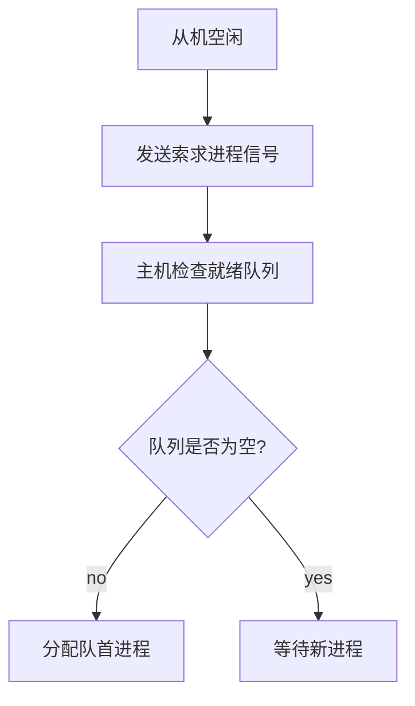

# 1 操作系统概论

## 1.1 基本概念

### 1.1.1 什么是操作系统

计算机系统自下而上可以大致分为4部分：硬件、操作系统、应用程序和用户。操作系统管理各种计算机硬件，为应用程序提供基础，并且充当计算机硬件与用户之间的中介。

操作系统（Operating System,OS）是指**控制和管理整个计算机系统的硬件与软件资源**，合理地组织、调度计算机的工作与资源的分配，进而为用户和其他软件提供方便**接口与环境**的程序集合。

操作系统是计算机系统中最基本的**系统软件**。

### 1.1.2 功能

1. **系统资源的管理**
   1. 处理机管理
      1. 多道程序环境下，处理机的管理以进程 / 线程为单位，因此对处理机的管理可以归结为对**进程**的管理。
         1. 同时，多道环境下，程序执行具有**制约性（存在竞争）和间断性**
   2. 存储器管理
      1. 内存分配与回收
   3. 文件管理
   4. 设备管理
      1. 主要是IO请求
2. **用户与硬件之间的接口**
   1. 命令接口
      1. 联机命令接口
      2. 脱机命令接口
   2. 程序接口
      1. 程序接口由一组**系统调用**（广义指令）组成，用户可以使用系统调用来请求操作系统的服务
      2. e.g. 图形用户界面 GUI，即图形接口
3. 计算机资源的扩充
   1. 纯硬件称为裸机，覆盖了软件的的机器称为扩充机器 / 虚拟机

### 1.1.3 特征

1. 并发 Concurrence
   1. 单处理机环境下，宏观上的多道程序执行（并行），在微观上表现为**分时交替执行**
      1. CPU 与 IO设备的并行是真正的并行
   2. 若要实现进程并行，需要硬件支持，如多处理机环境
2. 共享 Sharing
   1. 资源可供多个并发进程共同使用
      1. 互斥共享：**临界资源**
      2. 同时访问：微观上还是分时的
3. 虚拟 Virtual
   1. 时分复用
      1. 虚拟处理器
   2. 空分复用
      1. 虚拟存储器
4. 异步 Asynchronism
   1. 并发执行时，由于资源有限，进程的执行“走走停停”
   2. 异步的存在是的 OS 的运行处于某种随机，可能导致进程有关时间的错误
      1. 变量访问顺序不当

## 1.2 发展历程


- 最早是手工操作，属于无 OS

### 1.2.1 批处理系统

#### 单道批处理

- 16真题

将一批作业以**脱机**的方式输入磁带，配上监督程序 Monitor，使得这批作业可以一个个连续处理。

特点：

1. 自动性
2. 顺序性
3. 单道性

缺点：高速 CPU 仍需要等待低速 IO

#### 多道批处理

- 17 18 22真题

所有作业在**外存**排成队列，调度程序选择若干作业调入内存，在管理程序的控制下穿插地运行，共享系统资源。

某道程序因 IO操作而暂停时，CPU 立即转去执行另一道程序，实现系统各部件之间的并行。

特点：

1. 多道
2. 宏观上并行
3. **微观上串行**

技术实现：

1. 处理器的分配
2. 多道程序的内存分配
3. IO设备的分配
4. 大量程序 / 数据的存放和组织

优点：

1. 资源利用率高，多道共享资源
2. 吞吐量大

缺点：

1. 响应时间长
2. **不**提供人机交互
   1. 例外：18真题是有交互的多道
   2. 常考：多道的缺点是没有交互性

### 1.2.2 分时操作系统

分时技术，将处理器的运行时间分成很短的时间片，轮流分配给各联机作业。

特点：

1. 同时性 / 多路性
   1. **多用户性**
2. 交互性
3. 独立性
4. 及时性

### 1.2.3 实时操作系统

1. 硬实时系统
   1. 某个动作可以在绝对的、规定的时刻发生
      1. e.g. 飞行器控制
2. 软实时系统
   1. 能偶尔违反时间规定
      1. e.g. 订票系统

## 1.3 运行环境

### 1.3.1 处理器运行模式

- 14、21、22真题

两种程序：

1. 应用程序
   1. 用户态
2. 内核程序
   1. 内核态
   2. 可以执行**特权指令**
      1. e.g. **IO指令**、关中断、内存相关、修改状态字寄存器

注意，切换到用户态的指令也是特权指令。

**内核**是计算机的底层软件，可以视为连接应用和硬件的桥梁。

内核主要包括：

1. 时钟管理
   1. 提供时钟中断服务
      1. 18真题
2. 中断机制
   1. 中断的初衷是为了提高多道程序运行的 CPU 利用率
      1. 16真题
   2. 中断机制只有一小部分属于内核
   3. 主要负责 保护恢复中断现场、转移控制权
3. **原语**
   1. Atomic Operation 原子操作
      1. 底层可被调用的公用小程序，最接近硬件，
      2. 运行时间短、调用频繁
      3. 是一个整体，执行过程**不可中断**
   2. 定义（实现）原语的直接方法是关中断，使其所有动作**不可分割**地完成后再开中断
   3. 因为原语是内核的一部分，所以原语在**内核态**执行，常驻内存
4. 系统控制的数据结构及处理
   1. 系统DS
      1. 进程控制块 PCB、缓冲区、消息队列、各类链表、内存分配表
   2. 处理
      1. 进程管理
      2. 存储器管理
      3. 设备管理

### 1.3.2 中断和异常

- 计组：[5.5 异常和中断](计算机组成原理.md#5.5%20异常和中断)

中断（和异常）是**切换**内核态和用户态的**唯一**方式，且是**硬件**实现的。

- 硬件：用一位寄存器保存状态
- **访管中断**是用户程序主动请求操作系统内核为其提供服务时，故意触发的一种**软中断**（Trap）
  - 它是用户态 to 内核态的唯一入口
  - 换言之，访管指令是一条在**用户态**执行的指令
  - 再换言之，内核态可以执行**除了访管指令**之外的全部指令

### 1.3.3 系统调用

系统调用是 OS 提供给应用程序（程序员）的接口，可视为一种特殊的公共子程序。每个系统调用都有**唯一**的系统调用号。

系统中各种共享资源都由 OS 统一管理，所以凡是与**共享资源**有关的操作（存储分配、IO传输、文件管理），都必须通过**系统调用**的方式向 OS 提出请求。

功能：

1. 设备管理
2. 文件管理
3. 进程控制
4. 进程通信
5. 内存管理

#### 系统调用过程

- 12 17 22 23 真题

1. 用户程序首先将**系统调用号**和所需的**参数**压入堆栈
   1. 调用实际的调用指令，然后执行一个**陷入指令**（异常）
      1. **用户态 to 内核态**
   2. 由硬件和操作系统内核程序保护被中断进程的现场
      1. 将**PC、PSW及通用寄存器**内容等压入堆栈
         1. 一般的调用不需要保存 PSW
2. 分析**系统调用类型**，转入相应的系统调用处理子程序
   1. 系统中配置了一张系统调用入口表，表中的每个表项都对应一个系统调用，根据**系统调用号**可以找到该系统调用处理子程序的**入口地址**。
3. 系统调用结束后，恢复被中断的或设置新进程的CPU现场，返回被中断进程或新进程，继续往下执行。
   1. **内核态 to 用户态**

这么设计的目的是：用户程序不能直接执行对系统影响非常大的操作，必须通过系统调用的方式请求 OS 代为执行，以便保证系统的稳定性和安全性。

OS 的**运行环境**可以理解：

1. 用户通过 OS 运行上层程序
   1. e.g. 系统提供的命令解释程序或用户自编程序
2. 上层程序的运行依赖于 OS 的底层管理程序提供服务支持
   1. 当需要管理程序服务时，系统通过硬件中断机制进入内核态，运行管理程序
   2. 也可能是程序运行出现异常情况，被动地需要管理程序的服务，此时则通过异常处理进入内核态
3. 管理程序运行结束时，退出中断或异常处理程序，返回到用户程序的断点处继续执行。


一些由**用户态 to 内核态**的例子：

1. 用户程序要求操作系统的服务，即系统调用。
2. 发生一次中断。
3. 用户程序中产生了一个**错误状态**。
4. 用户程序中企图执行一条**特权指令**。

以内核态转向用户态由一条指令实现，也是特权指令。

==缺少 4. 程序的链接与装入 5. 程序运行时内存映像与地址空间

## 1.4 结构

### 1.4.1 分层法


### 1.4.2 模块化


衡量模块的独立性主要有两个标准：

- 内聚性
  - 模块内部各部分间联系的紧密程度
  - 内聚性越高，模块独立性越好
- 耦合度
  - 模块间相互联系和相互影响的程度
  - 耦合度越低，模块独立性越好

### 1.4.3 宏内核

从 OS 的内核架构来划分，可分为宏内核和微内核。

**宏内核**，也称单内核或大内核，是指将系统的主要功能模块都作为一个**紧密联系**的整体运行在**内核态**，从而用户程序提供**高性能的系统服务**。因为各管理模块之间**共享信息**，能有效利用相互之间的有效特性，所以具有无可比拟的性能优势。

主流 OS 都是基于宏内核的架构，以 Linux 为例，Linux 内核是一个非常大的、单一的二进制程序。操作系统最核心的功能，如**进程调度、内存管理、文件系统、设备驱动、网络协议栈**等，都作为内核的一部分，在**特权模式（内核态）** 下运行。

- 其实微内核和宏内核是同步发展的，目前的 OS 是一种吸收了微内核优点的混合内核

### 1.4.4 微内核

- 背景：随着 OS 提供的服务越来越复杂，设计规模急剧增长，OS 面临着软件维护问题（由于所有模块都紧密交织在一起，即强耦合，修改一个功能可能会引发一系列不可预知的副作用，使得修复bug和添加新功能变得异常困难且风险极高）

**微内核**应运而生，就是将一些**非核心的功能移到用户空间**，这种设计带来的好处是方便扩展系统，所有新服务都可以在用户空间增加，**内核基本不用去做改动**。

微内核将 OS 分为 微内核 和 多个服务器。

- **微内核**：实现了最基本核心功能的小型内核，运行在内核态
- **服务器**（进程）：OS 的大部分功能在服务器中，作为进程来实现，运行在用户态

客户与服务器之间借助**微内核提供的消息传递机制**实现交互。


微内核的基本功能：

1. 进程管理
2. 低级存储器管理
3. 中断和陷入处理

微内核的特点：（23真题）

1. 扩展性和灵活性
   1. 添加服务器代替修改内核代码
2. **可靠性**和安全性
   1. 只有微内核运行在内核态，**其余模块都运行在用户态**，一个模块中的错误只会使这个模块崩溃，而**不会使整个系统崩溃**。
   - e.g. 文件服务代码运行时出了问题：
     - **宏内核**因为文件服务是运行在内核态的，系统直接就崩溃
     - **微内核**的文件服务是运行在**用户态**的，只要将文件服务功能强行停止，系统不会崩溃
3. 可移植性
4. 分布式计算
   1. 消息传递机制很适合分布式

微内核最大的**问题**是性能，因为需要频繁地在内核态和用户态切换。

### 1.4.5 外核

外核是一种极端追求性能的虚拟化方案，其核心思想是：**内核（外核）只负责最底层的资源分配和安全保护**，而将如何管理、使用这些资源的决策权完全上交给运行在用户空间的各个**虚拟机**（或称为“库操作系统”）。

- 这就像房东（外核）只负责把房子的各个房间（CPU、内存、磁盘块）安全地租给不同的租客（虚拟机），并确保他们不会进入别人的房间。至于每个租客如何装修、布置自己的房间，房东完全不管。

外核最大的优点：减去了映射层，**省去了昂贵的重映射查表过程**，虚拟机直接使用物理地址，外核只做安全审查。

## 1.5 引导

- 21 22 真题

OS 是一种存放在硬盘中的程序，而 **OS 引导**是指 CPU 运行特定程序，识别硬盘，找到 OS 程序，启动 OS。

引导过程：

1. 激活 CPU
   1. CPU 读取 ROM 中的 boot 程序
   2. 将指令寄存器置为 BIOS 的第一条指令，开始执行 BIOS
2. 硬件自检
   1. BIOS 构建中断向量表
   2. POST（通电自检）
3. 加载带有 OS 的硬盘
4. 加载主引导记录 MBR
   1. MBR 的作用是帮助 CPU 找到 OS 所在具体的分区
5. 扫描硬盘分区表，加载活动分区
   1. MBR 包含分区表
   2. MBR 扫描分区表，识别含有 OS 的活动分区
6. 加载分区引导记录 PBR
   1. 读取活动分区的第一个扇区，这个扇区就是 PBR
7. 加载启动管理器
8. 加载 OS 到内存

## 1.6 虚拟机

主要分两类：


第一类虚拟机管理程序类似一个 OS，是**唯一**一个运行在特权级的程序。

- 虚拟机管理程序向上层提供若干虚拟机
- 虚拟机作为用户态的一个**进程**运行

第二类虚拟机管理程序是一个依赖 OS 分配和调度的程序，类似一个普通进程。

- 此时底层的 OS 称为宿主 OS

---

# 2 进程与线程

## 2.1 进程与线程

- 多道环境下，引入进程的概念，为了更好地描述和控制程序的并发执行。

进程是进程实体的**运行过程**，是系统进行资源分配和调度的独立单位。

- 进程的根本特性是**动态性**，因为进程强调一次运行过程；区别于完整的程序，程序只是静态的可执行文件

为了使每个程序独立运行，配置了一个专门的数据结构来描述和管理进程，称为**进程控制块**（Process Control Block，PCB）。

- 程序段、相关数据段、PCB构成了**进程实体**（进程映像）
- 创建进程，就是创建进程的 PCB

特征：

1. 动态性
   1. 一次执行，有生命周期
2. 并发性
3. 独立性
4. 异步性

### 2.1.1 进程组成

1. 进程控制块 PCB
   1. 进程描述信息
      1. 进程标识符 PID
      2. 用户标识符 UID
   2. 进程控制和管理信息
      1. 进程状态、优先级
   3. 资源分配清单
   4. 处理机相关信息
      1. 也称 CPU 上下文
2. 程序段
3. 数据段

### 2.1.2 进程状态与转换

- 14 15 18 23 真题

五种状态：

1. 运行态
   1. 单 CPU 中，每个时刻只有**一个**进程处于运行态
2. 就绪态
   1. 就绪态可以有很多进程，组成就绪队列
   2. 区分于阻塞：就绪态是仅等待 CPU；阻塞态不是等待CPU
3. 阻塞态 / 等待态
   1. 等待某个资源或者 IO（**不是等待 CPU**）
   2. 即使 CPU 空闲也不能运行
4. 创建态
   1. 正在创建
5. 终止态
   1. 正在结束

状态转换图：


- 运行态 to 阻塞态：进程请求资源时发生等待，转入阻塞态
  - **主动行为**
  - e.g. 主动执行信号量的 **wait** 操作
- 阻塞态 to 就绪态：等待完成，中断处理程序转换进程为就绪态
  - **被动行为**，需要协助
  - e.g. 等待其他进程用 **signal** 操作唤醒

### 2.1.3 进程控制

- 10 20 21 24 真题

#### 进程创建

允许一个进程创建另一个进程，此时创建者称父进程，被创建的进程称为子进程。

- **子进程可以继承父进程所拥有的资源**
- 当子进程终止时，应将其从父进程那里获得的资源还给父进程

在操作系统中，**终端用户登录、启动程序执行、作业调度、系统提供服务、用户程序的应用请求**等都会引起进程的创建。

- 10 真题

创建过程（创建原语）：

1. 分配唯一的进程标识号，并申请一个空白 PCB
   1. PCB 是**有限**的
   2. 若PCB 申请失败，则创建失败
2. 分配资源
   1. **内存、文件、1/O设备和 CPU 时间**等（在 PCB 中体现）
      1. 不分配 CPU
   2. 这些资源或从操作系统 / 父进程获得
   3. 若资源不足（如内存），并不是创建失败，而是处于**创建态**，等待内存资源
3. 初始化PCB
   1. 初始化标志信息、CPU状态信息、CPU 控制信息
   2. 设置进程的优先级
4. 插入就绪队列
   1. 若进程就绪队列能够接纳新进程，则将新进程插入就绪队列，等待被调度运行。

#### 进程终止

引起进程终止的事件主要有：

1. 正常结束
   1. 表示进程的任务已完成并准备退出运行
2. 异常结束
   1. 表示进程在运行时，发生了某种异常事件
   2. e.g. 存储区越界、保护错、非法指令、特权指令错、运行超时、算术运算错、1/0 故障等
3. 外界干预
   1. 进程应外界的请求而终止运行，如操作员或操作系统干预、父进程请求和父进程终止

终止过程（终止原语）：

1. 根据被终止进程的**标识符**，检索出该进程的**PCB**，从中读出该进程的状态。
2. 若被终止进程处于运行状态，立即终止该进程的执行，将CPU 资源分配给其他进程。
3. 若该进程还有子孙进程，则通常需将其所有子孙进程终止，**有些系统无此要求**。
4. 将该进程所拥有的全部资源，或归还给其父进程，或归还给操作系统。
5. 将该PCB 从所在队列（链表）中删除。

有些系统不允许子进程在父进程终止的情况下存在，对于这类系统，若一个进程终止，则它所有子进程也终止，这种现象称为**级联终止**。

#### 进程阻塞和唤醒

- 14 18 19 22 23 真题

阻塞是进程的一种**主动**行为，**只有运行态能转为阻塞态**。

阻塞过程（阻塞原语 Block）：

1. 找到 PID 对应的 PCB
2. 若为运行态，则保护线程并转为阻塞态
3. 将该 PCB 插入等待队列

所等待的数据到达时，调用唤醒原语。

唤醒过程（唤醒原语 Wakeup）：

1. 在等待队列中找到对应的 PCB
2. 转为就绪态
3. 将该 PCB 插入就绪队列

注意，Block 和 Wakeup 必须成对使用。

### 2.1.4 进程通信

- 14 真题，新修

后文提到的 PV 操作是低级通信方式，本小节介绍高级通信方式。

1. 共享存储
   1. 进程之间直接设置一块共享存储空间，作信息交换
2. 消息传递
   1. 数据交换以格式化消息 Message 为单位
   2. 很好地支持分布式系统
   3. 分为直接、间接（利用中间实体传递）
   4. e.g. 微内核与服务器
3. **管道通信**
   1. 管道是一个特殊的**共享文件**，即 pipe 文件
      1. 只能由创建进程访问，子进程继承父进程的管道
   2. FIFO；生产者-消费者方式通信
   3. **只允许单向通信**；双向需要两根管道
   4. 读数据是**一次性**的，读完即释放
   5. 互斥：只有一个进程读写（**可以有多个读写**），其余**阻塞**
   6. 同步：管道满则阻塞
4. 信号
   1. 通知进程发生某事件的机制
   2. 在进程的 PCB 中，至少 n 位向量记录该进程的待处理 / 被阻塞信号
   3. CPU 只在**进程从内核态返回用户态之前**处理信号
      1. 更具体地说，是在**一次系统调用、中断或异常处理完成之后，即将恢复进程在用户态的上下文并继续执行之前**，内核会检查**该进程的 PCB**，看是否有待处理的信号。

### 2.1.5 线程

线程类似轻量级进程：

- 是一个基本的 CPU 执行单位
- 是程序执行流的**最小单位**
- 是进程中的一个实体

线程由 线程ID、PC、寄存器集合、堆栈 组成。

线程自己不拥有系统资源，只拥有一点儿在运行中必不可少的资源，但它可与同属一个进程的其他线程**共享进程所拥有的全部资源**。

一个线程可以创建和撤销另一个线程，**同一 / 不同进程**中的多个线程之间都可以**并发执行**（注意，并发不等于并行）。

- 由于线程之间相互制约，致使线程在运行中呈现出间断性
- 线程也有就绪、阻塞和运行三种基本状态。

补充：并发和并行的区别

- **并发**：多个任务**同时开始、交替执行**，强调的是系统处理多个任务的**能力**。
- **并行**：多个任务**同时执行**，强调的是同时执行多个任务的**手段**。

#### 线程和进程的比较

1. 调度方面
   1. 线程切换代价小
2. 并发性
3. 资源方面
   1. 线程不拥有系统资源
4. 独立性
   1. 每个进程都拥有**独立**的地址空间和资源，除了共享全局变量，不允许其他进程访问。
   2. 某个进程中的**线程**对其他进程不可见。
   3. 同一进程中的不同线程是为了提高并发性及进行相互之间的合作而创建的，它们**共享进程的地址空间和资源**。
   4. 线程虽然不能脱离进程单独运行，但是线程包含 CPU 现场，可以独立执行程序。（王道小题）
5. 系统开销
   1. 线程系统开销小
6. 多线程支持多处理器系统
   1. 对于传统单线程进程，不管有多少个 CPU，进程只能运行在一个 CPU上
   2. 对于**多线程进程**，可将进程中的多个线程分配到多个 CPU 上执行

#### 线程的属性

1. 线程是一个轻型实体，不拥有系统资源，但每个线程都应有一个**唯一的标识符**和一个线程控制块，线程控制块记录线程执行的寄存器和栈等现场状态。
   1. **一个线程只可以属于一个进程**
2. 不同的线程可以执行相同的程序，即同一个服务程序被不同的用户调用时，操作系统将它们创建成不同的线程。
3. 同一进程中的各个线程**共享该进程所拥有的资源**。
4. **线程是 CPU 的独立调度单位**，多个线程是可以**并发**执行的。在单 CPU 的计算机系统中，各线程可交替地占用 CPU；在多 CPU 的计算机系统中，各线程可同时占用不同的 CPU，若各个 CPU 同时一个进程内的各线程服务，则可缩短进程的处理时间。
5. 一个线程被创建后，便开始了它的生命周期，直至终止。
6. 提高系统并发性：线程切换时，有可能**不发生进程切换**，平均而言每次切换所需的开销就变小了。

#### 线程的控制

类似进程，有一个线程控制块 TCB，包含：

- 线程标识符
- 寄存器（PC、状态、通用）
- 运行状态
- 优先级
- 线程存储区
- 堆栈

注意，**同一进程的所有线程**可以访问进程的地址空间和全局变量；同时，每个线程有自己的堆栈，**互不共享**

- 24 真题

通常，线程终止后**不立即释放资源**，只有执行了分离函数后，被终止线程才释放资源。

#### 线程的实现

线程分为两类：

1. 用户级线程 ULT
   1. 也称**线程库支持的线程**
   2. 对 OS 透明
      1. 所以用户级的 TCB **不是 OS 分配的**，是由库函数维护
   3. 优点
      1. 线程切换不需要转换到内核空间，**系统开销小**
      2. 调度算法可以是进程专用的，不同的进程可根据自身的需要，对自己的线程选择不同的调度算法
      3. 用户级线程的实现**与操作系统平台无关**，对线程管理的代码是属于用户程序的一部分。
   4. 缺点
      1. 因为内核给一个进程分配一个 CPU，而用户级线程是一个进程控制多个线程，所以一个进程中至多有一个线程的执行，**无法并行**
         1. 自然地，进程中的某个线程阻塞，则**整个进程阻塞**，即其他用户级线程都阻塞
2. 内核级线程 KLT
   1. 也称**内核支持的线程**
   2. 优点
      1. 内核调度能发挥出多 CPU 的优势，可以调度同一进程的**多线程并行**
      2. 内核线程有很小的数据结构，**线程切换开销小**
   3. 缺点
      1. **系统开销大**


#### 多线程模型

1. **多对一模型**
   1. 多个用户级线程映射到一个内核级线程
   2. 优点：线程管理是在用户空间进行的，无须切换到内核态，因此效率比较高。
   3. 缺点：若一个线程在访问内核时发生阻塞，则**整个进程都会被阻塞**
      1. 在任何时刻，只有一个线程能够访问内核，**多个线程不能同时在多个 CPU 上运行**，因为多个线程都是对应一个内核级线程（对应一个内核）。
      2. 这点类似用户级线程的缺点，**本质**是因为多用户级线程映射到一个内核级线程 与 一个进程控制多用户级线程是相似的。
2. **一对一模型**
   1. 将每个用户级线程映射到一个内核级线程
   2. 线程切换由内核完成，需要切换到内核态
   3. 优点：当一个线程被阻塞后，允许调度另一个线程运行，所以**并发能力较强**。
   4. 缺点：每创建一个用户线程，相应地就需要创建一个内核线程，开销较大。
3. **多对多模型**
   1. 将 n 个用户级线程映射到 m 个内核级线程上，要求 n≥m
   2. 特点：既克服了多对一模型并发度不高的缺点，又克服了一对一模型的一个用户进程占用太多内核级线程而开销太大的缺点。此外，还拥有上述两种模型各自的优点。

## 2.2 CPU 调度

### 2.2.1 调度

调度：按照算法选择进程分配给 CPU，实现并发。

三级调度：

1. 高级调度 / **作业调度**
   1. 辅存与内存之间
   2. 后备队列 to 就绪队列
2. 中级调度 / **内存调度**
   1. 外存与内存之间
   2. 挂起队列 to 就绪队列
3. 低级调度 / **进程调度**
   1. 就绪队列 to 运行态
   2. **频率最高**、最低级


### 2.2.2 调度的实现

#### 调度程序

- 也称调度器
- 是 OS **内核**程序

由排队器、分派器、上下文切换器组成。


#### 调度过程

- 12 21真题

可以进行进程调度的情况：

1. **创建新进程**后，父子进程都处于就绪态，调度程序选一个先运行。
   1. 不是必然的
2. 当前**进程结束**后，**必须**从就绪队列中选择一个进程运行。
   1. 若没有就绪进程，则运行一个闲逛进程
3. 当前进程因 IO请求、信号量操作或其他原因**阻塞**时，**必须**调度其他进程运行。
4. 运行进程出错。
5. （IO设备就绪后）发出 IO中断时，原先等待 IO 的进程由阻塞态 to 就绪态，此时需要选择 新就绪的进程 或者 中断发生时运行的进程 运行。
6. 优先级更高的进程强行剥夺 CPU。

**不能**进行进程调度的情况：

1. **处理中断的过程中**
2. 完全屏蔽中断的原子操作
   1. e.g. 锁相关、中断保护、恢复

#### 调度方式

1. 非抢占式
2. 抢占式
   1. 主要遵循 优先权、短进程、时间片原则

### 2.2.3 调度的目标

- 真题

#### CPU 利用率

$$
\text{CPU utilization} = \frac{\text{CPU有效工作时间}}{\text{CPU有效工作时间} + \text{CPU空闲等待时间}}
$$

- 注意，CPU 与设备、设备与设备之间是可以并行的。

#### 系统吞吐量

单位时间内 CPU 完成的作业数量，长作业耗时长，降低吞吐量。

#### 周转时间

**周转时间** 指的是从一个作业**提交给系统**开始，到该作业**执行完成**所经历的全部时间。

$$
\text{周转时间} = \text{作业完成时间} - \text{作业提交时间}
$$

$$
\text{带权周转时间} = \frac{\text{周转时间}}{\text{实际运行时间}}
$$

#### 等待时间

字面意思，完成之前所有等待的时间，可能有多段。衡量一个调度算法的优劣，常常只需简单地考察等待时间。

#### 响应时间

从用户提交请求到系统首次产生响应所用的时间。

在交互式系统中，周转时间不是最好的评价准则，一般采用**响应时间**作为衡量调度算法的重要准则之一。从用户角度来看，调度策略应尽量降低响应时间，使响应时间处在用户能接受的范围之内。

### 2.2.4 进程切换

- 23 24 真题
- 进程切换的重点在于**上下文切换**

对通常的进程而言，其创建、撤销及要求由系统设备完成的 IO 操作，都是**利用系统调用进入内核**，再由内核中的相应处理程序予以完成的。

**进程切换同样是在内核的支持下实现的**，因此可以说，任何进程都是在操作系统内核的支持下运行的。

切换 CPU 到另一个进程需要保存当前进程状态并恢复另一个进程的状态，这个任务称为**上下文切换**。

- 已知进程切换在内核态，上下文切换肯定也在内核态

**进程上下文采用 PCB 表示**，包括 CPU 寄存器的值、进程状态和内存管理信息等。

#### 上下文切换

具体流程：

1. 挂起一个进程，将 CPU 上下文保存到 PCB
   1. 包括程序计数器和其他寄存器
2. 将进程的 PCB 移入相应的队列
   1. e.g. 就绪、在某事件阻塞等队列
3. 选择另一个进程执行，并更新其 PCB
4. 恢复新进程的CPU 上下文
5. 跳转到新进程 PCB 中的程序计数器所指向的位置执行

上下文切换的消耗：

- 上下文切换通常是计算密集型的，即它需要相当可观的CPU 时间，在每秒几十上百次的切换中，每次切换都需要纳秒量级的时间，所以**上下文切换对系统来说意味着消耗大量的CPU 时间**。
- 有些 CPU 提供多个寄存器组，这样，上下文切换就只需要**简单改变当前寄存器组的指针**。

#### 上下文切换与模式切换

- 用户进程最开始都运行在用户态，若进程因中断或异常进入内核态运行，执行完后又回到用户态刚被中断的进程运行。

用户态 to 内核态，称为**模式切换**，而不是上下文切换，因为没有改变当前的进程。**上下文切换只能发生在内核态**，它是多任务操作系统中的一个必需的特性。

**模式切换**与上下文切换是不同的，模式切换时，CPU 逻辑上可能还在执行同一进程。

### 2.2.5 CPU 调度算法

- 真题

#### FCFS

先来先服务，优先选择最早进入队列的进程。

- 不可抢占算法
- 对短作业不利，很多后来的短作业卡着
- **效率低**：利于 CPU 繁忙型作业，**不利于 IO 繁忙型**
  - CPU 繁忙型是指占用 CPU 时间长的作业
    - 类似长作业，FCFS 适合长作业
  - IO 繁忙型是指频繁调用 IO 的作业
    - IO 繁忙型需要频繁让出 CPU，不适合 FCFS
- **系统开销最小**，最简单

#### SJF

短作业优先，优先选择运行时间最短的作业。

- 也称最短剩余时间优先算法
- 默认不可抢占，不一定
- 对长作业不利，产生**饥饿现象**

#### 高响应比优先

综合了 FCFS 和 SJF，同时考虑每个作业的**等待时间和（估计）运行时间**，计算响应比，克服了饥饿现象。

- 默认不可抢占

**响应比**的计算公式为：

$$
R_p = \frac{\text{等待时间} + \text{要求服务时间}}{\text{要求服务时间}}
$$

#### 优先级调度

按优先级，有抢占 / 非抢占、静态 / 动态优先级等。

进程优先级设置：

1. 系统 > 用户
2. 交互型 > 非交互型
3. **IO型** > 计算型

#### RR

时间片轮转算法，适用于分时系统，特点是**公平**。

所有就绪进程按照 FCFS 排队，然后每隔一定时间产生一次**时钟中断**（时间片轮转）。

- **时钟中断发生后，系统会修改当前进程在时间片内的剩余时间**
  - 时间片用完（剩余时间为0），则进程立刻被释放
  - 时间片尚未用完，但进程已完成，则**调度程序被立刻激活**。
- **时间片大小**对性能影响很大
  - 很大，则退化为 FCFS
  - 很小，则 CPU 频繁切换，开销大
  - 影响时间片的主要因素包括：响应时间、进程数量、系统开销

#### 多级队列调度

综合 RR 和 优先级调度，**动态调整时间片大小和优先级**。


- 每个队列采用 FCFS
- 优先级越高的队列，时间片越短
- 核心规则：
  - **一个进程在用完一次时间片之后，下放到低一级队列的末尾**
  - 按队列优先级调度：第1级空了才能调度第2级

总结：


#### 基于公平原则的调度

1. 保证调度
   1. 若系统中有 n 个用户登录，则每个用户都保证获得 1/n 的 CPU 时间；若在单用户系统中有 n 个进程正在运行，则每个进程都保证获得 I/n 的 CPU 时间。
2. 公平分享调度
   1. 保证所有用户获得相同的 CPU 时间

### 2.2.6 多处理机调度

多处理机系统的调度较单处理机系统复杂，与**系统结构**密切相关。

#### 系统架构类型

1. 非对称多处理机（AMP）

- 主从式操作系统
- **调度方式**：
  - 内核驻留在主机
  - **从机**只运行用户程序
  - 进程调度由**主机**负责
- **工作流程**：



- **缺点**：主机易成为系统瓶颈

2. 对称多处理机（SMP）

- 所有处理机相同
- **调度方式**
  - 调度程序可将任何进程分配给任何CPU
- 本节主要讨论 SMP 系统的调度问题

#### 核心调度问题

1. 处理器亲和性
   1. 让进程运行在同一个CPU上的特性
2. 负载平衡
   1. 将负载平均分配到所有CPU上

目标：避免 CPU 空闲与高负载并存的情况

#### 多处理机调度方案

1. 公共就绪队列
   1. 所有CPU共享一个就绪队列
   2. 良好的负载平衡
      1. CPU空闲时立即获取进程
   3. **处理器亲和性差（进程频繁迁移）**
2. 私有就绪队列
   1. 每个CPU有自己的就绪队列
   2. 良好的处理器亲和性
   3. 需要额外的负载平衡机制

## 2.3 同步与互斥

- 重点

多道环境下，进程是并发的 且 不同进程之间存在制约关系，为了协调制约，引入了进程同步的概念。

### 2.3.1 基本概念

#### 临界资源

临界资源：同一时刻只能为一个进程所用的资源。

- e.g. 打印机、共享变量、数据

必须**互斥**地访问临界资源，在每个进程中，访问临界资源的代码称作**临界区**。

访问临界资源的过程：

1. 进入区
   1. 检查是否可以进入临界区
      1. 若可以，则设置访问临界区的标志，阻止其他进程同时进入临界区
2. 临界区
   1. 访问临界资源的代码
3. 退出区
   1. 清除之前设置的访问临界区标志
4. 剩余区
   1. 剩余部分

#### 同步

- 也称 直接制约关系
- **本质是合作**

同步：为同一任务服务的多个进程在合作中需要**协调运行次序**而产生的制约关系。

e.g. 输入进程 A 通过单缓冲向进程 B 提供数据：

- 当该缓冲区空时，进程 B 不能获得所需数据而阻塞，一旦进程 A 将数据送入缓冲区，进程 B 就被唤醒。
- 反之，当缓冲区满时，进程 A 被阻塞，仅当进程 B 取走缓冲数据时，才唤醒进程A。
- 重点在于运行次序

#### 互斥

- 也称 间接制约关系
- **本质是竞争**

互斥：同一时刻只有一个进程可以访问**临界资源**，其余进程必须等待。

**互斥准则**：前两个规定临界区，后两个规定进程

1. 空闲让进
   1. 临界区空闲则让进
2. 忙则等待
   1. 临界区忙则等待
3. 有限等待
   1. 进程不能无限等待
4. 让权等待（非必须）
   1. **进程不能进入临界区时，需要释放 CPU，防止忙等待**

### 2.3.2 互斥的实现

#### 软件实现

设置标志表明临界区是否有进程。

1. 单标志法
   1. 设置一个公用变量，表示**允许进入**临界区的进程编号
      1. 不能表示临界区空
   2. 不满足空闲让进
      1. 本质问题是临界区空闲时，只能让**指定**的进程进入
      2. 
2. 双标志先检查法
   1. 设置一个 bool 数组，表示各个进程进入临界区的意愿
   2. 
3. 双标志后检查法
   1. 先设置后检查
   2. 还是有问题，标志全是 true，大家都会饥饿
4. Peterson 算法
   1. 比前三个好，**通过 turn 谦让的机制，解决了饥饿问题**，但仍未遵循让权等待
   2. 

#### 硬件实现

1. 中断屏蔽方法（关中断）
   1. 屏蔽中断直接破坏了依靠进程切换（[调度过程](操作系统.md#调度过程)）实现的并发，限制了 CPU 交替执行作业的能力（并发），**效率降低**！
2. 硬件指令方法
   1. TSL指令
      1. TestAndSetLock指令是原子操作，功能是读出指定**标志**并置为 true
      2. **自旋**
      3. 
   2. Swap指令
      1. 类似 TS

### 2.3.3 互斥锁

- Mutex Lock

一个进程进入临界区时，调用 `acquire()` 获得锁；退出临界区时，调用 `release()` 释放锁。每个互斥锁有一个 bool 变量表示锁是否可用。

`acquire()` 和 `release()` 都是**原子操作**，不可被中断，因此互斥锁一般用硬件实现。

上述互斥锁是**自旋锁**，缺点是**忙等待**。

- 自旋：在一个小循环中不断地检查锁的状态
- 忙等待：当进程在调用 `acquire()` 时发现锁被占用，**不会释放CPU**，而是会持续执行一个循环（自旋），不断地检查锁是否被释放。

### 2.3.4 信号量

信号量机制用于解决同步、互斥问题，可以被 `wait()` 和 `signal()` 访问，简写为 PV操作。

- PV操作可以理解为消耗和生产资源

#### 信号量的含义

1. 整型信号量
   1. 表示资源数量 $S$
   2. `wait()` 操作在 $S \leq 0$ 时，会不断循环测试，陷入**忙等待**
      1. 未遵守让权等待
2. 记录型信号量
   1. 在整型基础上，再加一个进程链表，用于记录所有等待该资源的进程
   2. **避免了忙等待的问题**

遵循**让权等待**的互斥方法的 `wait(S)` 和 `signal(S)` 的操作如下：

- 调用了 `block` 做自我阻塞

```c
void wait(semaphore S) { // 相当于申请资源
    S.value--;   // 注意此处，是先减1，再判断value大小
    if (S.value < 0) {
        add this process to S.L;
        block(S.L);
    }
}
```

对信号量 $S$ 的一次 $P$ 操作，表示进程请求一个该类资源，因此执行 `S.value--`，使系统中可供分配的该类资源数减 1。

当 `S.value < 0` 时，表示该类资源已分配完毕，因此应调用 `block` 原语进行**自我阻塞**，主动放弃 CPU，并插入该类资源的等待队列 $S.L$（等待后续唤醒）。

- **运行态 → 阻塞态**

```c
void signal(semaphore S) { // 相当于释放资源
    S.value++;
    if (S.value <= 0) {
        remove a process P from S.L;
        wakeup(P);
    }
}
```

对信号量 $S$ 的一次 $V$ 操作，表示进程释放一个该类资源，因此执行 `S.value++`，使系统中可供分配的该类资源数加 1。

若加 1 后仍是 `S.value <= 0`，则表示仍有进程在等待该类资源，因此应调用 `wakeup` 原语将 $S.L$ 中的第一个进程唤醒。

- **阻塞态 → 就绪态**

#### 信号量机制的使用

**互斥**操作中，PV操作必须成对出现：


**同步**操作中，目的是**有序执行**，因此**设置初始** $S = 0$，假如要求 P1 P2 的顺序来执行，则代码规定 P1 生产资源（V操作），P2消耗资源（P操作），这样 $S$ 的设置恰能保证有序执行。


e.g. 信号量实现前驱关系


### 2.3.5 经典同步问题

- 大题

#### 生产者-消费者

1. 互斥：生产者和消费者对缓冲区的访问是互斥的
2. 同步：按照生产-消费的顺序

e.g. 桌子上有一个盘子，每次只能向其中放入一个水果。爸爸专向盘子中放苹果，妈妈专向盘子中放橘子，儿子专等吃盘子中的橘子，女儿专等吃盘子中的苹果。只有盘子为空时，爸爸或妈妈才可向盘子中放一个水果；仅当盘子中有自己需要的水果时，儿子或女儿可以从盘子中取出。

伪代码：

```c
dad() {
    while(1) {
        准备一个苹果;    // 生产操作
        P(plate);       // 申请盘子使用权（互斥向盘中取、放水果）
        把苹果放入盘子;  // 临界区操作
        V(apple);       // 释放苹果资源（允许取苹果）
    }
}

mom() {
    while(1) {
        准备一个橘子;
        P(plate);
        把橘子放入盘子;
        V(orange);
    }
}

son() {
    while(1) {
        P(orange);      // 申请橘子资源（互斥向盘中取橘子）
        从盘子中取出橘子; // 临界区操作
        V(plate);       // 释放盘子资源（允许向盘中取、放水果）
        吃掉橘子;       // 消费操作
    }
}

dau() {
    while(1) {
        P(apple);
        从盘子中取出苹果;
        V(plate);
        吃掉苹果;
    }
}
```

#### 读者-写者

互斥：

1. 读者 写者
2. 写者 写者

读优先方案：

1. 第一个读者要判断是否互斥，非第一个读者不用判断。
2. 读优先：**有一个读者之后，读者始终优先于写者**
   1. 代码分析：从有第一个读者开始，读者占据`rw`，直到 `count == 0` 时，最后一个读者读完才把 `rw` 释放，才能有写者访问。

```c
int count=0;          //用于记录当前的读者数量
semaphore mutex=1;    //用于保护更新 count 变量时的互斥
semaphore rw=1;       //用于保证读者和写者互斥地访问文件

writer() {            //写者进程
    while (1) {
        P(rw);        //互斥访问共享文件
        写文件;
        V(rw);        //释放共享文件
    }
}

reader() {            //读者进程
    while (1) {
        P(mutex);     //互斥访问 count 变量
        if (count==0) //当第一个读进程读共享文件时
            P(rw);    //阻止写进程写
        count++;      //读者计数器加 1
        V(mutex);     //释放互斥变量 count

        读文件;

        P(mutex);     //互斥访问 count 变量
        count--;      //读者计数器减 1
        if (count==0) //当最后一个读进程读完共享文件
            V(rw);    //允许写进程写
        V(mutex);     //释放互斥变量 count
    }
}
```

读写公平：

- 也成为写相对优先
- 读写者都额外加一对PV操作 `P/V(w)`，使得读写地位平等

```c
int count=0;          //用于记录当前的读者数量
semaphore mutex=1;    //用于保护更新 count 变量时的互斥
semaphore rw=1;       //用于保证读者和写者互斥地访问文件
semaphore w=1;        //用于实现"写相对优先"

writer() {            //写者进程
    while(1){
        P(w);         //在无写进程请求时进入
        P(rw);        //互斥访问共享文件
        写文件;
        V(rw);        //释放共享文件
        V(w);         //恢复对共享文件的访问
    }
}

reader() {            //读者进程
    while(1){
        P(w);         //在无写进程请求时进入
        P(mutex);     //互斥访问 count 变量
        if(count==0)  //当第一个读进程读共享文件时
            P(rw);    //阻止写进程写
        count++;      //读者计数器加 1
        V(mutex);     //释放互斥变量 count
        V(w);         //恢复对共享文件的访问

        读文件;

        P(mutex);     //互斥访问 count 变量
        count--;      //读者计数器减 1
        if(count==0)  //当最后一个读进程读完共享文件
            V(rw);    //允许写进程写
        V(mutex);     //释放互斥变量 count
    }
}
```

#### 哲学家进餐

问题描述：一张圆桌边上坐着5名哲学家，每两名哲学家之间的桌上摆一根筷子，两根筷子中间是一碗米饭，哲学家们倾注毕生精力用于思考和进餐，哲学家在思考时，并不影响他人。只有当哲学家饥饿时，才试图拿起左、右两根筷子（一根一根地拿起）。若筷子已在他人手上，则需要等待。饥饿的哲学家只有同时拿到了两根筷子才可以开始进餐，进餐完毕后，放下筷子继续思考。


避免死锁的算法：

- 加一个 `mutex` 使得**取筷子**这件事互斥，便不会有所有人同时取一边的死锁情况了

```c
semaphore chopstick[5]={1,1,1,1,1}; //初始化信号量
semaphore mutex=1;                   //设置取筷子的信号量

Pi() {                               //i号哲学家的进程
    do {
        P(mutex);                    //重点：在取筷子前获得互斥量
        P(chopstick[i]);             //取左边筷子
        P(chopstick[(i+1)%5]);       //取右边筷子
        V(mutex);                    //释放取筷子的信号量

        进餐;

        V(chopstick[i]);             //放回左边筷子
        V(chopstick[(i+1)%5]);       //放回右边筷子

        思考;
    } while(1);
}
```

### 2.3.6 管程

管程是一种**进程同步工具**，保证进程互斥，无需程序员自己实现互斥，降低了死锁的概率。同时，管程提供了**条件变量**，可以让程序员灵活地实现进程同步。

**管程（monitor）**：利用共享数据结构抽象地表示系统中的**共享资源**，而将对该数据结构实施的**操作**定义为一组过程。

- 包括进程对共享资源的申请、释放等操作
- 根据资源情况，或接受或阻塞进程的访问
  - 确保每次仅有一个进程使用共享资源，实现进程互斥
  - **管程每次只允许一个进程进入**

管程定义了**一个数据结构**和**能为并发进程所执行（在该数据结构上）的一组操作**。

管程由4部分组成：

1. 管程的名称
2. 局部于管程内部的共享数据结构说明
3. 对该数据结构进行操作的一组过程（或函数）
4. 对局部于管程内部的共享数据设置初始值的语句

管程就像一个类（class），封装了一个数据结构和相关的一些操作，定义如下：


#### 条件变量

- 18 真题

当一个进程进入管程后被阻塞，直到**阻塞的原因**解除时，在此期间，若该进程不释放管程，则**其他进程无法进入管程**。其中，将阻塞原因定义为**条件变量 condition**。

通常，一个进程被阻塞的原因可以有多个，因此在管程中设置了**多个条件变量**。每个条件变量保存了一个**等待队列**， 用于记录因该条件变量而阻塞的所有进程，对条件变量只能进行两种操作，即 `wait` 和 `signal`。

```c
monitor Demo{
   共享数据结构 S;
   condition x;       //定义一个条件变量

   init_code(){ ... }

   take_away(){
      if(S<=0) x.wait();    //资源不够，在条件变量x上等待
      // 阻塞该进程，并加入x的阻塞队列
      资源足够，分配资源，做一系列相应处理；
   }

   give_back(){
      归还资源，做一系列相应处理；
      if(有进程在等待) x.signal();    //唤醒一个等待进程
   }
}
```

条件变量和信号量的比较：

- 相似点
  - 条件变量的 `wait/signal` 操作类似于信号量的 P/V 操作，可以实现进程的阻塞/唤醒
    - 且 条件变量的 `wait` 有阻塞队列
- 不同点
  - 条件变量是**没有值**的，仅实现了**排队等待**的功能
  - 信号量是**有值**的，信号量的值反映了剩余资源数
  - 在管程中，剩余资源数用共享数据结构记录

## 2.4 死锁

- 死锁：**每个**进程都在等待
  - 多个进程的概念
- 饥饿：**一个**进程在信号量内无穷等待
  - 单个进程的概念

饥饿不一定死锁，比如长作业在很长时间内（甚至无限期）因为短作业而被推迟，这并不是死锁。

### 2.4.1 原因

#### 系统资源的竞争

通常是指系统中的**不可剥夺资源**，e.g. 磁带机、打印机，其数量不足以满足多个进程的运行。

**只有对不可剥夺资源的竞争才可能产生死锁。**

#### 进程顺序非法

请求和释放资源的**顺序不当**会导致死锁。

e.g. 进程 P1 P2 分别保持了资源 R1 R2， 而 P1 申请资源 R2，P2 申请资源 R1 时，两者都会因为所需资源被占用而阻塞，于是导致死锁。

信号量使用不当也会造成死锁（信号量其实也是一种资源）。进程间彼此相互等待对方发来的消息，也会使得这些进程无法继续向前推进。

e.g. 进程 A 等待进程 B 发的消息，进程 B 又在等待进程 A 发的消息，可以看出进程 A 和 B 不是因为竞争同一资源，而是在顺序不当导致等待对方的资源，最终死锁。

### 2.4.2 必要条件

同时满足 4 条才会发生死锁：

1. **互斥条件**
   1. 资源是互斥的
2. **不可剥夺条件**
   1. 进程占用的资源不能被抢占，只能主动释放
3. **请求并保持条件**
   1. 进程已经保持了至少一个资源，同时又在请求新资源
4. **循环等待条件**
   1. 存在进程资源的循环等待链
   2. 只是必要条件，不是充分条件
      1. 

### 2.4.3 处理策略

| 资源分配策略 | 各种可能模式                                                               | 主要优点                                     | 主要缺点                                                 |
| ------------ | -------------------------------------------------------------------------- | -------------------------------------------- | -------------------------------------------------------- |
| 死锁**预防** | 保守，宁可资源闲置<br />一次请求所有资源，资源剥夺，资源按序分配           | 适用于突发式处理的进程，不必进行剥夺         | 效率低，初始化时间延长；剥夺次数过多；不便灵活申请新资源 |
| 死锁**避免** | 是预防和检测的折中（在运行时判断是否可能死锁）<br />寻找可能的安全允许顺序 | 不必进行剥夺；**性能较好**                   | 必须知道将来的资源需求，进程不能被长时间阻塞             |
| 死锁**检测** | 宽松，只要允许就分配资源<br />定期检查死锁是否已经发生                     | 不延长进程初始化时间，允许对死锁进行现场处理 | 通过剥夺解除死锁，造成损失                               |

#### 死锁预防

破坏死锁的4个必要条件的其中几个。

1. 破坏互斥
   1. 将只能互斥使用的资源改成允许共享使用
2. 破坏不可剥夺
   1. 请求新资源得不到满足时，必须释放已经保持的资源
   2. 缺点：反复申请释放增加系统开销
3. 破坏请求并保持
   1. 要求进程在请求时不能持有不可剥夺资源
      1. 预先静态分配：进程在运行钱一次申请完它所需要的全部资源
      2. 逐步释放：获取初期资源后开始运行，运行过程中逐步释放用完的资源，再请求
4. 破坏循环等待
   1. **顺序资源分配法**：给资源编号，进程必须按照递增（顺序）请求资源，所以请求大号必须持有小号，已经持有大号的进程不可能请求小号，预防了死锁

#### 避免死锁

同样属于事先预防策略，但是不是事先破坏死锁条件，而是在资源的**动态分配**过程中，防止系统进入死锁。

- 优点：较好的系统性能

1. 确定**安全状态**
   1. 在资源分配前，先确定系统是否安全。
   2. 安全状态：系统能按照某种进程顺序分配资源，满足每个进程的最大需求
   3. 
2. **银行家算法**
   1. 进程运行前先声明对各种资源的最大需求量，数量不超过系统的资源总量。
   2. OS 在分配资源之前，先确定是否有足够资源分配给进程，在确定分配之后是否会处于**不安全状态**。

#### 银行家算法

假设系统中有 $n$ 个进程，$m$ 类资源，在银行家算法中需要定义下面 4 个数据结构。

1. **可利用资源向量 Available**：含有 $m$ 个元素的数组，其中每个元素代表一类可用的资源数量。
   1. `Available[j] = K` 表示此时系统中有 $K$ 个 $R_j$ 类资源可用。
2. **最大需求矩阵 Max**：$n \times m$ 矩阵，定义系统中 $n$ 个进程中的每个进程对 $m$ 类资源的最大需求。
   1. `Max[i,j] = K` 表示进程 $P_i$ 需要 $R_j$ 类资源的最大数量为 $K$。
3. **分配矩阵 Allocation**：$n \times m$ 矩阵，定义系统中每类资源当前已分配给每个进程的资源数。
   1. `Allocation[i,j] = K` 表示进程 $P_i$ 当前已分得 $R_j$ 类资源的数量为 $K$。
4. **需求矩阵 Need**：$n \times m$ 矩阵，表示每个进程接下来最多还需要多少资源。
   1. `Need[i,j] = K` 表示进程 $P_i$ 还需要 $R_j$ 类资源的数量为 $K$。

上述三个矩阵间存在下述关系：

$$Need = Max - Allocation$$

通常，Max 矩阵和 Allocation 矩阵是题中的已知条件，而求出 Need 矩阵是解题的第一步。

##### 银行家算法描述

设 `Request` 是进程 $P_i$ 的请求向量，`Request[j] = K` 表示进程 $P_i$ 需要 j 类资源 $K$ 个。当 $P_i$ 发出资源请求后，系统按下述步骤进行检查：

1. 若 `Request[j] <= Need[i,j]`，则转向步骤2；否则认为出错，因为它所需要的资源数已超过它所宣布的最大值。
2. 若 `Request[j] <= Available[j]`，则转向步骤3；否则，表示尚无足够资源，$P_i$ 必须等待。
3. 系统试探着将资源分配给进程 $P_i$，并修改下面数据结构中的数值：

```python
Available = Available - Request;
Allocation[i,j] = Allocation[i,j] + Request[j];
Need[i,j] = Need[i,j] - Request[j];
```

4. 系统执行安全性算法，检查此次资源分配后，系统是否处于安全状态。若安全，才正式将资源分配给进程 $P_i$，以完成本次分配；否则，将本次的试探分配作废，恢复原来的资源分配状态，让进程 $P_i$ 等待。

##### 安全性算法

- 重点

设置工作向量 `Work`，表示**当前的剩余可用资源数量**，其实就是一个不断更新的 `Available`，它有 m 个元素，在执行安全性算法前，令 `Work =Available`。

1. 初始时安全序列为空。
2. 从 `Need` 矩阵中找出符合下面条件的行，将对应的进程加入安全序列；若找不到，则执行步骤4。
   1. 该行对应的进程不在安全序列中，而且该行小于或等于 `Work`
3. 进程 P 进入安全序列后，当作顺利完成，**释放分配给它的资源，加到工作向量**，所以应执行 `Work = Work + Allocation[i]`，返回步骤2。
4. 若此时安全序列中己有所有进程，则系统处于安全状态，否则系统处于不安全状态。

e.g. 例题辅助理解


#### 死锁检测

可以用**资源分配图**来检测系统是否处于死锁状态。


- 对于资源结点，**出边是已分配资源，入边是进程的请求**
- 简化的过程就是尝试满足进程请求，消除入边，进而消除进程结点及其占用
- a b c 是一次完全简化的过程

**死锁定理**：当且仅当资源分配图是**不可完全简化**的时，发生死锁。

#### 死锁解除

1. 资源剥夺
   1. 挂起死锁进程，抢占其资源
2. 撤销进程
   1. 强制撤销死锁进程，剥夺资源
3. 进程回退
   1. 让死锁进程回退，使其**在回退时自愿释放资源**而非剥夺
   2. 需要保留历史，设置还原点

---

# 3 内存管理

## 3.1 内存管理基础

### 3.1.1 基本概念

内存管理的主要功能：

1. 内存空间的分配与回收
2. 地址转换
3. 内存空间的扩充
4. 内存共享
5. 存储保护

#### 逻辑地址 物理地址

- **逻辑地址**：每个模块从 0 开始编址，称为逻辑地址 / 相对地址 /虚拟地址
  - 进程运行时，看到的和使用的地址都是逻辑地址
  - 用户只需要知道逻辑地址
- **物理地址**：内存中物理单元的地址
  - 是地址转换的最终地址
  - 进程通过物理地址从**主存**中存取
  - **地址重定位**：装入程序将可执行代码装入内存时，必须通过地址转换将逻辑地址转换为物理地址

OS 通过**内存管理部件**（MMU），将逻辑地址转换为物理地址。

#### 链接 装入

创建进程首先需要**将程序和数据装入内存**。将用户源程序变为可在内存中执行的程序，通常需要以下几个步骤：

1. 编译
   1. 编译程序将源代码编译成若干**目标模块**
2. 链接
   1. 链接程序将一组**目标模块**和所需的**库函数**链接在一起，形成一个完成的**装入模块**
   2. **形成逻辑地址**
3. 装载
   1. 装入程序将装入模块装入内存
   2. **形成物理地址**


##### 三种装入方式

1. 绝对装入
   1. 只适合单道程序环境
   2. 编译程序产生**绝对地址**的目标代码
   3. 逻辑地址和实际内存地址完全相同
2. 可重定位装入
   1. 也称**静态重定位**
   2. **静态**：作业一旦进入内存，在整个运行期间就不能在内存中移动，也不能申请内存空间
3. **动态**运行时装入
   1. 也称**动态重定位**
   2. 程序可以在内存中发生移动
   3. 装入程序将装入模块装入内存后，并不会立即将装入模块中的相对地址转换为绝对地址，而是推迟到程序真正执行的时候才转换，因此，装入内存后所有地址均为相对地址
      1. **动态重定位是在作业的执行过程中运行的**
   4. 需要**重定位寄存器**，存放装入模块的起始位置
      1. 

##### 三种链接方式

1. 静态链接
   1. 一组目标模块形成**完整**的装入模块之后**不再拆开**
   2. 由于所有目标模块都是从 0 开始的相对地址，需要**修改相对地址**
   3. 变换外部调用符号
2. **装入时**动态链接
   1. 一组目标模块在装入内存时，边装入边链接
   2. 便于修改和**更新**
   3. 便是实现对目标模块的**共享**
3. **运行时**动态链接
   1. 程序执行中需要某个目标模块时，才对它进行链接（到装入模块上）
   2. 未用到的目标模块都**不会被调入内存，不会被链接**
   3. 加快装入过程
   4. 节省内存空间

#### 内存映像

**当程序调入内存运行时**，就构成了进程的内存映像。

内存映像：

1. 代码段
   1. 只读
   2. 可共享
2. 数据段
   1. 包含全局 / 静态变量
3. 进程控制块 PCB
   1. 存放在系统区
   2. OS 通过 PCB 控制进程
4. 堆
   1. 存放动态分配的变量
   2. e.g. malloc函数
5. 栈
   1. 实现函数调用
   2. 从高往低增长

代码段和数据段在调入内存时就指定了大小，但是**堆栈都是动态的**。


#### 内存保护

确保每个进程有一个单独的内存空间。

- 保护 OS 不受用户进程影响
- 保护用户进程不受其他进程影响

内存保护的 2 种方法：

1. CPU 中设置上、下限寄存器
   1. 存放用户进程在主存中的上下限地址，判断有无越界
2. 重定位寄存器、界地址寄存器
   1. 也称基地址寄存器、限长寄存器
   2. 用于**越界检查**
   3. 重定位：存放进程的**起始物理地址**
   4. 界地址：存放进程的**最大逻辑地址**
   5. 使用特权指令，**只有内核可以加载这两个存储器**


#### 内存共享

- 只有只读的区域适合共享

**可重入代码**也称纯代码，是一种允许多个进程同时访问，但不允许被修改的代码。

### 3.1.2 连续分配管理

- 连续：为用户程序分配一个连续的内存空间。

连续管理主要是**分区管理**，这种管理最简单，系统代价最小。

1. 单一连续分配
   1. 采用**静态**重定位
   2. 内存分为系统区和用户区
      1. 用户区只有一道用户程序
   3. 简单、无外部碎片
      1. **有内部碎片**
   4. 无需内存保护，因为内存中永远只有一道程序
      1. 只能用户单用户、单任务的 OS
      2. 内存利用率低
2. 固定分区分配
   1. 采用**静态**重定位
   2. 最简单的多道存储管理方式
   3. 将用户内存空间划分为若干固定大小的分区，**每个分区只装入一道作业**
   4. 建议分区大小不等，增加灵活性
   5. 通过**分区使用表**来分配回收内存
   6. 程序大小不一，经常发生占不满 / 装不下的情况，形成**内部碎片**
      1. 无外部碎片
      2. 内存利用率低
3. **动态**分区分配
   1. 采用动态重定位
   2. 在进程装入内存时，根据进程的实际需要，动态分配内存
   3. 分区数量、大小可变
   4. 随着时间推移，会出现越来越多的小内存块，称为**外部碎片**
      1. 外部碎片形成过程：
      2. 外部碎片可以通过**紧凑技术**克服，即 OS 移动进程，进行整理，但是相对费时

> [!tip] 内部 / 外部碎片
> 内外部是指在**分区**的内部还是外部。
>
> 动态分区由于每个分区大小就是进程所需大小，每个分区都是刚好装满，显然没有内部碎片。

#### 动态分区的内存回收

设置**空闲分区链表**，可以按始址排序。

**分配内存时**，检索空闲分区链，找到所需的分区，若其大小大于请求大小，则从该分区中按请求大小分割一块空间分配给装入进程（若剩余部分小到不足以划分，则不需要分割），余下部分仍然留在空闲分区链中。

**回收内存时**，系统根据回收分区的始址，从空闲分区链中找到相应的插入点，此时可能出现四种情况：

1. 回收区与插入点的前 / 后一空闲分区相邻，此时将这两个分区合并，并修改前一分区表项的大小为两者之和 / 修改后一分区表项的始址和大小。
2. 回收区同时与插入点的前、后两个分区相邻，此时将这三个分区合并，修改前一分区表项的大小为三者之和，并取消后一分区表项。
3. 回收区没有相邻的空闲分区，此时应该为回收区新建一个表项，填写始址和大小，并插入空闲分区链。

#### 基于顺序的分配算法

1. **首次适应算法**
   1. 空闲分区**按地址**递增排序，顺序找到**第一个**能满足大小的空闲分区分配给作业
   2. 由于从低往高找，所以保留了高地址的大空闲分区，而低地址出现许多碎片
      1. 这句话并不是说大空闲区一开始就在高地址，而是低地址的大空闲区已经被分配了（切碎了）
2. 邻近适应算法
   1. 也称循环首次适应
   2. 从上次查找结束的位置开始查找
   3. 高低地址同等概率被分配，但是高地址没有大空闲分区可用，比首次适应算法更差
3. 最佳适应算法
   1. 空闲分区**按容量**递增排序
   2. 顺序找到第一个能满足大小的空闲分区
   3. 最佳是指能更多地留下大空闲分区，但是性能差，产生**最多的外部碎片**
4. 最坏适应算法
   1. 与最佳相反，按容量递减
   2. 很快导致没有大空闲分区可用，性能也差

综上，**首次适应算法开销最小，性能最好**。

#### 基于索引的分配算法

大型系统由于分区链表很长，一般采用索引的方式。

1. 快速适应算法
   1. 空闲分区**按大小分类**
   2. 根据进程大小，在索引表中找到满足的**最小空闲分区链表**
   3. 从链表中取第一块分配
      1. 查找效率高，没有内存碎片
      2. 算法复杂，系统开销大
2. 伙伴系统
   1. 伙伴系统是一种**动态分区分配**算法，规定所有分区的大小均为 $2^k$（$k$ 为正整数）。
   2. 分配过程：需要为进程分配大小为 $n$ 的分区（$2^{i-1} < n \leq 2^i$）
      1. 在大小为 $2^i$ 的空闲分区链中查找
      2. 若找到，则将该空闲分区分配给进程
      3. 若未找到（表示大小为 $2^i$ 的空闲分区已耗尽），则在大小为 $2^{i+1}$ 的空闲分区链中继续查找
         1. 若存在大小为 $2^{i+1}$ 的空闲分区，则将其等分为两个分区（这两个分区称为**一对伙伴**）
            1. **其中一个用于分配，另一个加入大小为 $2^i$ 的空闲分区链**
         2. 若不存在，则继续在更大的分区链中查找，直至找到为止
   3. 回收过程：
      1. 回收分区时，需要检查相邻的空闲分区是否为**伙伴关系**
         1. 如果是伙伴分区，则将它们合并成更大的分区
      2. **继续检查**合并后的分区是否能与更大的伙伴分区合并
      3. 重复此过程直到无法合并为止
   4. 特点：
      - 分区大小总是 2 的幂次方
      - 通过伙伴关系快速合并空闲分区，**减少外部碎片**
      - 分配和回收**效率较高**，适用于内核内存管理
3. 哈希算法
   1. 建立哈希表，每个表项记录一个空闲分区链表的头指针

连续分配的**存储密度高于**非连续分配，常见的**非连续分配有分页、分段**，后文介绍。

### 3.1.3 分页管理

固定分区有内部碎片，动态分区有外部碎片，为了减少碎片的产生，引入了**分页**的思想。

将内存（物理）空间分为固定大小的分区（e.g. 4KB），称为**页框 / 页帧 / 物理块**。同时，进程的逻辑空间也分为**与块大小相等**的区域，称为**页**。

> [!NOTE] 分页和固定分区
> 形式上看，分页和固定分区类似，但是**块的大小相对分区要小很多**，同时进程也按照块划分。一个占用多个块的进程只有最后一块中存在内部碎片（页内碎片），这种碎片很小，比固定分区好很多。

#### 基本概念

- **页号**
  - **逻辑空间**中每个页面的编号
- **页框号** / 物理块号
  - **物理空间**中每个页框 / 块的编号
    - 为了方便地址转换，页面大小应该是 $2^n$
- 逻辑地址结构
  - 页号 + 页内偏移量 
    - 偏移量对应页大小（e.g. $2^{12}$）
    - 页号对应页数（e.g. $2^{20}$）
- 页表
  - 页面映射表
  - 实现页号到物理块号的映射 
  - 进程的每个页面对应一个**页表项**，每个页表项由页号和块号组成
    - 在页表中，**页表项连续存放**，因此页号可以是隐含的，索引就可以表示页号，不用单独占用存储空间，所以上图中页号写在了外面。

#### 基本地址变换机构

- 借助页表实现


为了提高变换速度，设置了**页表寄存器 PTR**，存放页表始址和页表长度。

寄存器的造价昂贵，因此在单 CPU 系统中只设置一个页表寄存器。**平时，进程和页表长度存放在 PCB，当进程被调度执行时，才装入页表寄存器中**。

设页面大小为 $L$，逻辑地址 A 到物理地址 E 的变换过程如下（假设逻辑地址、页号、每页的长度都是十进制数）：

1. 根据逻辑地址计算
   1. 页号 $P = A/L$，页内偏移量 $W = A \mod L$
2. 判断页号是否越界
   1. 若页号 $P >$ 页表长度 $M$，则产生**越界中断**，否则继续执行。
3. 在页表中查询页号对应的**页表项**，确定页面存放的**物理块号**。
   1. 页号 $P$ 对应的页表项地址 $=$ 页表始址 $F +$ 页号 $P \times$ 页表项长度，取出该页表项内容 $b$，即为物理块号。
4. 计算物理地址 $E = b \times L + W$
   1. 用物理地址 $E$ 去访存
   2. 注意：
      1. 物理地址 $=$ 页面在内存中的始址 $+$ 页内偏移量
      2. 页面在内存中的始址 $=$ 块号 $\times$ 块大小

- **以上整个地址变换过程均是由硬件自动完成的**
- 页式管理只需要一个整数就能确定对应的物理地址，因为页⾯大⼩是固定的。因此，页式管理中**地址空间是一维的**

> [!NOTE] 如何确定页表项大小
> 页表项的作用是找到该页在内存中的位置。
>
> 以 32 位内存地址空间、按字节编址、一页 4KB 为例，地址空间内共有 $2^{32}B/4KB = 2^{20}$ 页，因此需要 $\log_2 2^{20} = 20$ 位才能保证表示范围能容纳所有页面。
>
> 又因为**内存以字节作为编址单位**，即页表项的大小 $\geq \lceil 20/8 \rceil = 3B$。
>
> 所以在这个条件下，页表项的大小应大于等于 3B。

> [!tip] 分页管理的两个问题
>
> 1. 每次访存都需要做逻辑地址 to 物理地址的变换，转换必须要快，否则访存速度降低
> 2. 页表不能太大，否则内存利用率降低

#### 具有快表的地址变换机构

上文介绍的**基本地址变换**存取一个数据**至少要访问两次内存**：第一次是访问页表；第二次是根据该地址存取数据。显然，这种方法比通常的速度慢了一半。

为此，在地址变换机构中增设一个**具有并行查找能力的高速缓冲存储器**，称为快表 TLB， 也称**相联存储器**，用来存放当前访问的若干页表项，以加速地址变换的过程。与此对应，**主存中的页表常称为慢表**。

- 先找快表，再找慢表
- **查快表不算访存**
  - 查快表成功，则只需一次访存（访问快表查到的物理地址）


一般快表的命中率可达 90% 以上，这样分页带来的速度损失就可降低⾄ 10% 以下。快表的有效性基于著名的局部性原理，后文虚拟内存介绍。

#### 多级页表


访存次数计算：每级页表一次 + 最后访问数据一次

- e.g. 二级页表需要 3 次访存

### 3.1.4 分段管理

- **分页管理通过硬件机制实现**，对用户完全透明。
  - e.g. 页号和偏移量对用户透明
- **分段管理**的提出则考虑了**用户和程序员**，以满⾜⽅便编程、信息保护和共享、动态增长及动态链接等多⽅⾯的需要。
  - e.g. 段号和偏移量由用户显式提供

分段系统将用户进程的逻辑地址空间划分为**大⼩不等的段**。

- 和分页类似，有段号和段内偏移

e.g. 用户进程由主程序段、两个子程序段、栈段和数据段组成，于是可以将**这个进程划分为 5 段**，每段从0开始编址，并分配一段连续的地址空间

- 段内要求连续，段间不要求连续，进程的地址空间是**二维的**
  - **段页式也是二维**

#### 段表

段表项包含 **段号、段长、基址**，段号同样是隐式的。


#### 地址变换机构

变换过程和分页类似，也是**两次访存**，不赘述。


#### 段的共享和保护

- 19 真题

在分页系统中，虽然也能实现共享，但远不如分段系统来得方便。**在分段系统中，不管该段有多大，都只需为该段设置一个段表项，因此非常容易实现共享。**

为了实现段共享，在系统中配置一张共享段表，所有共享的段都在共享段表中占一个表项。表项中记录了共享段的段号、段长、内存始址、状态（存在）位、外存始址和共享进程计数 `count` 等信息。

共享进程计数 `count` 记录有多少进程正在共享该段，仅当所有共享该段的进程都不再需要它时，此时其 `count=0`，才回收该段所占的内存区。**对于一个共享段，在不同的进程中可以具有不同的段号**，每个进程用自己进程的段号去访问该共享段。但是，在物理内存中，应当仅有**一份**共享段。

不能被任何进程修改的代码称**可重入代码 / 纯代码**，它是一种允许多个进程同时访问的代码。

为了防止程序在执行时修改共享代码，在每个进程中都必须配以**局部数据区**，将在执行过程中可能改变的部分复制到数据区，这样，进程就可对该数据区中的内容进行修改。

与分页管理类似，分段管理的保护方法主要有两种：

1. 存取控制保护
2. 地址越界保护
   1. 地址越界保护将段表寄存器中的段表长度与逻辑地址中的段号比较，若段号大于段表长度，则产生越界中断
   2. 再将段表项中的段长和逻辑地址中的段内偏移进行比较，若段内偏移大于段长，也会产生越界中断
   3. 分页管理只需要判断页号是否越界，页内偏移是不可能越界的。

### 3.1.5 段页式管理

在段页式系统中，进程的地址空间首先被分成若⼲逻辑段，每段都有自己的段号，然后**将各段分成若⼲大⼩固定的页**。

- 每个段有一张页表
- 自然地，逻辑地址包含 段号、页号、页内偏移量
- **在段页式存储管理中，每个进程的段表只有一个，而页表可能有多个**

对内存空间的管理仍然和分页存储管理一样，将其分成若⼲和页⾯大⼩相同的物理块，**对内存的分配以物理块单位**。


三次访存：


## 3.2 虚拟内存管理

### 3.2.1 基本概念

#### 传统存储管理

上一节讨论的内存管理策略都是为了**同时将多个进程保存在内存中**，便于多道程序设计。它们有以下特征：

1. 一次性
   1. 作业一次性全部装入内存，才开始运行
2. 驻留性
   1. 作业一直驻留在内存中，直至结束

显然，有许多作业其实并不需要一直呆在内存中，它们占据了大量内存空间。

#### 局部性原理

- [局部性原理](计算机组成原理.md#局部性原理)

**时间局部性**通过将近来使用的指令和数据保存到⾼速缓存中，并使用⾼速缓存的层次结构实现。

**空间局部性**通常使用较大的⾼速缓存，并将预取机制集成到⾼速缓存控制逻辑中实现。

虚拟内存技术实际上建⽴了“内存-外存”的两级存储器结构，利用局部性原理实现⾼速缓存。

#### 虚拟存储器

基于局部性原理，程序装入时，只需要装入少量页 / 段进入内存，其余留在外存，即可开始执行。

1. 在执行过程中，发现所访问信息不在内存时，再由 OS 将所需信息从外存调入内存，称为**请求调页**/段。
2. 当内存空间不够时，OS 再将内存中暂时不用的信息换到外存，腾出空间，称为**页面置换**/段置换。
   - **部分装入、请求调入、置换功能均对用户透明**

基于此，OS 仿佛提供了一个比实际内存容量大得多的存储器，称为**虚拟存储器**。

- 虚拟是因为这种存储器并不存在，容量大只是错觉

特征：

1. 多次性
   1. 多次调入内存
2. 对换性
   1. 作业在内存外存多次对换
3. 虚拟性

硬件支持：

1. 一定容量的内外存
2. 页表机制
3. 中断机制
4. 地址变换机构

### 3.2.2 请求分页管理

#### 页表项


- 状态位：是否调入内存
- 访问字段：本页被访问的次数 / 多长时间未被访问
- 修改位：调入内存后是否被修改
  - 决定换出时是否写回外存
- 外存地址：记录该页在外存的存放地址

#### 缺页中断机构

每当访问页不在内存，便产生缺页中断，请求 OS 的缺页中断处理程序。

此时缺页的进程阻塞，放入阻塞队列，调页完成后再将其唤醒，放回就绪队列。

1. 若内存中有空闲页框，则为进程分配一个页框，**将所缺页⾯从外存装入该页框**，并修改页表中相应的表项。
2. 若内存中没有空闲页框，则由页⾯置换算法**选择一个页⾯淘汰**，若该页在内存期间被修改过，则还要将其写回外存。
   1. **未被修改过的页⾯不用写回外存。**

> [!NOTE] 缺页中断区别于一般的中断
>
> 缺页中断作为中断，同样要经历诸如保护 CPU 环境、分析中断原因、转入缺页中断处理程序、恢复 CPU 环境等⼏个步骤。但与一般的中断相⽐，它有以下两个明显的区别：
>
> - 在**指令执行期间**而非一条指令执行完后产⽣和处理中断，属于**内部异常**。
> - 一条指令在执行期间，可能产⽣**多次**缺页中断。

#### 地址变换机构

地址变换过程：


### 3.2.3 页框分配

- 新增

#### 驻留集

操作系统必须决定读取多少页，即决定给特定的进程分配⼏个页框。给一个进程分配的页框的集合就是这个进程的**驻留集**，注意，驻留集在外存。

1. 驻留集越⼩，留在内存中的进程就越多，可以提⾼多道程序的并发度，但分配给每个进程的页框太少，会导致**缺页率较⾼**，CPU 需耗费大量时间来处理缺页。
2. 驻留集越大，当分配给进程的页框超过某个数量时，再为进程增加页框对缺页率的改善 是不明显的，反而只能是浪费内存空间，还会导致多道程序**并发度的下降**。

#### 内存分配

主要有 可变 / 固定分配、全局 / 局部置换 两方面，分为一下三种：

1. 固定分配局部置换
   1. **固定分配**
      1. 为每个进程分配固定数量的物理块
   2. **局部置换**
      1. 若发生缺页，则**只能从分配给进程的（在内存的）页面中**选一页置换
      2. 以保证分配给该进程的内存空间不变
2. 可变分配全局置换
   1. **可变分配**
      1. 先为每个进程分配一定数量的物理块
      2. 在进程运行期间可根据情况**适当地增加或減少**
   2. **全局置换**
      1. 若发⽣缺页，则系统从**空闲物理块队列**中取出一块分配给该进程， 并将所缺页⾯调入。
   3. 这种⽅法⽐固定分配局部置换更加灵活，但是盲目地增加物理块可能导致系统多道程序的并发能⼒下降。
3. 可变分配局部置换
   1. 若进程在运行中**频繁地发⽣缺页中断**，则系统再为该进程分配若⼲物理块，直⾄该进程的缺页率趋于适当程度；反之，若进程在运行中的缺页率特别低，则可适当减少分配给该进程的物理块，但不能引起其缺页率的明显增加（局部：只允许从该进程在内存的页中选出一页换出）。
   2. 这种⽅法在保证进程不会过多地调页的同时，也**保持了系统的多道程序并发能⼒**。
      1. 需要更复杂的实现， 也需要更大的开销，但对⽐频繁地换入/换出所浪费的计算机资源，这种牺牲是值得的。

> [!tip] 为什么没有固定分配全局置换
> 全局置换意味着一个进程拥有的物理块数量必然会变化，不可能是固定分配。

#### 物理块调入算法

采用**固定分配**策略时，可以采用以下几种方式调入物理块：

1. 平均分配
2. 按比例分配：根据进程大小
3. 优先权分配

#### 调入页面的时机

1. 预调页策略
   1. 根据局部性原理，可能一次调入若干相邻的页面会更高效
   2. 主要用于首次调入
2. 请求调页策略
   1. 缺页时提出请求
   2. 主要用于运行时

#### 何处调入页面

请求分页系统的**外存**主要有两个部分：

- 存放文件的**文件区**
  - 离散分配
- 存放对换页面的**对换区**
  - 连续分配

基于此，缺页调入主要有三种情况：

1. 有足够的对换区
   1. 全部从对换区调入页面，提高速度
2. 对换区不足
   1. 不会被修改的文件直接从**文件区**调入
   2. 可能被修改的部分在换出时放在对换区
3. Unix 方式
   1. 与进程有关的文件都放在**文件区**
   2. 运行过但是被换出的都放在**对换区**
      1. 因此，未运行过的文件都在**文件区**

> [!NOTE] 内存与虚拟内存
> 注意，页面的换入换出的概念都是针对**内存（主存储器）与磁盘**而言的，而虚拟内存（虚拟存储器）是指内存+对换区，所以页面并不是从虚拟内存换出，是从内存换出。
>
> 

#### 如何调入页面

1. 当进程所访问的页⾯不在内存中时（存在位为 0），便向 CPU 发出缺页中断，中断响应后便转入缺页中断处理程序。
2. 该程序通过查找页表得到该页的物理块
   1. 若内存未满，则启动磁盘 IO，将所缺页调入内存，并修改页表。
   2. 若内存已满，则先按某种置换算法从内存中选出一页 准备换出。
      1. 若该页未被修改过（修改位为 0），则不需要将该页写回磁盘
      2. **若该页已被修改（修改位为 1），则必须将该页写回磁盘，然后将所缺页调入内存，并修改页表中的相应表项，置其存在位为1。**
3. 调入完成后，进程就可利用修改后的页表形成所要访问数据的内存地址。

### 3.2.4 页面置换算法

#### 最佳置换

- OPT

淘汰**最长时间内不被访问** / 永不使用的页面，但是属于上帝视角。虽然性能最好，但是无法实现，可以用于评估其他算法。

#### 先进先出

- FIFO

没有利用局部性原理，**性能差**。甚至**可能**出现分配的物理块增多但是缺页次数反而增加的现象，称为 Belady 现象。

#### 最近最久未使用

- LRU

性能较好，需要寄存器和栈的**硬件支持**，开销大。

#### 时钟置换

- CLOCK

性能接近 LRU，但是开销比 LRU 小。

1. 简单的 CLOCK 置换
   1. 每个页设置一个**访问位** A，首次装入时置为 1。
   2. 算法将内存中的页⾯链接成一个**循环队列**，并有一个**替换指针**与之相关联。
      1. 替换指针初始设置（没有发生过替换前）指向首项
   3. 当某一页被替换时，该指针被设置指向被替换页⾯的**下一页**。
   4. 在选择淘汰一页时，只需检查页⾯的访问位：
      1. 若为 0，就选择该页换出
      2. 若为 1，则将它置 0，暂不换出，给予该页第二次驻留内存的机会，再依次顺序检查下一个页⾯。
   5. 当检查到队列中的最后一个页⾯时，若其访问位仍 1，则返回到队首去循环检查。因为该算法是循环地检查各个页⾯的使用情况，所以称为 CLOCK 算法。
   6. 该算法只有一位访问位，而置换时将**未使用过**的页⾯换出，所以也称最近未用（NRU）算法。
2. 改进型 CLOCK
   1. 增加一个修改位 M，在选择页面换出时，优先考虑**未使用且未修改**的页面
      1. 优先级从高到低依次是：
         1. 一类：未访问 未修改
         2. 二类：未访问 已修改
         3. 三类：已访问 未修改
         4. 四类：已访问 已修改
   2. 多轮扫描：
      1. 第一轮扫描一类，不改变访问位，没有找到则进行二轮
      2. 第二轮扫描二类，改变访问位，没有找到则将所有页帧的访问位设为 0，重复第一轮、第二轮
   3. 优点：减少磁盘 IO 次数
   4. 缺点：多轮扫描，算法本身开销增大

### 3.2.5 抖动和工作集

抖动：刚刚换出的页面马上又要换入内存，或者反之，这种频繁的页面调度称为抖动。

抖动的根本原因是分配给每个进程的物理块（驻留集）太少，不能满足进程的正常运行，频繁地出现缺页。

工作集：进程最近访问的页面集合，一般可以用时间 + 工作集窗口尺寸来确定。


### 3.2.6 页框回收

- 新增，但是12已涉及，主要考察页面缓冲算法

> [!note] 2012真题描述
> 被系统回收的页框，放入空闲页框链尾，其中内容在下一次分配之前不清空

#### 页面缓冲算法

页面缓冲算法在置换算法的基础上增加了已修改页面的链表，用于保存已修改且需要换出的页面，等链表中换出页面达到一定量，再一起换出，**以减少页面换出的磁盘 IO 开销**。

缓冲算法在内存中设置了如下两个链表：

1. 空闲页⾯链表
   1. 当进程需要读入一个页⾯时，便从空闲页⾯链表中取链首的页框并装入该页。当有一个未被修改的页⾯要换出时，实际上并不将它换出到磁盘，而将它所在的页框挂在空闲链表的链尾。
   2. 注意，这些挂在空闲链表内且未被修改的页框中是有数据的，若以后某个进程需要这些数据，则可从空闲链表上将它们取下， 进而避免从磁盘读入的操作，**减少页⾯换入的开销**。
2. 修改页⾯链表
   1. 当进程需要将一个已修改的页⾯换出时，系统并不⽴即将它换出到磁盘， 而将它所在的页框挂在修改页⾯链表的末尾。这样做的目的是降低将已修改页⾯写回磁盘的频率，**减少页⾯换出的开销**。

上述将物理页⾯换出的过程即为页框的回收。

> [!NOTE] 页缓冲队列的位置
>
> 页缓冲队列在内存外存之间，不影响缺页率
> 

#### 页框回收

- 不属于 OS 的重点

当系统可分配的内存不⾜时，就必须回收一些页框，但并非所有页框都是可以回收的。属于 内核的大部分页框（如内核栈、内核代码段、内核数据段和大部分内核使用的页框）都是不能回收的，而由进程使用的页框（如进程代码段、进程数据段、进程堆栈、进程访问文件时映射的文件页、进程间共享内存使用的页框）大部分是可以回收的。

在Linux 内核中，设置了一个负责页⾯换出的守护进程 kswapd，它定期检查内存的使用情况， 当空闲页框数量少于特定的阈值时，便发起页框回收操作。下⾯解释为什么空闲页框数量少于特定的阈值时就要发起回收操作。例如，要释放一个页框，内核可能需要将页框的数据写回磁盘， 为此内核可能要请求一个页框来作为 IO 传送的缓冲区，而系统中不存在空闲页框，因此不可能释放页框，此时可能导致内核陷入一种内存请求的僵局，并导致系统奔溃。

Linux 系统采用 3.1.2 节介绍的“伙伴算法”对内存中具有不同长度的连续空闲页框进行统计和记录。将内存中连续的空闲页框视为空闲页框块，并根据它们的大⼩（连续页框的数量）分组。 分配页框是一个化整为零的过程，会产⽣很多碎⽚，而系统也必须有把零碎的页框合并成大的连 续页框块的机制，Linux 使用伙伴算法的逆操作进行页框的回收。回收页框时，算法先检查是否 有大⼩相等的伙伴页框块存在，若有，则将它们合并成一个大⼩为原来两倍的新空闲页框块，每次合并完后，还要检查是否可以继续合并成更大的页框块。

### 3.2.7 内存映射文件

内存映射文件是 OS 向应用程序提供的一个**系统调用**，在磁盘文件与进程的虚拟空间之间建立映射关系，**将一个文件映射到其虚拟地址空间的某个区域**，之后就能用**访问内存的⽅式**来读/写文件，使得编程简单。

磁盘文件的读/写由 OS 负责完成，**对进程而⾔是透明的**。在映射进程的页⾯时，不会实际读入文件的内容，而只在访问页⾯时才被每次一页地读 入。当进程退出或关闭文件映射时，所有被改动的页⾯才被写回磁盘文件。

- 前文提到的共享内存很多时候是通过映射相同文件实现的。

### 3.2.8 虚拟存储器的性能

缺页率是影响性能的主要因素，缺页率又受到页面大小、分配给进程的物理块数量、置换算法的影响。

| 指标           | 指标表现 | 缺页率 |
| -------------- | -------- | ------ |
| 页面           | 大       | 低     |
| 物理块         | 多       | 低     |
| 置换算法       | 好       | 低     |
| 程序局部化程度 | 高       | 低     |

### 3.2.9 地址翻译

- 408综合题方向

**地址翻译的全流程**：

1. 虚拟地址 to 物理地址
   1. 由虚拟地址的 TLB 组索引、TLB 标记，查 TLB / 页表（TLB 不命中），得到物理页号，翻译为物理地址。
2. 物理地址 to Cache
   1. 由物理地址的 Cache 标记、Cache 组号、块内地址查 Cache，得到实际数据
   2. Cache 查不到 / 无效，则再根据物理页号和页内偏移去主存查找

假设某系统满足：

- 虚拟地址：14位
- 物理地址：12位
- 页面大小：64B
- TLB：四路组相联，16个条目
- Cache：物理寻址、直接映射，行大小4B，16组

写出访问地址为 0x03d4、0x00f1、0x0229的过程。

1. 先算页号和页内偏移
   1. 页面大小 64B，字节编址，$\text{页内偏移位数} = \log_2(64) = 6\text{位}$
   2. 虚拟页号：$14 - 6 = 8\text{位}$，物理页号：$12 - 6 = 6\text{位}$
   3. **物理页号是通过虚拟页号找到的，和原来的页内偏移拼接成一个物理地址**
2. 由四路组相联，16条目，得到 TLB 有 4 组，需要 2 位组索引
   1. 虚拟页号低 2 位为组索引，高 6 位为 TLB 标记
3. Cache 行大小 4B，需要 2 为块偏移；16组，需要 4 位组索引
   1. 物理地址的低 2 位为块偏移（块内地址）
   2. 物理地址的往上 4 位作为组索引

最终得到地址结构：


补充：


图表：


找地址过程：


---

# 4 文件管理

## 4.1 文件

计算机以进程为基本单位进程资源的调度和分配；用户 IO 则以文件为基本单位。

文件系统提供了与二级存储相关的资源的**抽象**，让用户能在不了解文件的各种属性、文件存储介质的特征及文件在存储介质上的具体位置等情况下，⽅便快捷地使用文件。用户通过文件系统建⽴文件，用于应用程序的输入、输出，对资源进行管理。

> [!NOTE] 二级存储
>
> - 二级存储：硬盘、固态硬盘（SSD）、U盘等非易失性存储设备
> - 一级存储：内存

### 4.1.1 文件控制块

文件控制块（File Control Block, FCB）是用于存放控制文件需要的各种信息的数据结构。

- 文件与 FCB 一一对应
- FCB 的有序集合称为**文件目录**
- 一个 FCB 就是一个**文件目录项**


> [!NOTE] 目录、文件目录、目录文件
>
> 1. 目录 = 文件目录
> 2. 目录文件是描述目录的文件

### 4.1.2 索引节点

Unix 采用了**文件名与文件描述分离**的⽅法，使**文件描述信息**单独形成一个称为**索引节点**的数据结构，简称 i 节点 （inode）。 在文件目录中的**每个目录项仅由文件名和相应的索引节点号**（或索引节点指针）构成。

假设一个 FCB 为 64 B，盘块大小是 1 KB，则每个盘块中可以存放 16 个 FCB（**FCB 必须连续存放**），若一个文件目录共有 640 个 FCB，则查找文件平均需要启动磁盘 20 次。而在 UNIX 系统中，一个目录项仅占 16 B，其中 14 B是文件名，2 B 是索引节点号。在 1 KB 的盘块中可存放 64 个目录项，**可使查找文件的平均启动磁盘次数减少到原来的1/4，大大节省了系统开销。**

索引节点主要有：

1. 磁盘索引节点
   1. 每个文件有一个**唯一**的磁盘索引节点。
2. 内存索引节点
   1. 当文件被打开时，要将磁盘索引节点**复制**到内存的索引节点中，便于以后使用。

> [!tip] 关闭文件的操作
> 关闭文件最多删除内存索引节点，不删除磁盘索引节点。

### 4.1.3 文件的操作

#### 读文件

1. 按文件描述符在打开文件表中找到该文件的目录项
2. 按存取控制说明检查访问的合法性
3. 根据目录项中该文件的逻辑和物理组织形式，将逻辑记录号转换为物理块号
4. 向设备发出 IO 请求，完成数据交换

#### 删除文件

根据文件名查找目录，删除指定文件的目录项和文件控制块，然后回收该文件所占用的存储空间（包括磁盘空间和内存缓冲区）。

#### 打开文件

当用户对一个文件实施多次读/写等操作时，**每次都要从检索目录开始**。为了避免多次重复地检索目录，大多数操作系统要求，当用户首次对某文件发出操作请求时，须先利用系统调用 open 将该文件打开。系统维护一个包含所有打开文件信息的表，称为**打开文件表**。

所谓“打开”，是指系统检索到指定文件的目录项后，**将该目录项从外存复制到内存中的打开文件表的一个表目中**，并将该表目的**索引号**（也称文件描述符）返回给用户。

当用户再次对该文件发出操作请求时， 可通过**索引号**在**打开文件表**中查找到文件信息，从而节省了大量的检索开销。当文件不再使用时，可利用系统调用 close 关闭它，则系统将从打开文件表中删除这一表目。

**多个进程可以同时打开文件**，通常采用两级表：系统级文件表和进程级文件表。

1. 整个系统的打开文件表包含与进程⽆关的信息
   1. e.g. 文件在磁盘上的位置、访问⽇期和文件大⼩
2. 每个进程的打开文件表保存的是进程对文件的使用信息
   1. e.g. 文件的当前读/写指针、文件访问权限， 并包含指向系统表中适当条目的指针。

> [!tip]
> 一旦有一个进程打开了一个文件，**系统级文件表就已经包含了该文件的条目**。 当另一个进程执行调用open 时，只不过是在这个进程自己的打开文件表中增加一个条目，并指向系统表的相应条目。

通常，系统级打开文件表为每个文件关联一个打开计数器（Open Count），以记录多少进程打开了该文件。当文件不再使用时，利用系统调用 close 关闭它，会删除单个进程的打开文件表中的相应条目，系统表中的相应打开计数器也会递减。当打开计数器为 0 时，表⽰该文件不再被使用，并且可从系统表中删除相应条目。


- 要明确，系统级/进程级的打开文件表都在**内存**中，和外存没关系

> [!tip] 重要考点：文件名不必是打开文件表的一部分
>
> 因为一旦完成对 FCB 在磁盘上的定位，系统就不再使用文件名，而是使用文件描述符 / 文件句柄。因此，只要文件未被关闭，所有文件操作都是通过**文件描述符**（而非文件名）来进行。
>
> - e.g. 只要完成了文件打开（open 系统调用），后⾯再使用 read、write、Lseek、close 等文件操作的系统调用，就不再使用文件名，而使用**文件描述符**。

每个打开文件都具有如下关联信息：

1. 文件指针
   1. 系统跟踪上次的读/写位置作为当前文件位置的指针，这种指针对打开文件的某个进程来说是**唯一**的，因此必须与磁盘文件属性分开保存。
2. 文件打开计数
   1. 计数器跟踪当前文件打开和关闭的数量。因为多个进程可能打开同一个文 件，所以系统在删除打开文件条目之前，必须等待最后一个进程关闭文件。
3. 文件磁盘位置
   1. 大多数文件操作要求系统修改文件数据。查找磁盘上的文件所需的信息保存在内存中，以便系统不必为每个操作都从磁盘上读取该信息。
4. 访问权限
   1. 每个进程打开文件都需要有一个**访问模式**（创建、只读、读/写、添加等）。该信息保存在进程的打开文件表中，以便操作系统能够允许或拒绝后续的 IO 请求。

> [!tip]
> 关闭文件是将当前文件的**控制信息**从内存写回磁盘，不是文件数据。

### 4.1.4 文件的逻辑结构

- 文件的**逻辑结构**是指从**用户**⾓度出发所看到的文件的组织形式。
  - **文件的逻辑结构与存储介质特性⽆关**，它实际上是指在文件的内部，数据在逻辑上是如何组织起来的。
- 文件的**物理结构**（也称存储结构）是指将文件存储在**外存**上的存储组织形式，是用户所看不见的。

按逻辑结构，文件可划分为：⽆结构文件、有结构文件

1. **⽆结构文件**
   1. 也称流式文件
   2. 由字符流构成，以字节为单位
   3. e.g. 系统中运行的**大量源程序、可执行文件、库函数**
   4. 对流式文件的访问，是通过读/写指针来指出下一个要访问的字节
   5. 由于没有结构，因此对记录的访问只能通过**穷举搜索**的⽅式
2. **有结构文件**
   1. 由一个以上的记录构成的文件，所以也称**记录式文件**
   2. 各记录由数据项组成

后两个小节进一步讨论有结构文件的分类。

#### 按记录的长度

有结构文件按记录的长度是否相等，可分为：

1. 定长记录
   1. 所有记录的长度都是相同的，各数据项都在记录中的相同位置，具有 相同的长度。
   2. **检索记录的速度快**，⽅便用户对文件进行处理，⼴泛用于数据处理中。
2. 变长记录
   1. 文件中各记录的长度不一定相同，原因可能是记录中所包含的数据项数量不同，也可能是数据项本⾝的长度不定。
   2. 检索记录只能顺序查找，**速度慢**。

#### 按组织形式

有结构文件按记录的组织形式，可分为：

##### 顺序文件

1. 串结构：顺序与关键字无关
2. 顺序结构：按照关键字顺序排列，**查找效率高**

处理大批记录时，顺序文件的效率最高；增删改查单个记录时，顺序文件的性能差。

##### 索引文件

对于定长记录的顺序文件，要查找第 $i$ 条记录，可直接根据下式计算得到第 $i$ 条记录相对于第 1 条记录的地址：$A_i = iL$。

然而，对于**变长记录**的顺序文件，要查找第 $i$ 条记录，**必须顺序地查找前 $i-1$ 条记录**，以获得相应记录的长度 $L$，进而按下式计算出第 $i$ 条记录的地址：

$$
A_i = \sum_{i=0}^{i-1} L_i + 1
$$

变长记录的顺序文件只能顺序查找，效率较低。为此，引入了索引文件解决这个问题。

可以建立一张**索引表**，为主文件的每个记录在索引表中分别设置一个索引表项，其中包含指向记录的指针和记录长度，索引表按关键字排序，因此其本身也是一个定长记录的顺序文件。

这样就将对变长记录顺序文件的顺序检索，**转变成了对定长记录索引文件的随机检索**，从而加快了记录的检索速度。


同时，配置索引表增加了存储开销。

##### 索引顺序文件

- 索引 + 顺序

e.g. 主文件包含姓名和其他数据项，**姓名为关键字**， 记录按姓名的首字母分组，同一个组内的关键字可以⽆序，但是组与组之间的关键字必须有序。**将每组的第一个记录的姓名及其逻辑地址放入索引表，索引表按姓名递增排列**。

检索时，首先查找**索引表**，找该记录所在的组，然后在该组内使用**顺序查找**，就能很快地找到记录，**提高了查找效率**。


##### 直接文件 / 散列文件

- Hash File

给定记录的键值或通过散列函数转换的键值直接决定记录的物理地址。**散列文件具有很高的存取速度，但是会引起冲突**，即不同关键字的散列函数值可能相同。

### 4.1.5 文件的物理结构

- 在磁盘上在磁盘上在磁盘上

物理结构本质是在研究文件数据在物理存储设备/**外存**上是如何分布和组织的。

1. 文件的分配⽅式：对**磁盘非空闲块**的管理
2. 文件存储空间管理：对磁盘空闲块的管理 [4.3 文件系统](操作系统.md#4.3%20文件系统)

本小节讨论的是**文件在磁盘上的分配方法**，分为 连续分配、链接分配、索引分配。

#### 连续分配

连续分配⽅法要求每个文件在磁盘上占有一组连续的块。磁盘地址定义了磁盘上的一个**线性排序**，这种排序使进程访问磁盘时需要的寻道数和**寻道时间最⼩**。


优点：

1. 支持顺序访问和直接访问，速度快
2. 磁头移动距离最小

缺点：

1. 要求分配连续空间，容易造成**外部碎片（存储碎片）**
2. 需要事先确定文件长度，无法动态增长
3. 为保持有序性，插入 / 删除麻烦，需要做物理块的移动（**IO 次数增多**）

#### 链接分配

链接分配是一种采用**离散分配**的⽅式。

优点：

1. 消除了磁盘的外部碎⽚，提⾼了磁盘的利用率。
2. 便于动态地为文件分配盘块，⽆须事先知道文件的大⼩。
3. 文件的插入、 删除和修改非常⽅便

##### 隐式链接

目录项中**仅**含有文件第一块的指针（盘块号）和最后一块的指针。每个文件对应一个磁盘块的链表，磁盘块分布在磁盘的任何地⽅。除文件的最后一个盘块外，**每个盘块都存有指向文件下一个盘块的指针，这些指针对用户是透明的**。


缺点：

1. 只支持顺序访问，效率低
2. 稳定性问题：任何一个指针丢失就会导致数据丢失
3. 指向下一个盘块的指针也要耗费一定的存储空间
   1. 解决方案：**⼏个盘块组成一个簇**，按簇而不按块来分配，可以大幅地减少查找时间，也可以改善许多算法的磁盘访问时间。⽐如一簇为4块，指针所占的磁盘空间⽐例也要⼩得多。这种⽅法的代价是**增加了内部碎⽚**。

##### 显式链接

将用于链接文件各物理块的指针，**显式地存放在内存的一张链接表**中，该表在整个文件系统中**仅设置一张**，称为文件分配表（File Allocation Table，FAT）。

每个表项中存放指向下一个盘块的指针。文件目录中**只**需记录该文件的起始块号，后续块号可通过查 FAT 找到。


- **注意，图中的 FAT 只写了盘块号和下一块，但是表项包含了指向对应物理块的指针**，所以直接访问是可行的。

FAT 的表项与全部磁盘块一一对应，并且可以用特殊数字 -1 表示最后一块，用 -2 表⽰空闲块。

因此，**FAT 还标记了空闲的磁盘块**，操作系统可以通过 FAT 对磁盘空闲空间进行管理，当某进程请求系统分配一个磁盘块时，系统只需从 FAT 中找到 -2 的表项，并将对应的磁盘块分配给该进程即可。

- **19 真题：FAT 也可以用于管理空闲磁盘块**

优点：

1. ⽀持顺序访问、**直接访问**
2. 显著提⾼了检索速度
   1. FAT 在系统启动时就被读入内存，检索记录是在内存中进行的，所以不仅显著提⾼了检索速度，还明显减少了访问磁盘的次数。
   2. 同时，缺点是 FAT 需要占用一定的内存空间。

#### 索引分配

事实上，在打开某个文件时，只需将该文件对应的**盘块的编号**调入内存即可，完全没有必要将整个 FAT 调入内存。为此，应该将**每个文件所有的盘块号集中地放在一起**，当访问到某个文件 时，将该文件对应的盘块号一起调入内存即可，这就是**索引分配**的思想。

它每个文件分配一个索引块，将分配给该文件的所有盘块号都记录在该索引块中。


优点：

1. 支持直接访问
   1. 索引块的第 i 项指向第 i 块
2. 不会产⽣外部碎⽚

缺点：增加了额外的存储空间开销

当索引块太多时，可以采用**多级索引分配**⽅式：


> [!NOTE] e.g. 二级索引计算
> 假设盘块大⼩为 4 KB，每个盘块号占 4 B，一个索引块中可存放 1024 个盘块号，则⽀持的最大文件为 1024 × 1024 × 4 KB= 4 GB。

#### 混合索引

1. 对于⼩文件，为了提⾼对众多⼩文件的访问速度，最好能将它们的每个盘块地址直接放入 FCB，这样就可以直接从 FCB 中获得该文件的盘块地址，即为直接寻址。
2. 对于中型文件，可以采用单级索引分配，需要先从 FCB 中找到该文件的索引表，从中获得该文件的盘块地址，即为一次间址。
3. 对于大型文件，可以采用两级和三级索引分配。

Unix 的 inode 就采用了混合索引的方式：


### 4.1.6 文件保护

文件保护：防⽌文件共享可能导致文件被破坏或未经核准的用户修改文件。

可以通过⼜令保护、加密保护和访问控制等⽅式实现。

- **访问控制**：控制用户对文件的访问⽅式
- **⼜令和加密**：为防⽌用户文件被他⼈存取或窃取，**没有控制用户对文件的访问类型**

#### 访问控制

解决**访问控制**最常用的⽅法是根据**用户⾝份**进行控制。而实现基于⾝份访问的最为普通的⽅法是，为每个文件和目录增加一个**访问控制列表（Access-Control List,ACL）**，以规定每个用户名及其所允许的访问类型。

- 优点：可以使用复杂的访问⽅法
- 缺点：长度⽆法预计并且可能导致复杂的空间管理
  - 使用**精简的访问列表**可以解决这个问题

精简的访问列表包括：

1. 拥有者：创建文件的用户
2. 组：一组需要共享文件且具有类似访问的用户
3. 其他：系统内的所有其他用户

创建文件时，系统将文件拥有者的名字、所属组名记录在 **FCB** 中。用户访问该文件时，若用户是文件主，按照文件主所拥有的权限访问文件；若用户和文件主在同一个用户组，则按照同组权限访问，否则只能按其他用户权限访问。

> [!NOTE] 计算描述文件权限的位数
> 按矩阵存放，`位数 = 用户类别数 * 访问权限数`

#### 口令与加密

⼜令：用户在建⽴一个文件时提供一个⼜令，系统为其建⽴ FCB 时附上相应⼜令，同时告诉允许共享该文件的其他用户。用户请求访问时必须提供相应的⼜令。这种⽅法时间和空间的开销不多，**缺点是⼜令直接存在系统内部，不够安全**。

密码：用户对文件进行加密，文件被访问时需要使用密钥。这种⽅法保密性强，节省了存储空间，不过编码和译码要花费一定的时间。

## 4.2 目录

### 4.2.1 基本概念

- FCB 的有序集合称为文件目录，一个 FCB就是一个文件目录项。
- 与文件管理系统和文件集合相关联的是文件目录，它包含有关文件的属性、位置和所有权等。

目录管理的基本要求：

- 从用户的⾓度看，目录在用户（应用程序）所需要的**文件名和文件**之间提供一种映射，所以目录管理要实现“**按名存取**”
- 目录存取的效率直接影响到系统的性能，所以要提⾼对目录的检索速度
- 在多用户系统中，应允许多个用户共享一个文件，因此目录还需要**提供用于控制访问文件的信息**
- 应允许不同用户对不同文件采用相同的名字， 以便于**用户按自己的习惯给文件命名**，目录管理通过**树形结构**来解决和实现

### 4.2.2 目录的操作

- 搜索：找到该文件的对应**目录项**。
  - 顺序检索法：路径名中的一个分量未找到，即说明文件不存在，无需继续检索。
  - 散列法：有冲突、开销大
- 创建文件：当创建一个新文件时，需要在目录中增加一个目录项。
- 删除文件：当删除一个文件时，需要在目录中删除相应的目录项。
- 创建目录：在树形目录结构中，用户可创建自己的用户文件目录，并可再创建子目录。
- 删除目录
  - 不删除非空目录，删除时要先删除目录中的所有文件，并递归地删除子目录
  - 可删除非空目录，目录中的文件和子目录同时被删除。
- 移动目录：将文件或子目录在不同的父目录之间移动，文件的路径名也会随之改变。
- 显示目录：用户可以请求显示目录的内容，如显示该用户目录中的所有文件及属性。
- 修改目录：某些文件属性保存在目录中，因此这些属性的变化需要改变相应的目录项。

### 4.2.3 目录的结构

#### 单级目录结构

在整个文件系统中只建立一张目录表，每个文件占一个目录项。


- 建立新文件时，需要确保没有**重名**的情况

#### 两级目录结构

分为 主文件目录（Master File Directory, MFD）和 用户文件目录（User File Directory, UFD）两级。

- 主文件目录记录用户对应的**用户文件目录**所在的位置
- 用户文件目录记录该用户所有文件的 FCB


二级结构的多用户之间文件可以重名，也提高了检索速度，但是不能分类。

#### 树形目录结构

- Linux 的目录就是树形目录
- 有绝对路径、相对路径

一个进程运行时，其所访问的文件大多局限于某个范围，当层次较多时，每次从根目录查询会浪费时间， 因此可为每个进程设置一个**当前目录**（也称**工作目录**），此时进程对各文件的访问都只需相对于当前目录进行。

- `.` 表示当前目录


树形实现了文件分类，但是仍不便于文件共享。

#### 无环图目录

无环图允许目录共享子目录/文件。为防止删除错误，需要为共享节点设置**共享计数器**，计数器为 0 才能删除节点，否则只删除共享链。


### 4.2.4 文件共享

文件共享使多个用户共享同一个文件，系统中只需保留该文件的一个副本，节省了存储空间。

文件共享可以通过无环图建立链接关系实现，将被共享文件的物理地址（盘块号）复制到相应目录。但是当某用户向该文件添加新数据且添加了新盘块，则这些新增的盘块只会出现在执行操作的目录，对其他共享用户不可见。

#### 硬链接

- 基于**索引节点**的共享方式
- [4.1.2 索引节点](#4.1.2%20索引节点)
- 此处是内存索引节点

内存索引节点中添加一个链接计数 count，也称引用计数，表示链接到本索引节点（文件）上的用户目录项的数量，**共享文件之间共享同一个内存索引节点**。

- 一个用户创建新文件时，`count = 1`
- 一个用户删除文件时，如果`count = 0`，删除文件及其**索引节点**，否则仅删除当前用户的目录项


#### 软链接

- 符号链接，类似 Windows 的快捷方式

创建一个 LINK 类型文件记录共享文件的路径：


当用户 B 访问文件 L 时，操作系统看到要读的文件属于 LINK 类型，则**根据其中记录的路径名去查询文件 F**，然后对 F 进行读/写操作，实现共享。- 只有**文件主**才拥有指向索引节点的指针，文件主删除文件后，其他共享用户会访问失败，**随后删除符号链接**。

> [!NOTE] 软链接的 count 值
>
> 1. 创建软链接之后，不管源文件的索引节点是多少，新创建的共享文件的内存索引节点 count 值置为 1。
> 2. 删除源文件时，新文件的 count 不变化。

## 4.3 文件系统

- **磁盘的文件系统**
  - 直接把数据存储在磁盘中
  - e.g. Ext 2/3/4、XFS 等都是这类文件系统
- **内存的文件系统**
  - 数据存储在内存空间
  - e.g. `/proc` 和 `/sys` 文件系统都属于这一类
  - 读写这类文件，实际上是读写内核中相关的数据
- **网络的文件系统**
  - 用来访问其他计算机主机数据的文件系统
  - e.g. NFS、SMB

### 4.3.1 文件系统的结构

#### 层次结构


#### 磁盘结构

文件系统存放在磁盘上，磁盘被划分为若干个分区，**每个分区中有一个独立的文件系统**。

- **主引导记录（MBR）**
  - 也称主引导程序
    - 位于磁盘的 **0 号区**，用来引导计算机
      - **每个磁盘有一个唯一的 MBR**，不属于每个分区独立的文件系统
    - MBR 后面是**分区表**，给出每个分区的起始和结束地址
    - 表中的第一个分区被标记为**活动分区**，当计算机启动时，计算机读入并执行 MBR
    - MBR 做的第一件事就是确定 1 活动分区，读入它的第一块，即引导块
- **引导块**
  - Windows 系统称之为**分区引导扇区**
  - MBR 执行引导块中的程序后，该程序负责启动该分区中的**操作系统**
  - 每个分区都从一个**引导块**开始，即使它不含有一个可启动的操作系统
  - 除了从引导块开始，磁盘分区的布局是随着文件系统的不同而变化的
- **超级块**
  - 包含文件系统的所有关键信息
  - e.g. 分区的块的数量、块的大小、空闲块的数量和指针、空闲的 FCB 数量和 FCB 指针
  - 在计算机启动时/该文件系统首次使用时，超级块会被读入内存
- **文件系统中空闲块的信息**
  - 使用位示图或指针链接的形式给出
- **i 节点**
  - 每个文件对应一个 i 节点，说明了文件的描述信息
- **根目录**
  - 存放文件系统目录树的根部
- 其他所有的**目录和文件**

> [!NOTE] 主引导扇区
> 主引导扇区由三部分构成：主引导记录 MBR、分区表、结束标志（AA55）

#### 内存结构

内存中的信息用于管理文件系统并通过**缓存**来提高性能，这些数据在安装文件系统时被加载时加载，在文件系统操作期间被更新，在卸载时被丢弃。

- 内存中的**安装表**（mount table）：包含每个已安装文件系统**分区**的有关信息
- 内存中的**目录结构的缓存**：包含最近访问目录的信息
- 整个系统的打开文件表
- 每个进程的打开文件表

补充：逻辑卷和物理盘可以互相包含


### 4.3.2 外存空闲空间管理

- 磁盘空闲块的管理

#### 空闲表法

- 连续分配方式
- 与内存的动态分区分配类似

在外存上为所有空闲区建立**一张空闲表**，每个空闲区对应一个**空闲表项**，按照盘块号递增。


- 表项序号
- 该空闲区的第一个空闲盘块号
- 该空闲区的空闲盘块数

**如何分配磁盘块**：

- 与内存管理中的动态分区分配很类似，同样可采用首次适应、最佳适应、最坏适应等算法来决定要为文件分配哪个区间。

**如何回收磁盘块**：

- 与内存管理中的动态分区分配很类似，考虑回收区是否与前后空闲区相邻，需要合并。

优点：

- 较高的分配速度
- 减少磁盘 IO 频率
- 适合小文件

#### #### 空闲链表法

##### 空闲盘块链

以**盘块**为单位拉成一条链，每个盘块都有指向下一个空闲盘块的指针。

当用户请求分配存储空间时，系统从链首开始，依次摘下适当数目的空闲盘块分配给用户。

当用户释放存储空间时，系统将回收的盘块依次插入空闲盘块链的末尾。

**优点**：

- 分配和回收一个盘块的过程非常简单
- 适用于离散分配的物理结构

**缺点**：

- 在为一个文件分配盘块时可能要重复操作多次，效率较低

##### 空闲盘区链

每个盘区包含若干相邻的盘块，同样连成一条链。

- 每个盘区含有下一个空闲盘区的指针和**本盘区的盘块数**
- 分配盘区的方法与内存的动态分区分配类似，通常采用首次适应算法
- 回收盘区时，同样也要将回收区与相邻接的空闲盘区合并
- 优缺点与盘块法相反

#### 位示图法

利用二进制的一位来表示磁盘中一个盘块的使用情况，磁盘上所有的盘块都有一个二进制位与之对应。

- 0 代表盘块空闲，1 代表盘块已分配


盘块的分配：

1. 顺序扫描位示图，从中找出一个/一组其值为 “0” 的二进制位
2. 将找到的一个/一组二进制位，转换成与之对应的盘块号 `b = n (i - 1) + j`
   1. 参数：第 i 行、第 j 列、每行 n 位
3. 修改位示图置为 1

盘块的回收：

- 将回收盘块的盘块号转换成位示图中的行号和列号：
  - `i = (b - 1) / n + 1`
  - `j = (b - 1) % n + 1`
- 修改位示图置为 0

**优点**：

- 很容易在位示图中找到一个或一组相邻接的空闲盘块
- 占用空间少，可将其保存在内存中，节省磁盘启动的开销

**缺点**：

- 位示图大小会随着磁盘容量的增加而增大，故常用于小型计算机

#### 成组链接法

- Unix 采用成组链接
- 这一节王道书和课讲的简直是一坨，建议听[【天勤考研】成组链接法\_哔哩哔哩\_bilibili](https://www.bilibili.com/video/BV1HE41167kj/?spm_id_from=333.337.search-card.all.click&vd_source=7f5cf2ae748c813cc5d4d6f55495312c)

将空闲盘块分成若干个组，每组的**第一个盘块**是**超级块**，记录下一组的空闲盘块总数和下一组空闲盘块号（记录的本质就是存放指向相应块的指针）。

由各组的第一个盘块（超级块）可以链接成一条链，超级块保存在**内存**的专用栈中，称为**空闲盘块号栈**。


总体视图：


盘块的分配：

- 根据空闲盘块号栈的**指针**，将与之对应的盘块分配给用户，同时移动指针
- 若该指针指向的是**栈底的盘块号（每组的第一块）**，则由于该盘块号对应的盘块中保存的是下一组空闲盘块号，因此要将该盘块的内容读入栈中，**作为新的空闲盘块号栈的内容**，并将原栈底盘块号对应的盘块分配出去 ( 其中有用的数据已读入栈中)
- 最后，将栈中的空闲盘块数减 1

盘块的回收：

- 将回收的盘块号存入空闲盘块号栈的顶部，同时移动指针，并将栈中的空闲盘块数加 1
- 当栈中的空闲盘块数已达 100 时，表示栈已满，将现有栈中的 100 个空闲盘块号存入新回收的盘块，并**将新回收的盘块号作为新栈底（新开一组）**，再将栈中的空闲盘块数置为 1

### 4.3.3 虚拟文件系统

- Virtual File System, VFS

屏蔽了不同文件系统的差异和操作细节，向上为用户提供了文件操作的**统一调用接口**。

**特点**：

- 向上层用户进程提供**统一标准的系统调用接口**，屏蔽底层具体文件系统的实现差异
- VFS 要求下层的文件系统必须实现某些规定的函数功能 `open/read/write`
- 一个新的文件系统想要在某 OS 上被使用，则必须满足 VFS 的要求
- 每打开一个文件，VFS 就在主存中新建一个 vnode，用统一的数据结构表示文件，无论该文件存储在哪个文件系统
  - vnode 的功能指针指向具体文件系统的函数功能

### 4.3.4 文件系统挂载

文件系统在进程使用之前必须先**挂载**到某个目录，此后便可通过这个目录来访问设备上的文件。

- 这里的设备是**逻辑上**的设备，如一个磁盘上的不同分区都可视为不同的设备

挂载过程：

1. 在 VFS 中注册新挂载的文件系统，**内存中的挂载表**包含每个文件系统的相关信息，包括文件系统类型、容量大小等
2. 新挂载的文件系统，要向 VFS 提供一个**函数地址列表**
3. 将新文件系统加到**挂载点**，也就是将新文件系统挂载到某个父目录下

---

# 5 IO 管理

## 5.1 IO 基础

### 5.1.1 IO 设备

- 详情见计组：[7 IO系统](计算机组成原理.md#7%20IO系统)

#### 分类

按照信息交换单位分类：

1. 块设备
   1. 信息交换以**数据块**为单位，如**磁盘、磁带**等。
   2. 磁盘设备的基本特征是**传输速率较高、可寻址**，即对它可随机地读/写任意一块
      1. **共享设备**要求可寻址、可随机访问
   3. 通常采用 DMA 方式
2. 字符设备
   1. 信息交换以**字符**单位，如交互式终端机、打印机等
   2. 它们的基本特征是传输速率低、**不可**寻址
   3. 通常采用中断 IO 方式

按设备的传输速率分类：高中低速

#### IO 接口

IO 接口，也称**设备控制器**，是 CPU 和 IO设备之间的桥梁。


> [!NOTE] IO 逻辑
> **用于实现对设备的控制**。
>
> 它通过一组控制线与 CPU 交互，对从 CPU 收到的 IO 命令进行译码。CPU 启动设备时，将启动命令发送给控制器，通过地址线将地址发送给控制器，由控制器的 IO 逻辑对地址进行译码，并对所选设备进行控制。

设备控制器的主要功能有：

1. 接收和识别命令
2. 数据交换
3. 标识和报告设备的状态
4. 地址识别
5. 数据缓冲
6. 差错控制

### 5.1.2 IO 软件层次结构

- 12 真题


#### 用户层软件

用户层软件实现了**与用户交互的接口**。

- 用户可直接使用该层提供的、与 IO 操作相关的**库函数**对设备进行操作
- 用户层软件**将用户请求翻译成格式化的 IO 请求**，并通过**系统调用**请求下层服务

#### 设备独立性软件

- **设备独立性**：又称**设备无关性**，使得应用程序独立于具体使用的物理设备

为实现设备独立性，引入了**逻辑设备**和**物理设备**两个概念。

- 使用逻辑设备名的**好处**：
  - 增加设备分配的灵活性
  - 易于实现 IO 重定向，用于 IO 操作的设备可以更换 ，而不必改变应用程序

为实现设备独立性，必须在驱动程序之上设置一层**设备独立性软件**，主要功能：

- 向上层提供统一的调用接口（如 read/write 系统调用）
  - 将上层的**系统调用参数翻译成设备操作命令**
- 设备的保护
- 差错处理
- 设备的分配与回收
- 数据缓冲区管理
- 建立逻辑设备名到物理设备名的映射关系，根据设备类型选择调用相应的驱动程序

#### 设备驱动程序

- **与硬件直接相关**，负责**具体实现系统对设备发出的操作命令**，驱动 IO 设备工作的驱动程序
- 每类设备设置一个设备驱动程序，它是 IO 进程与设备控制器之间的通信程序，通常**以进程的形式存在**
- 设备具体的差别被设备驱动程序所封装，设备驱动程序向上层用户程序提供一组标准接口
  - **接收上层软件发来的抽象 IO 命令**（如 read/write 命令）转换为具体命令后，**发送给设备控制器**，控制 IO 设备工作
- 将由设备控制器发来的信号传送给上层软件，从而为 IO 内核子系统**隐藏设备控制器之间的差异**

### 5.1.3 IO 应用程序接口

#### 基本分类

- **字符设备接口**
  - 字符设备：指数据的存取和传输是**以字符为单位**的设备（如键盘、打印机等）
  - 基本特征：
    - 传输速率较低、不可寻址
    - IO 通常采用中断驱动方式
- **块设备接口**
  - 块设备：指数据的存取和传输是**以数据块为单位**的设备（如磁盘）
  - 基本特征：
    - 传输速率高、可寻址
    - IO 通常采用 **DMA 方式**
- **网络设备接口**
  - 又称网络套接字（socket）接口
  - 套接字接口的系统调用使应用程序创建的本地套接字连接到远程应用程序创建的创建的套接字，通过此连接发送和接收数据

#### 阻塞/非阻塞 IO

- **阻塞 IO**
  - 指当用户进程调用 IO 操作时，**进程就被阻塞**，需要等待 IO 操作完成，进程才被唤醒继续执行
  - 大多数 OS 提供的 IO 接口都是采用阻塞 IO
  - **优点**：操作简单，实现难度低，适合并发量小的应用开发
  - **缺点**：IO 执行阶段进程会一直阻塞下去
- **非阻塞 IO**
  - 指用户进程调用 IO 操作时，不阻塞该进程，但进程需要通过**轮询**的方式来查询 IO 操作是否完成
  - **优点**：进程在等待 IO 期间不会被阻塞，可以做其他事情，适合并发量大的应用开发
  - **缺点**：轮询方式询问 IO 结果，会占用 CPU 的时间

## 5.2 设备独立软件

- 也称与设备无关的软件，是 IO 系统的**最高层软件**
- 它的**下层**是设备驱动程序，其界限因操作系统和设备的不同而有所差异。
  - 比如，一些本应由设备独立性软件实现的功能，也可能放在设备驱动程序中实现。这样的差异主要是出于对操作系统、设备独立性软件和设备驱动程序运行效率等多方面因素的权衡。
- 总体而言，设备独立性软件包括执行所有设备**公有操作**的软件

### 5.2.1 高速缓存

- 主要介绍磁盘高速缓存 Disk Cache

磁盘高速缓存技术可以提高磁盘的 **IO 速度**，访问高速缓存比原始磁盘数据更高效。

磁盘高速缓存在**逻辑**上属于磁盘，但是**物理**上是驻留在**内存**的盘块，主要有两种形式：

1. 在内存开辟一个单独空间作为缓存区，大小固定
2. 将未利用的内存空间作为一个缓冲池，供请求分页系统和磁盘 IO 共享

### 5.2.2 缓冲区 Buffer

缓存区有硬件/软件两种实现方法，由于硬件成本太高，所以一般都用软件，**利用内存作为缓冲区**。

#### 单缓冲

每当用户进程发出一个 IO 请求，OS 便在内存中为其分配一个缓冲区。

- 通常，一个缓存区的大小就是**一个块**
- 注意，必须等缓冲区**装满**才能取出数据
  - 缓存区是共享资源，使用时必须互斥

假定在块设备输入时，从设备将一块数据输入缓冲区的时间为 T，OS 将该缓冲区中的数据传送到工作区的时间为 M，而 CPU 对这一块数据进行处理的时间为C。

工作流程：


- 在单缓冲区中，T、M 是串行的，T、C 是**并行**的。
- 当`T > C`时，CPU 处理完一块数据后，暂时不能将下一块数据传送到工作区，必须等待缓冲区装满数据，平均处理一块数据的时间为 `T + M`。
  - 上图展示的是`T > C`这种情况
- 当`T < C`时，缓冲区中装满数据后，暂时不能继续送入下一块数据，必须等待 CPU 处理完上一块数据，再将下一块数据从缓冲区传送到工作区，平均处理一块数据的时间为 `C + M`。
- 综上，单块缓冲区处理每块数据的平均时间为 `Max(C, T) + M`

#### 双缓冲

为了提高设备利用率（并行程度），引入了双缓冲，也称缓冲对换。


- 装满缓冲区 1 之后，继续装满缓冲区 2
- C、M 可以与 T 并行
- 双缓冲区处理每块数据的平均时间为 `Max(C, M) + T`

双机**双向通信**时的缓冲区设置：

- 同一时刻的双向数据传输, 必须在两台机器中都设置两个缓冲区
  

#### 循环缓冲


- IN OUT 指针沿着循环方向不断移动

#### 缓冲池

相比于缓冲区（仅是一块内存空间），缓冲池是包含一个用于管理自身的数据结构和一组操作函数的管理机制，用于**管理多个缓冲区**。

缓冲池可供多个进程共享使用。缓冲池由多个系统公用的缓冲区组成，缓冲区按其使用状况可以分为：

1. 空缓冲队列，由空缓冲区链接而成的队列
2. 输入队列，由装满输入数据的缓冲区链接而成的队列
3. 输出队列，由装满输出数据的缓冲区链接而成的队列

此外还应具有4 种**工作缓冲区**：

1. 用于**收容**输入数据的工作缓冲区（hin）
   1. **收容输入**：需要输入数据时，从**空缓冲队列**的队首摘下一个空缓冲区，作为**收容输入工作缓冲区**，然后将数据输入其中，装满后再将它挂到**输入队列**的队尾。
2. 用于**提取**输入数据的工作缓冲区（sin）
   1. 提取输入：用户需要数据时，从**输入队列**的队首取得一个缓冲区，作为**提取输入工作缓冲区**，从中提取数据，用完该数据后将它挂到**空缓冲队列**的列尾。
3. 用于收容输出数据的工作缓冲区（hout）
4. 用于提取输出数据的工作缓冲区（sout）


### 5.2.3 设备的分配与回收

设备分配是指根据用户的需求分配所需的设备。

#### 相关数据结构

1. 设备控制表 DCT
   1. 设备的各个属性 
2. 控制器控制表 COCT
   1. 每个控制器由一个通道控制
3. 通道控制表 CHCT
   1. 一个通道可以为多个控制器服务
4. 系统设备表 SDT
   1. 整个系统唯一，记录了所有物理设备

#### 考虑因素

1. 设备固有属性：独占/共享/虚拟
2. 设备分配算法
3. 安全性：防止死锁

> [!NOTE] 设备分配需要考虑的因素
>
> 1. 设备的类型
> 2. 设备的访问权限
> 3. 设备的占用状态
> 4. 逻辑设备与物理设备的映射关系
>
> **这是23真题选择题，和书上（王道/汤小丹）讲的“设备分配需要考虑的因素”这一板块毫无关系，这种属于不用复习也能做对的题目，虽然某种程度上说属于送分题，因为选出答案很简单，但是不知道出这题的意义在哪，感觉出题人像是没有看过书一样，或者看错了，编的很奇怪的答案，说理解也谈不上理解，说背诵也谈不背诵。有时候弹幕喷王道的书和题完全分离，其实本质是出题人的思路很怪，不好评价，我觉得王道书上抄考研指定参考书的部分，抄得已经还不错了，不怪王道。**

#### 分配过程

1. 分配设备
2. 分配控制器
3. 分配通道

#### 逻辑设备名到物理设备名的映射

在系统中需要配置一张**逻辑设备表**，用于将逻辑设备名映射为物理设备名。

逻辑设备表（Logical Unit Table,LUT）的每个表项中包含3项内容：

1. 逻辑设备名
2. 物理设备名
3. **设备驱动程序的入口地址**

当进程用**逻辑设备名**来请求分配设备时，系统会为它分配一台相应的物理设备，并在 LUT 中建立一个表目，填上相应的信息，当以后进程再利用该逻辑设备名请求 IO 操作时，系统通过查找 LUT 来寻找**对应的物理设备及其驱动程序**。

在系统中，可采取两种方式设置逻辑设备表：

1. 整个系统中只设置一张 LUT。
   1. 所有进程的设备分配情况都记录在同一张 LUT 中，这就要求所有用户不能使用相同的逻辑设备名，主要适用于单用户系统。
2. 为每个用户设置一张 LUT。
   1. 系统为每个用户设置一张 LUT，同时在多用户系统中都配置系统设备表。因此，不同用户可以使用相同的逻辑设备名。


### 5.2.4 假脱机技术 SPOOLing

为了缓和 CPU 的高速性与 IO 设备的低速性之间的矛盾，引入了假脱机技术，它是操作系统中采用的一项将**独占设备改造成共享设备**的技术。

该技术利用专门的外围控制机，先将低速 IO 设备上的数据传送到**高速磁盘**上，或者相反。

1. 当CPU 需要输入数据时，便可直接从磁盘中读取数据
2. 当CPU 需要输出数据时，也能以很快的速度将数据先输出到磁盘上

引入多道程序技术后，系统便可利用程序来**模拟**脱机输入/输出时的外围控制机，在主机的直接控制下实现脱机输入/输出功能。

SPOOLing 系统的组成：


1. 输入井和输出井
   1. 在**磁盘**上开辟出的两个存储区域。
   2. 输入井模拟脱机输入时的磁盘，用于收容 IO 设备输入的数据。
   3. 所有进程的输入（或输出）文件链接成一个输入（或输出）队列。
2. 输入缓冲区和输出缓冲区
   1. 在**内存**中开辟的两个缓冲区。
   2. 输入缓冲区用于暂存由输入设备送来的数据，以后再传送到输入井。
3. 输入进程和输出进程
   1. 输入进程用于模拟脱机输入时的**外围控制机**，将用户要求的数据从输入设备传送到输入缓冲区，再存放到输入井中。**当 CPU 需要输入数据时，直接从输入井读入内存**。
4. 井管理程序
   1. 用于控制作业与磁盘井之间信息的交换。

打印机是典型的**独占设备**，利用 SPOOLing 技术可将它改造为一台可供多个用户**共享**的打印设备。

- 共享的同时也实现了**虚拟性**,，对每个进程而言， 它们都认为自己独占了一台设备
- 空间换时间

#### 打印机输出的例子

当多个用户进程发出打印输出请求时，SPOOLing 系统同意它们的请求，但并不真正立即将打印机分配给它们，而由**假脱机管理进程**为每个进程做如下两项工作：

1. 在磁盘缓冲区中为进程申请一个空闲盘块，并将要打印的数据送入其中暂存（**输出井**）。
2. 为用户进程申请一张空白的用户请求打印表，并将用户的打印要求填入其中，再将该表挂到**假脱机文件队列**上（**输出进程**）。

对每个用户进程而言，系统并非即时执行真实的打印操作，而只是即时将数据输出到缓冲区，这时的数据并未被真正打印，而只让用户感觉系统已为它打印，真正的打印操作是在打印机空闲且该打印任务在等待队列中已排到队首时进行的。

- **以上过程用户是不可见的**

### 5.2.5 设备驱动程序接口

设备驱动程序是 IO 系统的**上层**与**设备控制器**之间的通信程序，其主要任务是接收上层应用发来的**抽象 IO 请求**，如 read/write 命令，将它们转换为**具体要求**后发送给设备控制器，进而使其**启动设备**去执行任务；反之，同理。

**设备驱动程序**应具有以下功能：

1. 接收由上层软件发来的**命令**和**参数**，并将抽象要求转换为与设备相关的具体要求（具体的 IO 操作）。
   1. e.g. 将抽象要求中的盘块号转换为磁盘的盘面号、磁道号和扇区号。
2. 检查用户 IO 请求的合法性，了解设备的工作状态，传递与设备操作有关的参数，设置设备的工作方式。
3. **发出 IO 命令**（具体的 IO 操作），若设备空闲，则立即启动它，完成指定的 IO 操作；若设备忙，则将请求者的 PCB 挂到设备队列上等待。
4. 及时**响应**由设备控制器发来的**中断请求**，并根据其中断类型，调用相应的中断处理程序进行处理。

相比于普通的程序，设备驱动程序具有以下**差异**：

1. 设备驱动程序将抽象的 IO 请求转换成具体的 IO 操作后，传送给设备控制器，并将设备控制器中记录的设备状态和 IO 操作的完成情况**及时地反馈**给请求进程。
2. 设备驱动程序与设备采用的 **IO 控制方式**紧密相关，常用的控制方式是中断驱动方式和 DMA 方式。
3. 设备驱动程序与**硬件**密切相关，对于不同类型的设备，应配置不同的设备驱动程序。
   1. 由于设备驱动程序与硬件紧密相关，目前很多设备驱动程序的基本部分**已固化在 ROM 中**。
4. 设备驱动程序应允许同时**多次调用执行**。

为了使所有的设备驱动程序都有**统一的接口**，一方面，要求每个设备驱动程序与操作系统之间都有相同或相近的接口，以便更容易地添加一个新的设备驱动程序，同时更容易地编制设备驱动程序；另一方面，要将抽象的设备名转换为**具体的物理设备名**，并且进一步找到相应的设备驱动程序入口。此外，还应对设备进行保护，防止无权访问的用户使用设备。

### 5.2.6 IO 操作的例子

- 本节以 C 语言中的库函数 scanf 为例，分析 IO 操作的具体执行细节。

先补充两个概念：

1. 内核缓冲区
   1. 处于内核空间的缓冲区
   2. 内核空间用来存放 OS 的代码和数据，是供所有进程**共享**的
2. 用户缓冲区
   1. 在 scanf 函数执行的第一阶段，就申请了用户缓冲区 buf，由于 buf 位于用户空间中，而接下来需要在内核空间中运行，**系统调用函数运行在内核态**，因此要**先把 IO 端口中的数据复制到内核空间**中，在系统调用返回前，再将数据从内核空间复制到用户空间。

程序调用 `scanf("%c", &d)` 时，尝试用键盘输入对变量 d 进行赋值。`scanf()` 会关联一个用户缓冲区 buf，这个缓冲区是 C 语言函数库在用户空间中管理的。

#### 第一阶段

`scanf()` 的第一阶段的工作是在C语言函数库中完成的：

1. 检查与 scanf 函数关联的用户缓冲区 buf
   1. 若缓冲区中非空，则直接读取。
   2. 若缓冲区为空，则触发系统调用 read，以从**内核缓冲区**中读取数据。
2. 执行系统调用read
   1. read 调用会在执行 trap 指令前传入本次调用的三个参数：
      1. fd：文件描述符，指明输入设备。
      2. buf：用户空间的缓冲区，数据从内核缓冲区被复制到这个缓冲区。
      3. count：读取的最大字节数。

#### 第二阶段

第二阶段的工作是系统调用，read 调用会展开成一段包含**陷阱指令**的代码，从**用户态 to 内核态**以执行相关的操作。

系统调用的大致过程：


进入内核态后，系统调用服务例程申请一个**内核缓冲区**，并且最终转到真正执行 IO 操作的设备驱动层。

在中断方式下，系统调用服务例程执行过程的大致描述如下：

1. 设置相应的 IO 参数后，发起 IO 的进程 P 进入阻塞态，CPU 调度其他进程运行。
2. 用户通过键盘输入字符，字符被送到键盘 IO 接口的数据端口。
3. 键盘 IO 接口向 CPU 发出中断请求。
4. CPU 响应中断并执行键盘中断处理程序，将字符从 **IO 接口**的数据端口送入**内核缓冲区**。
5. 进程 P 被唤醒，插入就绪队列，等待被调度。
6. 进程 P 再次获得 CPU 后，系统调用服务例程将字符从**内核缓冲区**复制到**用户缓冲区**。
7. 进程P从系统调用返回，之后 scanf 函数进行字符解析，最终将该字符存储到变量 d 中。

整个 IO 操作过程的工作流程：


数据流向：


## 5.3 外存管理

### 5.3.1 磁盘

- 计组：[3.4.1 磁盘的组成](计算机组成原理.md#3.4.1%20磁盘的组成)

#### 磁盘管理

##### 磁盘初始化

一个新的磁盘只是一个磁性记录材料的空白盘。在磁盘可以存储数据之前，必须将它**分成扇区**，以便磁盘控制器能够进行读/写操作，这个过程称为**低级格式化/物理格式化**。

每个扇区通常由头部、数据区域和尾部组成。头部和尾部包含了一些磁盘控制器的使用信息，其中利用磁道号、磁头号和扇区号来标志一个扇区，利用 CRC 字段对扇区进行校验。大多数磁盘在工厂时作为制造过程的一部分就已低级格式化，这种格式化能够让制造商测试磁盘，并且初始化逻辑块号到无损磁盘扇区的映射。对于许多磁盘，当磁盘控制器低级格式化时，还能指定在头部和尾部之间留下多长的数据区，通常选择256 字节或512字节等。

##### 分区

在可以使用磁盘存储文件之前，还要完成两个步骤：

1. 将磁盘**分区**（C 盘、D 盘等形式的分区），每个分区由一个或多个柱面组成，每个分区的起始扇区和大小都记录在磁盘主引导记录的分区表中。
2. 对物理分区进行**逻辑格式化**（也称高级格式化），将初始的文件系统数据结构存储到磁盘上，这些数据结构包括空闲的空间和已分配的空间，以及一个初始为空的目录，建立根目录、对保存空闲磁盘块信息的数据结构进行初始化。

因为扇区的单位太小，为了提高效率，操作系统将多个相邻的扇区组合在一起，形成一**簇**（在Linux 中称为块）。

- 为了更高效地管理磁盘，**一簇只能存放一个文件的内容**
- 文件所占用的空间只能是簇的整数倍
- 若文件大小小于一簇（甚至是0字节），则也要占用一簇的空间

##### 引导块

计算机启动时需要运行一个**初始化程序**/自举程序，它初始化 CPU、寄存器、设备控制器和内存等，接着启动操作系统。为此，自举程序找到磁盘上的操作系统内核，将它加载到内存，并转到起始地址，从而开始操作系统的运行。

**自举程序通常存放在 ROM 中**，为了避免改变自举代码而需要改变 ROM 硬件的问题，通常只在 ROM 中保留很小的自举装入程序，而将**完整功能的引导程序保存在磁盘的启动块**上，启动块位于磁盘的固定位置。具有启动分区的磁盘称启动磁盘或系统磁盘。引导 ROM 中的代码指示磁盘控制器将引导块读入内存，然后开始执行，它可以从非固定的磁盘位置加载整个操作系统，并且开始运行操作系统。

Windows 允许将磁盘分为多个分区，有一个分区为引导分区，它包含操作系统和设备驱动程序。Windows 系统将引导代码存储在磁盘的第 0 号扇区，它称为**主引导记录**（MBR）。

下面以 Windows 为例来分析引导过程：

1. 引导首先运行 ROM 中的代码，这个代码指示系统从 MBR 中读取**引导代码**。除了引导代码，MBR 还包含一个**磁盘分区表**和一个标志（以指示从哪个分区引导系统）。
2. 当系统找到**引导分区**时，读取分区的第一个扇区，称为**引导扇区**，并继续余下的引导过程，包括加载各种系统服务。


##### 坏块

磁盘有移动部件且容错能力弱，因此容易导致扇区损坏（甚至在出厂时就有坏块）。

对坏块有多种处理方式：

1. 对于简单磁盘，如采用 IDE 控制器的磁盘，坏块可手动处理，如 MS-DOS 的 Format命令执行逻辑格式化时会扫描磁盘以检查坏块。坏块在 FAT 表上会标明，因此程序不会使用它们。
2. 对于复杂的磁盘，控制器维护磁盘内的坏块列表。这个列表在出厂低级格式化时就已初始化，并在磁盘的使用过程中**不断更新**。
3. 低级格式化将一些块保留作为备用，**OS 看不到这些块**。控制器可以采用备用块来逻辑地替代坏块，这种方案称**扇区备用**。

对坏块的处理实质上就是用某种机制使系统**不去使用坏块**。

#### 磁盘调度算法

- 计组：[3.4.2 磁盘的性能指标](计算机组成原理.md#3.4.2%20磁盘的性能指标)

**磁盘存取时间**主要有三部分相加：

1. 寻道时间
   1. $T = mn+s$
   2. 跨越 n 条磁道、每次跨道的时间 m、启动磁头臂的时间 s
2. 旋转延迟时间
   1. $T = \frac{1}{2r}$
   2. 磁盘的旋转速度为 r
   3. 逻辑上对扇区**交替编号**可以减少延迟时间
      1. 因为磁头读入一个扇区需要短暂的处理时间，此时盘片仍在高速旋转！如果下一个逻辑扇区**物理上紧挨着前一个扇区**，那么当处理完成时，盘片已经转过头了。
3. 传输时间
   1. $T = \frac{b}{rN}$
   2. 旋转速度 r、一个磁道上的字节数 N

四种磁盘调度算法：

1. FCFS
   1. 公平性
2. SSTF
   1. 最短寻道时间优先
   2. 饥饿
3. SCAN
   1. 在 SSTF 的基础上规定了磁头移动的方向：**只有磁头移动到最外侧磁道时才能向内移动**，反之同理
   2. 也称电梯调度算法
4. Circular-SCAN
   1. 在 SCAN 的基础上规定磁头只能单向移动，到结束端后立即返回起始端

   2. 实际使用时还可以改进：即磁头只需移动到**最远端的一个请求**即可返回，不需要到达磁盘端点。这种改进后的 SCAN 算法和 C-SCAN 算法称LOOK 调度和 C-LOOK 调度。

#### 提高磁盘 IO 速度的方法

1. 采用磁盘高速缓存
2. 调整磁盘请求顺序（各种磁盘调度算法）
3. 提前读
   1. 在读磁盘当前块时，将下一磁盘块也读入内存缓冲区。
4. 延迟写
   1. 仅在缓冲区首部设置延迟写标志，然后释放此缓冲区并将其链入空闲缓冲区链表的尾部，\*_当其他进程申请到此缓冲区时，才真正将缓冲区信息写入磁盘块_。
5. 优化物理块的分布
   1. 除了扇区编号优化，当文件采用链接方式和索引方式组织时，应尽量将同一个文件的盘块安排在一个磁道或相邻的磁道上，以减少寻道时间。
   2. 另外，将若干盘块组成簇，按簇对文件进行分配，也可减少磁头的平均移动距离。
6. 虚拟盘
   1. 用**内存**空间去仿真磁盘，又叫 RAM 盘。
   2. 常用于存放临时文件。
7. 采用磁盘阵列 RAID
   1. 因为可以采用**并行交叉**存取，所以能大幅提高磁盘1/0速度。

### 5.3.2 固态硬盘

- Solid State Disk, SSD

#### 读写特性

一个 SSD 由**闪存芯片**和**闪存翻译层**组成。

- **闪存芯片**替代传统磁盘中的**机械驱动器**
- **闪存翻译层**将来自 CPU 的逻辑块读/写请求翻译成对底层物理设备的读/写控制信号，因此闪存翻译层替代了**磁盘控制器**


数据以**⻚**为单位读/写，以**块**为单位擦除。

只有在一⻚所属的块整个被擦除后， 才能写这一⻚。 一旦一个块被擦除, 块中的每个⻚就都可以直接再写一次。 某个块进行了若干重复写后, 就会磨损坏， 不能再使用。

比起传统磁盘，SSD 有很多优点：

1. 它由半导体存储器构成，没有移动的部件，因此**随机访问速度比机械磁盘要快很多**
2. 没有任何机械噪声和震动，能耗更低、抗震性好、安全性高

#### 磨损均衡

为了弥补 SSD 有限寿命的缺陷，引入了**磨损均衡**。

SSD 磨损均衡技术大致分为两种：

1. 动态磨损均衡
   1. 写入数据时，优先选择**擦除次数少**的新闪存块。
2. 静态磨损均衡
   1. 更先进
   2. SSD 也会监测并自动进行数据分配，让**老的闪存块承担以读为主**的任务。同时让较新的闪存块腾出空间，以承担更多以写为主的存储任务。

---

# 6 考纲

## 6.1 第一章 操作系统概述

(一) 操作系统的基本概念

(二) 操作系统的发展历程

(三) 程序运行环境

1. CPU 运行模式(内核模式、用户模式)
2. 中断和异常的处理
3. 系统调用
4. 程序的链接与装入
5. 程序运行时内存映像与地址空间

(四) 操作系统结构(分层，模块化，宏内核，微内核，外核

(五) 操作系统引导

(六) 虚拟机

## 6.2 第二章 进程管理

(一) 进程与线程

1. 进程与线程的基本概念
2. 进程/线程的状态与转换
3. 线程的实现(内核支持的线程，线程库支持的线程)
4. 进程与线程的组织与控制
5. 进程间通信(共享内存，消息传递，管道，信号) （新增）

(二) CPU 调度与上下文切换

1. 调度的基本概念
2. 调度的目标
3. 调度的实现
4. CPU 调度算法（新增）
5. 多处理机调度（新增）
6. 上下文及其切换机制

(三) 同步与互斥

1. 同步与互斥的基本概念
2. 基本的实现方法(软件方法;硬件方法)
3. 锁
4. 信号量
5. 条件变量
6. 经典同步问题(生产者-消费者问题;读者-写者问题;哲学家进餐问题)

(四) 死锁

1. 死锁的基本概念
2. 死锁预防
3. 死锁避免
4. 死锁检测和解除

## 6.3 第三章 内存管理

(一) 内存管理基础

1. 内存管理的基本概念
2. 连续分配管理方式
3. 页式管理
4. 段式管理
5. 段页式管理

(二) 虚拟内存管理

1. 虚拟内存基本概念
2. 请求页式管理
3. 页框分配与回收（新增）
4. 页置换算法
5. 内存映射文件(Memory-MappedFiles)
6. 虚拟存储器性能的影响因素及改进方式

## 6.4 第四章 文件管理

(一) 文件

1. 文件的基本概念
2. 文件元数据和索引节点(inode)
3. 文件的操作(建立，删除，打开，关闭，读，写)
4. 文件的保护
5. 文件的逻辑结构
6. 文件的物理结构

(二) 目录

1. 目录的基本概念
2. 树形目录
3. 目录的操作
4. 硬链接和软链接

(三) 文件系统

1. 文件系统的全局结构(layout)
2. 外存空闲空间管理办法
3. 虚拟文件系统
4. 文件系统挂载(mounting)

## 6.5 第五章 输入输出（IO）管理

(一) IO管理基础

1. 设备(设备的基本概念，设备的分类，IO 接口，I/0 端口)
2. IO控制方式(轮询方式，中断方式，DMA方式)
3. IO软件层次结构
4. 输入/输出应用程序接口

(二) 设备独立软件

1. 缓冲区管理
2. 设备分配与回收
3. 假脱机技术(SPOOLing)
4. 设备驱动程序接口

(三) 外存管理

1. 磁盘(磁盘结构，格式化，分区，磁盘调度方法)
2. 固态硬盘(读写性能特性，磨损均衡)

---

# 7 REF

- 非常详细的开源408笔记，结合了PPT和书：[408/操作系统/第1章 计算机系统概述.md at master · LYuYang61/408 · GitHub](https://github.com/LYuYang61/408/blob/master/%E6%93%8D%E4%BD%9C%E7%B3%BB%E7%BB%9F/%E7%AC%AC1%E7%AB%A0%20%E8%AE%A1%E7%AE%97%E6%9C%BA%E7%B3%BB%E7%BB%9F%E6%A6%82%E8%BF%B0.md)
- 王道网课：[1.1.1+1.1.2 操作系统的概念、功能\_哔哩哔哩\_bilibili](https://www.bilibili.com/video/BV1YE411D7nH?spm_id_from=333.788.videopod.sections&vd_source=7f5cf2ae748c813cc5d4d6f55495312c&p=2)
- 王道408课本：这篇笔记基本是参考408课本做的，有少部分的补充知识


